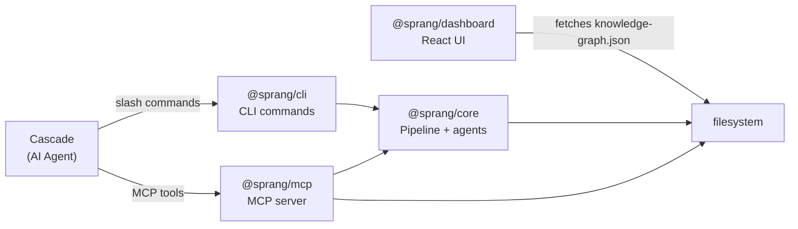
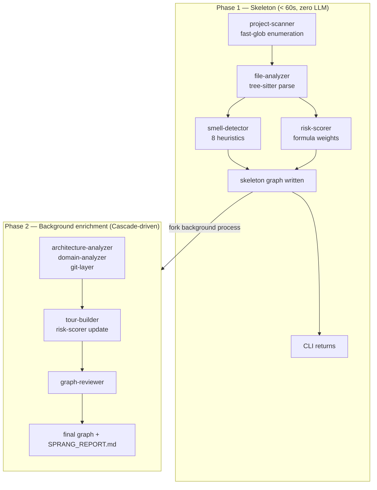
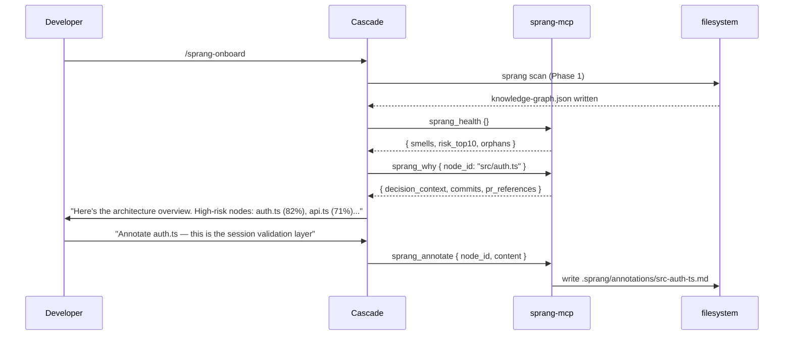

# Sprang

**The qualitative leap** (*kvalitativ spring*, Kierkegaard) in codebase comprehension.

Sprang is a knowledge graph platform for [Devin Desktop](https://devin.ai) (Cascade + Devin Local) that creates total codebase comprehension — not just symbol search, but *why* code exists, *who* changed it, *what* it risks, and *how* it all fits together.

Cascade is the intelligence layer. Sprang is the data layer. Together they answer "what will break if I change this file?" in one tool call.

---

## What Sprang gives Cascade

| Capability | How |
|---|---|
| **Git decision context** | `git-layer` — who changed each file, why, PR references, change frequency |
| **Code smell detection** | `smell-detector` — 8 deterministic detectors, zero LLM required |
| **Risk scoring** | `risk-scorer` — blast radius × coupling × test gap × churn |
| **Guided tours** | `tour-builder` — BFS-ordered pedagogical paths through the codebase |
| **Domain map** | `domain-analyzer` — directory cohesion clustering |
| **7 Cascade workflows** | `/sprang`, `/sprang-onboard`, `/sprang-diff`, and more |
| **7 Agent Skills** | Same commands for Devin Local |
| **8 MCP tools** | Direct graph access for Cascade's tool calls |
| **< 60s skeleton** | Phase 1 is 100% static — no LLM, no API key |
| **Live dashboard** | Force-directed graph, risk heatmap, tour player, health view |

---

## Quick start

```bash
# Scan your project (< 60s, no API key, no LLM)
npx sprang scan /path/to/your/project

# Check health
npx sprang health

# Query the graph
npx sprang query "authentication"

# Watch for changes
npx sprang watch

# Check pipeline status
npx sprang status
```

---

## Devin Desktop setup

Add to `.devin/config.json` in your project:

```json
{
  "mcpServers": {
    "sprang": {
      "command": "npx",
      "args": ["sprang-mcp"],
      "env": { "SPRANG_ROOT": "${workspaceFolder}" }
    }
  }
}
```

Then in Cascade: `/sprang-onboard` to build the initial graph.

### Available slash commands

| Command | Description |
|---|---|
| `/sprang` | Build or refresh the knowledge graph |
| `/sprang-onboard` | Full onboarding — scan + tour + health summary |
| `/sprang-diff` | Analyze impact of changed files |
| `/sprang-domain` | Explore domain architecture |
| `/sprang-why <file>` | Why does this file exist? Git history + rationale |
| `/sprang-health` | Full health report: risk, smells, orphans |
| `/sprang-team` | Team contribution analysis |

---

## How the LLM enrichment works

There is no external API key. **Cascade is the LLM.**

```
Developer runs /sprang in Cascade
       ↓
Cascade calls: sprang scan (Phase 1, static, < 60s)
       ↓
knowledge-graph.json written to .sprang/
       ↓
Cascade reads graph via MCP tools (sprang_health, sprang_why, etc.)
       ↓
Cascade uses its own intelligence to understand the codebase
       ↓
Cascade writes annotations via sprang_annotate
```

Phase 2 enrichment (summaries, domain naming, rationale extraction) is optional and performed by Cascade calling the scan pipeline with its context. No third-party API is required or used.

---

## Architecture

```
packages/
├── core/       Pipeline, 9 agents, schema, watcher
├── cli/        npx sprang (scan, health, query, watch, status)
├── mcp/        stdio MCP server (8 tools)
└── dashboard/  React + Vite + Sigma.js visualization
```

### Monorepo package relationships



---

## Two-phase execution



---

## Agent descriptions

### Analysis agents

| Agent | Phase | Role |
|---|---|---|
| `project-scanner` | 1 | fast-glob enumeration, language detection, framework heuristics |
| `file-analyzer` | 1+2 | tree-sitter parse, function/class nodes, cyclomatic complexity |
| `architecture-analyzer` | 2 | topological sort, layer depth, label assignment |
| `domain-analyzer` | 2 | directory cohesion clustering |
| `tour-builder` | 2 | BFS traversal, 5-8 ordered pedagogical steps |
| `graph-reviewer` | 2 | schema validation, referential integrity |

### The three differentiating agents

**`git-layer`** — Decision context from git history:

```
git log --follow --format="%H|%ae|%ai|%s" -- <filepath>
   ↓
associate commits to nodes via line-range diff hunk headers
   ↓
node.decision_context: { commits, primary_authors, last_changed,
                          change_frequency, rationale_snippets, pr_references }
```

**`smell-detector`** — 8 deterministic heuristics, zero LLM:

| Smell | Trigger |
|---|---|
| `god_node` | `out_degree > 20` OR cyclomatic_sum > 200 |
| `circular_dependency` | Johnson's cycle detection, cycles ≤ 6 nodes |
| `duplicate_logic` | Same param_count + complexity_bucket + ≥2 shared callers |
| `unclear_coupling` | Two modules share > 40% import targets, no direct edge |
| `low_cohesion` | Functions referenced by ≥3 distinct domains, < 50% same top domain |
| `unstable_interface` | change_frequency > 10/90d AND in_degree > 5 |
| `orphan_node` | in_degree=0 AND out_degree=0 AND not entry point |
| `over_connected` | total_degree (in + out) > 30 |

**`risk-scorer`** — Composite formula:

```
risk_score = clamp(
  blast_radius_score × 0.35 +   ← BFS reachable dependents / total nodes
  coupling_density_score × 0.25 +  ← (in+out degree)/40, +0.2 if in cycle
  test_gap_score × 0.25 +          ← 0.0 if tested, 0.5+blast×0.5 if untested
  churn_score × 0.15,              ← change_frequency/20
  0.0, 1.0
)
```

---

## MCP tools

The MCP server (`npx sprang-mcp`) exposes 8 tools to Cascade:

| Tool | Input | Output |
|---|---|---|
| `sprang_query` | `{ query, limit? }` | TF-IDF ranked nodes with summaries |
| `sprang_node` | `{ node_id }` | Full node + 1-hop neighborhood |
| `sprang_diff_impact` | `{ files: string[] }` | BFS impact analysis, risk-ranked |
| `sprang_tour` | `{ tour_id? }` | Ordered pedagogical tour steps |
| `sprang_domain` | `{ domain_name? }` | Domain hierarchy |
| `sprang_health` | `{}` | Smell summary, top-10 risk, orphans, circular deps |
| `sprang_why` | `{ node_id }` | Decision context + annotation content |
| `sprang_annotate` | `{ node_id, content, tags? }` | Write `.sprang/annotations/<id>.md` |

### Cascade interaction flow



---

## Dashboard

`pnpm --filter @sprang/dashboard dev` opens a React + Vite app at `localhost:5173`.

### Views

- **Graph** — Force-directed canvas (Sigma.js). Click a node to open the detail panel. Toggle risk heatmap, filter by layer, start a guided tour.
- **Health** — Structural health report: smell breakdown, top-10 risky nodes, circular dependency list, orphan nodes.
- **Domains** — Hierarchical domain → flow → step explorer.

### Keyboard shortcuts

| Key | Action |
|---|---|
| `Cmd/Ctrl+K` | Open node search |
| `Esc` | Close node panel / search |
| `g` or `1` | Switch to Graph view |
| `h` or `2` | Switch to Health view |
| `d` or `3` | Switch to Domains view |
| `r` | Toggle risk overlay |

---

## Extended graph schema

```typescript
interface SprangNode {
  // Core fields
  id: string;
  label: string;
  type: NodeType;       // 16 types: file | function | class | ...
  summary?: string;
  layer?: string;
  complexity?: 'simple' | 'moderate' | 'complex';
  location?: { file: string; start_line?: number; end_line?: number };

  // Sprang extensions
  decision_context?: {
    commits: CommitRef[];
    primary_authors: string[];
    last_changed: string;          // ISO-8601
    change_frequency: number;      // commits in last 90 days
    rationale_snippets: string[];
    pr_references: string[];
  };

  structural_warnings?: Array<{
    category: SmellCategory;       // 8 categories
    severity: 'low' | 'medium' | 'high';
    description: string;
    related_node_ids: string[];
    heuristic: string;
  }>;

  risk_score?: number;             // 0.0–1.0
  risk_factors?: RiskFactor[];     // 8 factor tags
}
```

Annotations stored as `.sprang/annotations/<node-id>.md` with YAML frontmatter — committed to the repo.

---

## Live watcher

`sprang watch` uses chokidar with:
- `awaitWriteFinish: { stabilityThreshold: 800ms }` — no spurious saves
- 2s debounce collecting changed files into a batch
- SHA256 fingerprinting to skip unchanged-content saves
- Incremental: re-analyze changed files + 1-hop import neighbors only
- Atomic write: `.tmp` then rename

---

## Development

```bash
pnpm install
pnpm build             # build all packages
pnpm test              # 108+ tests across 10 test files
pnpm typecheck         # strict TypeScript, zero errors
pnpm --filter @sprang/dashboard dev   # dashboard at localhost:5173
pnpm --filter @sprang/dashboard test:e2e  # Playwright E2E tests
```

### Test structure

```
packages/core/tests/
├── schema/                          # Zod validators, round-trip
├── agents/
│   ├── project-scanner.test.ts
│   ├── file-analyzer.test.ts
│   ├── smell-detector.test.ts       # circular-deps, god-node, clean
│   ├── risk-scorer.test.ts          # formula weights, factor tags
│   ├── git-layer.test.ts            # commit association, PR refs
│   └── architecture-analyzer.test.ts
└── integration/
    └── pipeline.test.ts             # full Phase 1 against simple-ts/

packages/dashboard/e2e/              # Playwright UI tests
```

### Test fixtures

| Fixture | Purpose |
|---|---|
| `simple-ts/` | 3 clean TS files — baseline |
| `circular-deps/` | A→B→C→A cycle |
| `god-node/` | 30+ imports, 300+ LOC |
| `git-repo/` | 20 scripted commits, 3 authors, PR refs |
| `well-tested/` | Every source file has tests |

---

## Configuration

`.sprang/config.json` in your project root:

```json
{
  "smellThresholds": {
    "godNodeOutDegree": 20,
    "circularMaxCycleLength": 6,
    "overConnectedDegree": 30
  },
  "riskWeights": {
    "blastRadius": 0.35,
    "coupling": 0.25,
    "testGap": 0.25,
    "churn": 0.15
  },
  "watch": {
    "debounceMs": 2000
  },
  "excludePatterns": []
}
```

---

## License

MIT

---

*Sprang was inspired by knowledge graph work in the open-source codebase comprehension space. The three differentiating agents (git-layer, smell-detector, risk-scorer) and the Devin Desktop integration are original work.*
