<!-- Hero banner — generated with Gemini gemini-3.1-flash-image-preview -->
<p align="center">
  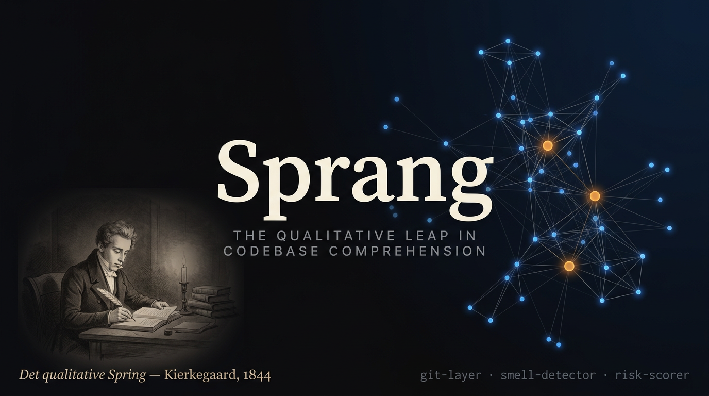
</p>

<!-- Logo + tagline -->
<p align="center">
  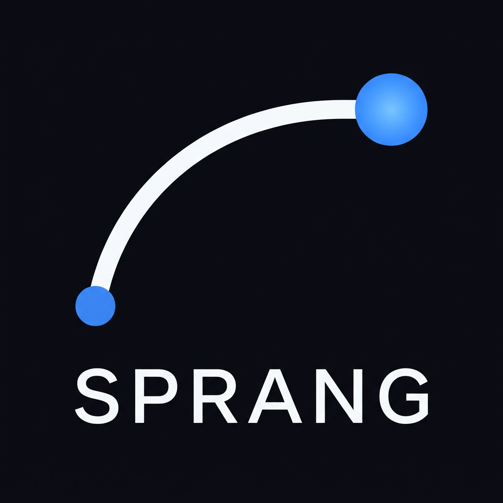
</p>

<p align="center">
  <strong>The qualitative leap in codebase comprehension.</strong><br/>
  <em>Det qualitative Spring — Kierkegaard</em>
</p>

<p align="center">
  <a href="#installation"></a>
  <a href="#mcp-tools"></a>
  <a href="#slash-commands"></a>
  
  
  
</p>

---

Sprang is a knowledge graph platform for [Windsurf](https://windsurf.com) (Cascade) and [Devin Desktop](https://devin.ai) that creates **total codebase comprehension** — not just symbol search, but *why* code exists, *who* changed it, *what* it risks, and *how* it all fits together.

Cascade is the intelligence layer. Sprang is the data layer. Together they answer **"what will break if I change this file?"** in a single tool call.

> *"The System knows everything about being, but nothing about existence."*  
> Kierkegaard's critique of Hegel applies equally to symbol indexers and grep tools.  
> Sprang bridges the gap: from static facts to living, contextual understanding.

---

## Quick install — just ask Cascade

Open Cascade (or any AI agent with terminal access) and paste this prompt. It will clone, build, wire up the MCP server, copy the rules, and run your first scan — all in one shot.

```
Please install the Sprang knowledge graph platform for this project.

Steps:
1. Clone the repo somewhere sensible (e.g. ~/tools/sprang):
   git clone https://github.com/FavioVazquez/sprang.git ~/tools/sprang

2. Install and build:
   cd ~/tools/sprang && pnpm install && pnpm build

3. Link the CLI globally so `sprang` works from any terminal:
   pnpm --filter @sprang/cli link --global

4. Add the MCP server to Windsurf's global config at
   ~/.codeium/windsurf/mcp_config.json
   (merge into existing file if it already exists):
   {
     "mcpServers": {
       "sprang": {
         "command": "node",
         "args": ["<ABSOLUTE_PATH_TO_SPRANG>/packages/mcp/dist/server.js"],
         "env": { "SPRANG_ROOT": "<ABSOLUTE_PATH_TO_THIS_PROJECT>" }
       }
     }
   }
   Replace <ABSOLUTE_PATH_TO_SPRANG> with the real path where you cloned it,
   and <ABSOLUTE_PATH_TO_THIS_PROJECT> with the current workspace root.

5. Copy the Cascade rules into this project so Sprang runs automatically:
   cp ~/tools/sprang/.devin/rules/sprang-context.md .devin/rules/
   cp ~/tools/sprang/.devin/rules/sprang-highrisk.md .devin/rules/
   (create .devin/rules/ if it does not exist)

6. Run the initial scan on this project:
   sprang scan . --skip-llm

7. Tell me when done. I will reload the MCP server and run /sprang-onboard
   to give you a full architecture walkthrough.
```

> **Windsurf users:** after step 4, reload the window (`Cmd/Ctrl+Shift+P` → *Reload Window*) to pick up the new MCP server before step 7.

---

## Contents

- [Quick install — just ask Cascade](#quick-install--just-ask-cascade)
- [What Sprang does](#what-sprang-does)
- [Platform architecture](#platform-architecture)
- [Prerequisites](#prerequisites)
- [Manual installation](#manual-installation)
- [CLI usage](#cli-usage)
- [Setup with Windsurf / Cascade](#setup-with-windsurf--cascade)
- [Setup with Devin Desktop](#setup-with-devin-desktop)
- [Slash commands](#slash-commands)
- [Two-phase pipeline](#two-phase-pipeline)
- [The three differentiating agents](#the-three-differentiating-agents)
- [MCP tools](#mcp-tools)
- [Dashboard](#dashboard)
- [Knowledge graphs](#knowledge-graphs)
- [Graph schema](#graph-schema)
- [Live watcher](#live-watcher)
- [Development](#development)
- [Configuration](#configuration)

---

## What Sprang does

<!-- Dashboard mockup — generated with Gemini gemini-3.1-flash-image-preview -->
<p align="center">
  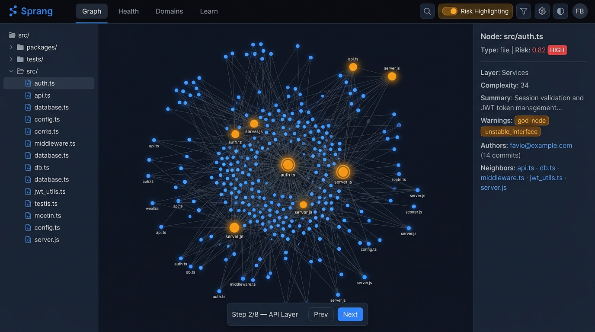
  <em>Force-directed knowledge graph, risk heatmap, node detail panel with decision context, and guided tour player.</em>
</p>

Sprang gives Cascade a persistent memory of your codebase — not just file names and symbols, but the full context of *why* things exist, *who* changed them, *what* they risk, and *how* they connect.

### One-call answers

```
# "What will break if I change auth.ts?"
sprang_diff_impact { files: ["src/auth.ts"] }
→ 14 impacted nodes, top risk: api-gateway.ts (0.91), session.ts (0.78)

# "Why does this file exist?"
sprang_why { node_id: "src/auth.ts" }
→ 23 commits, 3 authors, PR #441 "add JWT refresh flow", churn: 8/90d

# "Show me the riskiest parts of this codebase"
sprang_health {}
→ god_node: 2, circular_dependency: 1, unstable_interface: 3
  top risk: auth.ts (0.82), api.ts (0.71), db/pool.ts (0.68)

# "Walk me through the architecture"
/sprang-onboard
→ 8-step guided tour, persona-adaptive (junior / senior / PM)
```

### What it brings to Cascade

| Capability | How |
|---|---|
| **Git decision context** | `git-layer` — who changed each file, why, PR references, change frequency |
| **Code smell detection** | `smell-detector` — 8 deterministic heuristics, zero LLM required |
| **Risk scoring** | `risk-scorer` — blast radius × coupling × test gap × churn, 0.0–1.0 per node |
| **Guided tours** | `tour-builder` — BFS-ordered pedagogical paths through the codebase |
| **Domain map** | `domain-analyzer` — directory cohesion clustering into named business layers |
| **Blast-radius diff** | `sprang_diff_impact` — BFS over the graph before any edit, risk-ranked |
| **Team annotations** | `sprang_annotate` — write `.sprang/annotations/<id>.md`, committed to the repo |
| **Knowledge graphs** | `/sprang-knowledge` — Obsidian / Logseq / Dendron / Foam / Zettelkasten / plain markdown |
| **11 slash commands** | Full workflow coverage for both Windsurf/Cascade and Devin Desktop |
| **8 MCP tools** | Direct graph access — no extra API key, Cascade is the LLM |
| **< 60s skeleton** | Phase 1 is 100% static — no LLM, no API key, runs anywhere |
| **Live dashboard** | Sigma.js force-directed graph, risk heatmap, diff overlay, BFS pathfinder, tour player |

---

## Platform architecture

<!-- Architecture diagram — generated with Gemini gemini-3.1-flash-image-preview -->
<p align="center">
  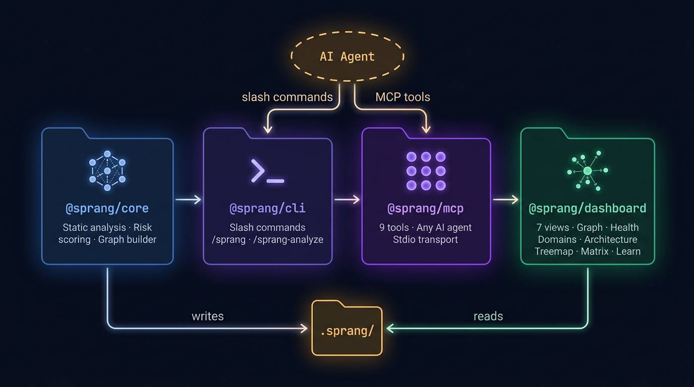
  <em>Four packages. One data layer. Cascade is the intelligence; Sprang is the memory.</em>
</p>

```
packages/
├── core/       Pipeline: 9 agents, schema, watcher, graph store
├── cli/        sprang scan | health | query | watch | status
├── mcp/        stdio MCP server — 8 tools for Cascade
└── dashboard/  React + Vite + Sigma.js — 4 views, 25 components
```

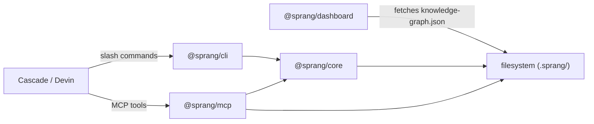

---

## Prerequisites

- **Node.js 20+** — `node --version`
- **pnpm 10+** — `npm install -g pnpm` or `corepack enable && corepack prepare pnpm@latest`
- **Git** — required for the `git-layer` agent to extract decision context

---

## Manual installation

```bash
# 1. Clone
git clone https://github.com/faviovazquez/sprang.git
cd sprang

# 2. Install all dependencies
pnpm install

# 3. Build all packages
pnpm build

# 4. Link CLI globally (so `sprang` works from anywhere)
pnpm --filter @sprang/cli link --global
```

```bash
# Verify
sprang --version   # 0.1.0
sprang --help
```

---

## CLI usage

```bash
# Phase 1 only — static, < 60s, zero LLM, zero API key
sprang scan /path/to/your/project --skip-llm

# Full scan — Phase 1 + Phase 2 Cascade-driven enrichment in background
sprang scan /path/to/your/project

# Check graph age, phase, and node/edge count
sprang status

# Print health report: smells, risk table, orphans, circular deps
sprang health

# Fuzzy-search nodes by name or summary
sprang query "authentication"

# Watch for file changes and incrementally update the graph
sprang watch
```

Output written to `.sprang/` in your project root:

```
your-project/
└── .sprang/
    ├── knowledge-graph.json   ← main graph (nodes, edges, risk scores, smells)
    ├── SPRANG_REPORT.md       ← human-readable architecture summary
    ├── annotations/           ← Cascade-written node annotations (commit these)
    ├── config.json            ← optional thresholds + excludes
    └── intermediate/          ← Phase 2 progress (gitignored)
```

---

## Setup with Windsurf / Cascade

### Step 1 — Scan your project

```bash
sprang scan . --skip-llm
```

Produces `.sprang/knowledge-graph.json` in under 60 seconds with no external API calls.

### Step 2 — Add the MCP server

**For Windsurf** — add to `~/.codeium/windsurf/mcp_config.json`:

```json
{
  "mcpServers": {
    "sprang": {
      "command": "node",
      "args": ["/absolute/path/to/sprang/packages/mcp/dist/server.js"],
      "env": { "SPRANG_ROOT": "/absolute/path/to/your/project" }
    }
  }
}
```

> In `mcp_config.json`, `${workspaceFolder}` is **not** resolved — use the full absolute path for `SPRANG_ROOT`.

### Step 3 — Restart Windsurf

Reload the window to pick up the new MCP server. You should see "sprang" in the MCP tools list.

### Step 4 — Run onboarding

```
/sprang-onboard
```

### What Cascade does automatically

Once the MCP server is active and `.devin/rules/` files are present, Cascade will automatically:

- **Before editing any file** — call `sprang_node` to check `risk_score` and `structural_warnings`
- **On high-risk files (risk > 0.7)** — call `sprang_why` to read decision context before changing anything
- **After changes** — call `sprang_diff_impact` to assess blast radius

Driven by `.devin/rules/sprang-context.md` (always-on) and `.devin/rules/sprang-highrisk.md` (glob trigger on `*.ts`, `*.tsx`, `packages/*/src`).

---

## Setup with Devin Desktop

Add to `.devin/config.json` in your project root:

```json
{
  "mcpServers": {
    "sprang": {
      "command": "node",
      "args": ["/absolute/path/to/sprang/packages/mcp/dist/server.js"],
      "env": { "SPRANG_ROOT": "${workspaceFolder}" }
    }
  }
}
```

> In `.devin/config.json`, `${workspaceFolder}` **is** resolved to the project root.

Skills and workflows live in `.windsurf/skills/` and `.windsurf/workflows/`, symlinked to `.devin/skills/` and `.devin/workflows/` so both Cascade and Devin agents discover them automatically.

---

## Slash commands

| Command | Description |
|---|---|
| `/sprang` | Build or refresh the knowledge graph — auto-detects codebase vs knowledge base |
| `/sprang-analyze [path] [--full] [--language <lang>] [--chunk N]` | Full LLM-driven codebase analysis — summaries, layers, tour, risk |
| `/sprang-knowledge [path] [--format obsidian\|logseq\|...] [--full]` | Build knowledge graph from markdown notes |
| `/sprang-chat <question>` | Ask any question about the codebase using the knowledge graph |
| `/sprang-explain <file>` | Deep-dive: what, why, who, risk, history for a file or function |
| `/sprang-onboard` | Guided architecture tour — adapts to persona (junior / senior / PM) |
| `/sprang-diff [files...]` | Blast radius analysis — writes diff overlay for dashboard amber highlight |
| `/sprang-domain [name]` | Explore business domain architecture and flows |
| `/sprang-why <file>` | Why does this file exist? Git history + rationale + team annotations |
| `/sprang-health` | Full health report: risk, smells, orphans, circular deps |
| `/sprang-team [node]` | Browse/write team annotations with staleness detection |

---

## Two-phase pipeline

<!-- Pipeline diagram — generated with Gemini gemini-3.1-flash-image-preview -->
<p align="center">
  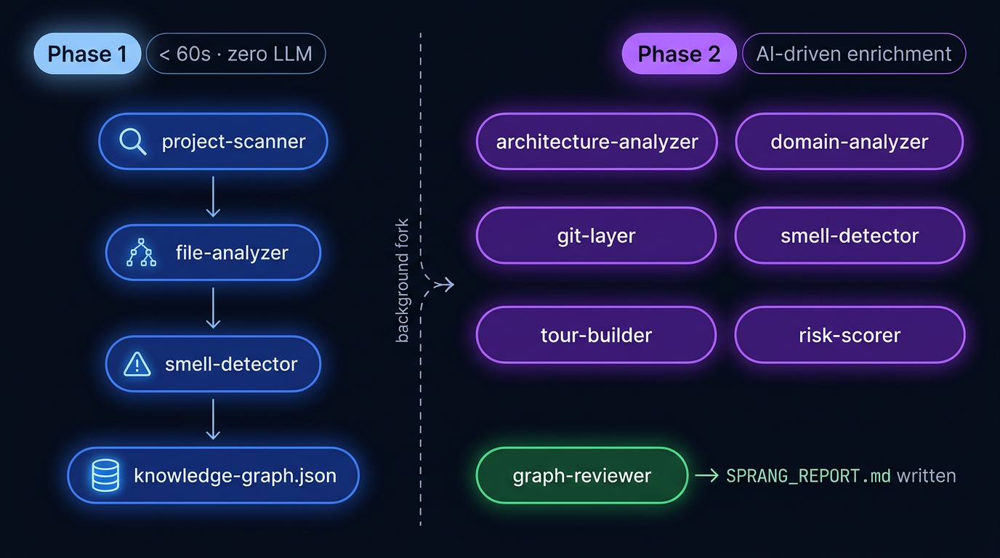
  <em>Phase 1 is entirely static — no LLM, no API key, under 60 seconds. Phase 2 runs in the background driven by Cascade.</em>
</p>

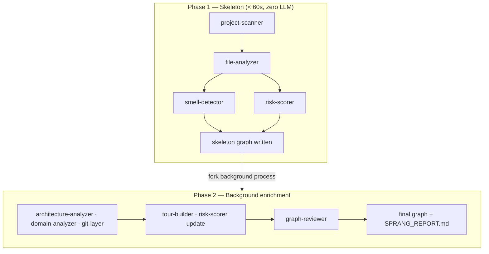

**No external API.** Cascade is the LLM. Phase 2 enrichment is performed by Cascade calling the scan pipeline with its own context window. No third-party API key required.

---

## The three differentiating agents

<!-- Graph modes — generated with Gemini gemini-3.1-flash-image-preview -->
<p align="center">
  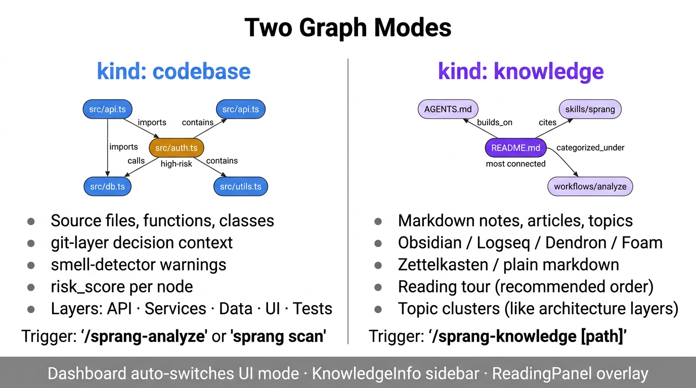
  <em>Sprang supports two graph kinds — codebase analysis and markdown knowledge base indexing.</em>
</p>

### `git-layer` — Decision context from version history

```
git log --follow --format="%H|%ae|%ai|%s" -- <filepath>
   ↓
associate commits to nodes via line-range diff hunk headers
   ↓
node.decision_context: { commits, primary_authors, last_changed,
                          change_frequency, rationale_snippets, pr_references }
```

### `smell-detector` — 8 deterministic heuristics, zero LLM

| Smell | Trigger |
|---|---|
| `god_node` | `out_degree > 20` OR cyclomatic_sum > 200 |
| `circular_dependency` | Johnson's cycle detection, cycles ≤ 6 nodes |
| `duplicate_logic` | Same param_count + complexity_bucket + ≥2 shared callers |
| `unclear_coupling` | Two modules share > 40% import targets, no direct edge |
| `low_cohesion` | Functions referenced by ≥3 distinct domains, < 50% same top domain |
| `unstable_interface` | change_frequency > 10/90d AND in_degree > 5 |
| `orphan_node` | in_degree=0 AND out_degree=0 AND not entry point |
| `over_connected` | total_degree (in + out) > 30 |

### `risk-scorer` — Composite formula

<!-- Risk formula — generated with Gemini gemini-3.1-flash-image-preview -->
<p align="center">
  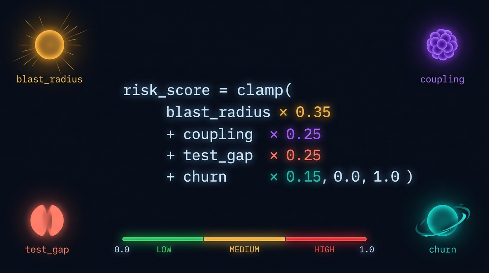
  <em>Deterministic, no LLM. Every factor is traceable — risk_factors[] lists the exact contributors per node.</em>
</p>

```
risk_score = clamp(
  blast_radius  × 0.35   ← BFS reachable dependents / total nodes
  + coupling    × 0.25   ← (in+out degree)/40, +0.2 if in cycle
  + test_gap    × 0.25   ← 0.0 if tested, 0.5+blast×0.5 if not
  + churn       × 0.15,  ← change_frequency/20
  0.0, 1.0
)
```

---

## MCP tools

<!-- MCP tools reference — generated with Gemini gemini-3.1-flash-image-preview -->
<p align="center">
  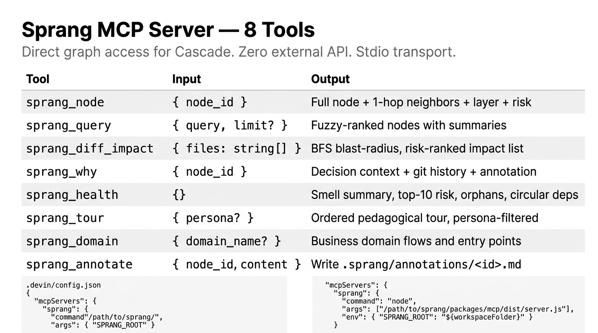
</p>

| Tool | Input | Output |
|---|---|---|
| `sprang_node` | `{ node_id }` | Full node + 1-hop neighbors + layer + in/out degree + annotation |
| `sprang_query` | `{ query, node_types?, limit? }` | Fuzzy-ranked nodes with summaries |
| `sprang_diff_impact` | `{ files: string[] }` | BFS blast-radius, risk-ranked impact list |
| `sprang_why` | `{ node_id }` | Decision context + git history + team annotation |
| `sprang_health` | `{}` | Smell summary, top-10 risk, orphans, circular deps |
| `sprang_tour` | `{ tour_id?, persona? }` | Ordered pedagogical tour, persona-filtered |
| `sprang_domain` | `{ domain_name? }` | Business domain flows and entry points |
| `sprang_annotate` | `{ node_id, content, tags? }` | Write `.sprang/annotations/<id>.md` |

### Enriched `sprang_node` response

```json
{
  "node": { "id": "...", "type": "file", "summary": "...", "risk_score": 0.72 },
  "neighbors": [{ "node_id": "...", "direction": "outgoing", "edge_type": "imports" }],
  "layer": { "id": "layer:services", "name": "Services" },
  "layer_mate_count": 7,
  "in_degree": 4,
  "out_degree": 11,
  "has_annotation": true,
  "annotation_path": ".sprang/annotations/src-auth-ts.md"
}
```

### Cascade interaction flow

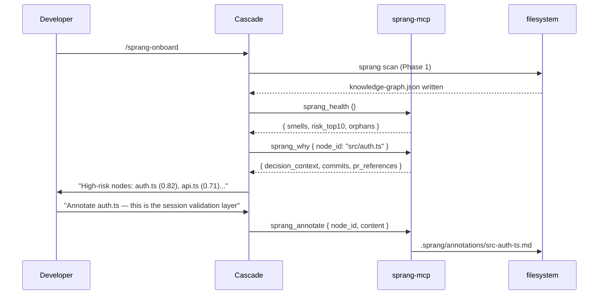

---

## Dashboard

```bash
# Development — live reload
SPRANG_ROOT=/path/to/your/project pnpm --filter @sprang/dashboard dev
# Opens at http://localhost:5173

# Point at this repo itself
SPRANG_ROOT=$(pwd) pnpm --filter @sprang/dashboard dev
```

### Views

| View | Key | Description |
|---|---|---|
| **Graph** | `g` / `1` | Sigma.js force-directed canvas — risk heatmap, layer filter, diff overlay, BFS pathfinder |
| **Health** | `h` / `2` | Smell breakdown, top-10 risky nodes, circular deps, orphan count |
| **Domains** | `d` / `3` | Business domain explorer — list view + React Flow layout toggle |
| **Learn** | `l` / `4` | Persona-adaptive guided tour with language lessons |

### Toolbar components (25 total)

| Component | Role |
|---|---|
| FilterPanel | Filter nodes by category, complexity, risk level, edge type |
| DiffToggle | Load `.sprang/diff-overlay.json` → amber/warm-gray blast radius |
| PathFinder | BFS shortest path between any two nodes |
| ExportMenu | Export graph as JSON, Markdown, clipboard, or SVG |
| FileExplorer | File tree with search; double-click opens CodeViewer |
| CodeViewer | Prism syntax highlighting with line-range jump |
| PersonaSelector | non-technical / junior / experienced |
| KnowledgeInfo | Right sidebar for knowledge graphs: backlinks, frontmatter, tags |
| ReadingPanel | Slide-up reading overlay for article nodes |
| ThemePicker | Dark / Light / High-contrast (persisted to `localStorage`) |
| LayerLegend | Layer color swatches; hover highlights all nodes in that layer |
| NodeTooltip | Mouse-following tooltip: type, label, summary, risk score |
| KeyboardShortcutsHelp | `?` opens shortcut reference modal |
| OnboardingOverlay | 4-step first-run guide (dismissed after first visit) |
| MobileBottomNav | Bottom nav on screens < 768px |
| BreadCrumb | Layer → Node drill-down above the graph panel |

### Keyboard shortcuts

| Key | Action |
|---|---|
| `Cmd/Ctrl+K` | Open node search |
| `Esc` | Close panel / search |
| `g` `1` | Graph view |
| `h` `2` | Health view |
| `d` `3` | Domains view |
| `l` `4` | Learn view |
| `r` | Toggle risk overlay |
| `?` | Keyboard shortcuts help |

---

## Knowledge graphs

`/sprang-knowledge [path]` builds a `kind: "knowledge"` graph from markdown notes — Obsidian vaults, Logseq databases, Dendron workspaces, Foam wikis, Zettelkasten archives, or plain markdown.

```bash
# In Cascade chat
/sprang-knowledge /path/to/your/notes
```

Produces:
- **Article nodes** — one per `.md` file, with summary, tags, `knowledgeMeta`
- **Topic / entity nodes** — inferred from MOC pages, wikilinks, frontmatter
- **Edges** — `cites`, `builds_on`, `contradicts`, `exemplifies`, `categorized_under`, `authored_by`
- **Topic clusters** — analogous to architecture layers
- **Reading tour** — recommended reading order from most-connected note outward

The dashboard auto-switches to knowledge mode: `KnowledgeInfo` sidebar, `ReadingPanel` overlay, reading order in the Learn tab.

---

## Graph schema

```typescript
interface SprangNode {
  id: string;           // "file:src/auth.ts" | "function:src/auth.ts:validate"
  label: string;
  type: NodeType;       // 16 types: file | function | class | service | ...
  summary?: string;
  layer?: string;
  complexity?: 'simple' | 'moderate' | 'complex';
  location?: { file: string; start_line?: number; end_line?: number };

  decision_context?: {
    commits: CommitRef[];
    primary_authors: string[];
    last_changed: string;        // ISO-8601
    change_frequency: number;    // commits in last 90 days
    rationale_snippets: string[];
    pr_references: string[];
  };

  structural_warnings?: Array<{
    category: SmellCategory;     // 8 categories
    severity: 'low' | 'medium' | 'high';
    description: string;
    related_node_ids: string[];
    heuristic: string;
  }>;

  risk_score?: number;           // 0.0–1.0
  risk_factors?: RiskFactor[];   // blast_radius | coupling | test_gap | churn | ...
  knowledgeMeta?: {              // knowledge graphs only
    wikilinks: string[];
    backlinks: string[];
    category: string;
  };
}
```

Annotations are stored as `.sprang/annotations/<node-id>.md` with YAML frontmatter — **commit these files** so team knowledge persists across sessions.

---

## Live watcher

`sprang watch` uses chokidar with:
- `awaitWriteFinish: { stabilityThreshold: 800ms }` — no spurious saves
- 2s debounce collecting changed files into a batch
- SHA-256 fingerprinting — skips unchanged-content saves
- **Incremental**: re-analyzes changed files + 1-hop import neighbors only
- **Atomic write**: `.tmp` → rename — crash-safe

---

## Development

```bash
pnpm install
pnpm build             # build all packages
pnpm test              # 167 tests, zero failures
pnpm typecheck         # strict TypeScript, zero errors
pnpm --filter @sprang/dashboard dev        # dashboard at localhost:5173
pnpm --filter @sprang/dashboard test:e2e   # Playwright E2E tests
```

### Test structure

```
packages/core/tests/
├── schema/                 Zod validators, round-trip
├── agents/
│   ├── project-scanner.test.ts
│   ├── file-analyzer.test.ts
│   ├── smell-detector.test.ts    circular-deps, god-node, clean baseline
│   ├── risk-scorer.test.ts       formula weights, factor tags
│   ├── git-layer.test.ts         commit association, PR refs
│   └── architecture-analyzer.test.ts
└── integration/
    └── pipeline.test.ts          full Phase 1 against simple-ts/ fixture

packages/dashboard/src/
├── store.test.ts           Zustand store unit tests
└── pathfinder.test.ts      BFS pathfinder unit tests

packages/dashboard/e2e/     Playwright UI tests
packages/mcp/tests/         MCP tool integration tests
```

### Test fixtures

| Fixture | Purpose |
|---|---|
| `simple-ts/` | 3 clean TS files — baseline |
| `circular-deps/` | A→B→C→A cycle for smell detection |
| `god-node/` | 30+ imports, 300+ LOC |
| `git-repo/` | 20 scripted commits, 3 authors, PR refs in messages |
| `well-tested/` | Every source file has a `tested_by` edge |

---

## Configuration

`.sprang/config.json` in your project root:

```json
{
  "smellThresholds": {
    "godNodeOutDegree": 20,
    "circularMaxCycleLength": 6,
    "overConnectedDegree": 30
  },
  "riskWeights": {
    "blastRadius": 0.35,
    "coupling": 0.25,
    "testGap": 0.25,
    "churn": 0.15
  },
  "watch": {
    "debounceMs": 2000
  },
  "excludePatterns": []
}
```

---

## License

MIT

---

*The name Sprang comes from Kierkegaard's concept of the* qualitative spring *— the leap that cannot be reached by gradual accumulation alone, but only by a discontinuous jump in understanding. The git-layer, smell-detector, risk-scorer agents and the Devin Desktop integration are original work. Sprang was inspired by the open-source codebase comprehension space, particularly the work in [Understand-Anything](https://github.com/adamcohenhillel/understand-anything).*
