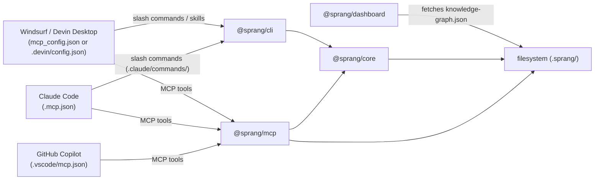
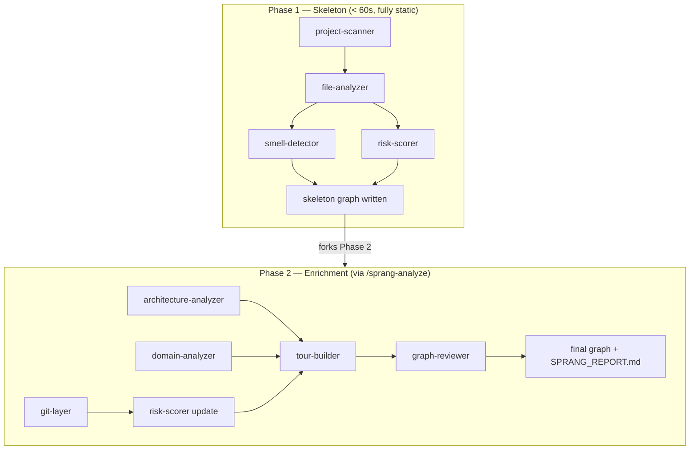
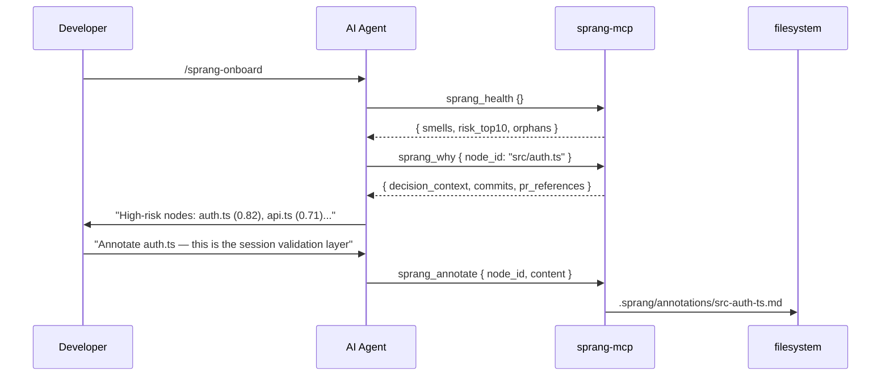

<!-- Hero banner — generated with Gemini gemini-3.1-flash-image-preview -->
<p align="center">
  
</p>

<p align="center">
  
</p>

<p align="center">
  <strong>The qualitative leap in codebase comprehension.</strong><br/>
  <em>Det qualitative Spring — Kierkegaard</em>
</p>

<p align="center">
  <a href="#installation"></a>
  <a href="#mcp-tools"></a>
  <a href="#slash-commands"></a>
  
  
  
  
</p>

---

Sprang is a knowledge graph platform for [Windsurf](https://windsurf.com) (Cascade / Devin Desktop), [Claude Code](https://claude.ai/code), and [GitHub Copilot](https://github.com/features/copilot) that creates **total codebase comprehension** — not just symbol search, but *why* code exists, *who* changed it, *what* it risks, and *how* it all fits together.

Your AI agent is the intelligence layer. Sprang is the data layer. Together they answer **"what will break if I change this file?"** in a single tool call.

> *"The System knows everything about being, but nothing about existence."*  
> Kierkegaard's critique of Hegel applies equally to symbol indexers and grep tools.  
> Sprang bridges the gap: from static facts to living, contextual understanding.

---

## Installation

> **Note:** Windsurf AI and Devin Desktop are the same product — Windsurf was rebranded as Devin Desktop. All instructions, skills, and workflows are identical for both. Both names appear in this README.

### Claude Code

**Via the plugin marketplace (recommended)**

Run these two commands inside a Claude Code session:

```
/plugin marketplace add FavioVazquez/sprang
/plugin install sprang
```

The first command registers the GitHub repo as a local marketplace source (reads `marketplace.json`). The second installs the plugin from it. Claude Code activates all slash commands, hooks, and rules from `.claude-plugin/`. Then build the MCP server to unlock all 9 tools:

```bash
# In the installed plugin directory (typically ~/.claude/plugins/sprang/)
pnpm install && pnpm build
```

**What the plugin activates:**

| File | What it does |
|---|---|
| `.claude-plugin/plugin.json` | Plugin manifest — name, version, metadata |
| `.claude-plugin/marketplace.json` | Marketplace source — registers this repo as an installable plugin |
| `.claude/commands/` | 11 slash commands (e.g. `/sprang`, `/sprang-onboard`) |
| `.claude/hooks/session-start.sh` | Warns Claude on session open if graph is missing or stale |
| `.claude/hooks/post-tool-use.sh` | Triggers incremental graph refresh after git commits |
| `.mcp.json` | MCP server config — 9 tools once binary is built |

To build the knowledge graph after install:

```
/sprang           # build the knowledge graph
/sprang-onboard   # guided architecture tour
```

---

### GitHub Copilot

**Via the plugin system (recommended)**

```bash
copilot plugin install FavioVazquez/sprang
```

This installs the skills and registers `.copilot-plugin/plugin.json` for Copilot's plugin discovery. Then build the MCP server:

```bash
# In the installed plugin directory
pnpm install && pnpm build
```

**Or clone manually:**

```bash
git clone https://github.com/FavioVazquez/sprang.git
cd sprang && pnpm install && pnpm build
```

Open VS Code with Copilot, switch to **Agent mode** (the model selector in the chat panel), and `.vscode/mcp.json` auto-connects the MCP server.

**What activates:**

| File | What it does |
|---|---|
| `.copilot-plugin/plugin.json` | Plugin discovery metadata with `skills` paths |
| `.vscode/mcp.json` | MCP server — auto-connects in Agent mode |
| `.github/copilot-instructions.md` | Pre-edit checklist auto-loaded by Copilot |

> MCP tools only work in Copilot **Agent mode** — not the default ask/edit modes.

---

### Windsurf / Devin Desktop — agentic install

Paste this prompt into Cascade or Devin. It handles everything: clones, builds, wires up the MCP server, copies slash commands, skills, and rules, runs the first scan, and starts the dashboard.

```
Please install the Sprang knowledge graph platform for this project.
Run all steps sequentially using terminal commands. Do not ask me for input between steps.

1. Clone Sprang to ~/tools/sprang, or pull latest if it already exists:
   if [ -d ~/tools/sprang ]; then
     git -C ~/tools/sprang pull --ff-only
   else
     git clone https://github.com/FavioVazquez/sprang.git ~/tools/sprang
   fi

2. Install dependencies and build all packages (run both in ~/tools/sprang):
   pnpm install
   pnpm build

3. Link the CLI globally so `sprang` works from any terminal.
   Run these commands in ~/tools/sprang/packages/cli:
     pnpm setup
     export PNPM_HOME="$HOME/.local/share/pnpm"
     export PATH="$PNPM_HOME:$PATH"
     pnpm link --global
   Verify: which sprang  (should print a path ending in /sprang)

4. Determine the two absolute paths you need:
   SPRANG_DIR = the absolute path where you cloned sprang (~/tools/sprang resolved)
   PROJECT_DIR = the absolute path of the current workspace root

   Write the MCP server config to ~/.codeium/windsurf/mcp_config.json.
   If the file already exists and has other mcpServers entries, merge — do not overwrite.
   The entry to add:
   {
     "mcpServers": {
       "sprang": {
         "command": "node",
         "args": ["SPRANG_DIR/packages/mcp/dist/server.js"],
         "env": { "SPRANG_ROOT": "PROJECT_DIR" }
       }
     }
   }
   Use the real resolved paths, not placeholders.

5. Copy rules, workflows, skills, and hooks into the current project:

   Rules — tell Cascade/Devin to use Sprang automatically:
     mkdir -p .devin/rules
     cp ~/tools/sprang/.devin/rules/sprang-context.md .devin/rules/
     cp ~/tools/sprang/.devin/rules/sprang-highrisk.md .devin/rules/
     cp ~/tools/sprang/.devin/rules/cascade-messaging.md .devin/rules/

   Hooks — enable persistent dashboard chat (conversation history):
     cp ~/tools/sprang/.devin/hooks.json .devin/hooks.json
     cp ~/tools/sprang/.devin/config.json .devin/config.json
     mkdir -p .windsurf/hooks
     cp ~/tools/sprang/.windsurf/hooks.json .windsurf/hooks.json
     cp ~/tools/sprang/.windsurf/hooks/save-conversation.py .windsurf/hooks/save-conversation.py

   Workflows — all /sprang-* slash commands for Windsurf / Cascade:
     mkdir -p .windsurf/workflows
     cp ~/tools/sprang/.windsurf/workflows/*.md .windsurf/workflows/

   Skills — same /sprang-* commands for Devin Desktop:
     mkdir -p .windsurf/skills
     cp -r ~/tools/sprang/.windsurf/skills/sprang* .windsurf/skills/

   Symlinks so both Windsurf and Devin find them:
     ln -sf ../.windsurf/workflows .devin/workflows
     ln -sf ../.windsurf/skills .devin/skills

6. Run the initial scan of this project (Phase 1 — fully static, under 60s):
   sprang scan . --phase1-only
   (If `sprang` is not yet in PATH, use: node ~/tools/sprang/packages/cli/dist/index.js scan . --phase1-only)

7. Start the dashboard:
   SPRANG_ROOT="PROJECT_DIR" pnpm --filter @sprang/dashboard preview
   Dashboard will be at http://localhost:7777

8. Install the cascade-messaging VS Code extension (enables persistent dashboard chat):
   if ! windsurf --list-extensions 2>/dev/null | grep -q cascade-messaging; then
     windsurf --install-extension ~/tools/sprang/cascade-messaging-0.1.0.vsix 2>/dev/null || \
     code --install-extension ~/tools/sprang/cascade-messaging-0.1.0.vsix 2>/dev/null || \
     echo "Manual install: Extensions → Install from VSIX → ~/tools/sprang/cascade-messaging-0.1.0.vsix"
   fi

9. Report what was installed and where. Then tell me:
   "Please reload the window now (Cmd/Ctrl+Shift+P → Reload Window) so the MCP server
   and cascade-messaging extension activate.
   Dashboard is live at http://localhost:7777.
   Once reloaded, type /sprang-onboard to begin."
```

> After the agent finishes, **reload the window** (`Cmd/Ctrl+Shift+P` → *Reload Window*), then type `/sprang-onboard`. Dashboard is at **http://localhost:7777**.

---

### Installer script

For scripted or manual setup on any platform:

```bash
# macOS / Linux
curl -fsSL https://raw.githubusercontent.com/FavioVazquez/sprang/main/install.sh | bash -s windsurf
# Options:  windsurf  |  copilot  |  claude
```

```powershell
# Windows (PowerShell)
irm https://raw.githubusercontent.com/FavioVazquez/sprang/main/install.ps1 | iex
# Options:  .\install.ps1 windsurf  |  .\install.ps1 copilot  |  .\install.ps1 claude
```

```bash
# If you already have the repo cloned:
./install.sh windsurf     # symlinks 11 skills into ~/.windsurf/skills/
./install.sh copilot      # symlinks 11 skills into ~/.copilot/skills/
./install.sh claude       # prints per-project setup guide
./install.sh --update     # pull latest + rebuild
./install.sh --uninstall windsurf
```

| Flag | Skills target | Platform |
|---|---|---|
| `windsurf` | `~/.windsurf/skills/` | Windsurf AI / Devin Desktop |
| `copilot` | `~/.copilot/skills/` | GitHub Copilot |
| `claude` | project-local | Claude Code (via `.mcp.json` + plugin manifest) |

---

## Contents

- [Installation](#installation)
- [What Sprang does](#what-sprang-does)
- [Platform architecture](#platform-architecture)
- [Prerequisites](#prerequisites)
- [Manual build](#manual-build)
- [CLI usage](#cli-usage)
- [Windsurf / Devin Desktop — detailed setup](#windsurf--devin-desktop--detailed-setup)
- [Dashboard chat (cascade-messaging)](#dashboard-chat-cascade-messaging)
- [Slash commands](#slash-commands)
- [Two-phase pipeline](#two-phase-pipeline)
- [The three differentiating agents](#the-three-differentiating-agents)
- [MCP tools](#mcp-tools)
- [Dashboard](#dashboard)
- [Knowledge graphs](#knowledge-graphs)
- [Graph schema](#graph-schema)
- [Live watcher](#live-watcher)
- [Development](#development)
- [Configuration](#configuration)

---

## What Sprang does

<!-- Dashboard mockup — generated with Gemini gemini-3.1-flash-image-preview -->
<p align="center">
  
  <em>Force-directed knowledge graph, risk heatmap, node detail panel with decision context, and guided tour player.</em>
</p>

Sprang gives your AI agent a persistent memory of the codebase — not just file names and symbols, but the full context of *why* things exist, *who* changed them, *what* they risk, and *how* they connect.

### One-call answers

```
# "What will break if I change auth.ts?"
sprang_diff_impact { files: ["src/auth.ts"] }
→ 14 impacted nodes, top risk: api-gateway.ts (0.91), session.ts (0.78)

# "Why does this file exist?"
sprang_why { node_id: "src/auth.ts" }
→ 23 commits, 3 authors, PR #441 "add JWT refresh flow", churn: 8/90d

# "Show me the riskiest parts of this codebase"
sprang_health {}
→ god_node: 2, circular_dependency: 1, unstable_interface: 3
  top risk: auth.ts (0.82), api.ts (0.71), db/pool.ts (0.68)

# "Walk me through the architecture"
/sprang-onboard
→ 8-step guided tour, persona-adaptive (junior / senior / PM)
```

### Capabilities

| Capability | How |
|---|---|
| **Git decision context** | `git-layer` — who changed each file, why, PR references, change frequency |
| **Code smell detection** | `smell-detector` — 8 deterministic heuristics, zero LLM calls |
| **Risk scoring** | `risk-scorer` — blast radius × coupling × test gap × churn, 0.0–1.0 per node |
| **Guided tours** | `tour-builder` — BFS-ordered pedagogical paths through the codebase |
| **Domain map** | `domain-analyzer` — directory cohesion clustering into named business layers |
| **Blast-radius diff** | `sprang_diff_impact` — BFS over the graph before any edit, risk-ranked |
| **Team annotations** | `sprang_annotate` — write `.sprang/annotations/<id>.md`, committed to the repo |
| **Knowledge graphs** | `/sprang-knowledge` — Obsidian / Logseq / Dendron / Foam / Zettelkasten / plain markdown |
| **11 slash commands** | Full workflow coverage for Windsurf/Devin Desktop and Claude Code |
| **9 MCP tools** | Direct graph access — all agents read and write the graph via MCP |
| **< 60s skeleton** | Phase 1 is fully static — runs anywhere, no network, no waiting |
| **Architecture card view** | React Flow + ELK layer map — one card per layer, weighted cross-layer edges |
| **Structural fingerprinting** | SHA-256 + signature extraction — SKIP/COSMETIC/STRUCTURAL per file |
| **Language lessons** | 12 programming pattern detectors attached to tour steps and graph nodes |
| **Semantic search** | Cosine similarity + TF-IDF fallback — `sprang_query mode:"semantic"` |
| **Auto-update hooks** | `sprang install-hooks` or native Claude Code hooks — incremental refresh after every commit |
| **Live dashboard** | Sigma.js force-directed graph, risk heatmap, diff overlay, BFS pathfinder, tour player |

---

## Platform architecture

<!-- Architecture diagram — generated with Gemini gemini-3.1-flash-image-preview -->
<p align="center">
  
  <em>Four packages. One data layer. Your AI agent is the intelligence; Sprang is the memory.</em>
</p>

```
packages/
├── core/       Pipeline: 9 agents, schema, watcher, graph store, fingerprinting, semantic search
├── cli/        sprang scan | health | query | watch | status | install-hooks
├── mcp/        stdio MCP server — 9 tools for all AI platforms
└── dashboard/  React + Vite + Sigma.js — 5 views (Graph/Health/Domains/Architecture/Learn)
```



---

## Prerequisites

- **Node.js 20+** — `node --version`
- **pnpm 10+** — `npm install -g pnpm` or `corepack enable && corepack prepare pnpm@latest`
- **Git** — required for the `git-layer` agent to extract decision context

---

## Manual build

If you've cloned the repo and want to build without using the installer:

```bash
cd ~/tools/sprang   # or wherever you cloned to

pnpm install        # install all dependencies
pnpm build          # build all packages

# Link the CLI globally
cd packages/cli
pnpm setup
export PNPM_HOME="$HOME/.local/share/pnpm"
export PATH="$PNPM_HOME:$PATH"
pnpm link --global
cd ../..

which sprang        # verify: should print $PNPM_HOME/sprang
sprang --version    # 0.2.0
```

```bash
# Start the dashboard (serves pre-built dist/, instant startup)
SPRANG_ROOT="/path/to/your/project" pnpm --filter @sprang/dashboard preview
# Open http://localhost:7777
```

---

## CLI usage

```bash
# Phase 1 — static analysis, < 60s, builds the skeleton graph
sprang scan /path/to/your/project --phase1-only

# Full scan — Phase 1 now + Phase 2 enrichment via your AI agent
sprang scan /path/to/your/project

# Skip scan if graph is already current (compares git HEAD vs stats.gitCommitHash)
sprang scan . --phase1-only --if-stale

# Install a post-commit git hook that auto-refreshes the graph after each commit
sprang install-hooks

# Check graph age, phase, and node/edge count
sprang status

# Print health report: smells, risk table, orphans, circular deps
sprang health

# Search nodes by name or summary
sprang query "authentication"
sprang query "authentication" --semantic   # cosine similarity over TF-IDF embeddings

# Watch for file changes and incrementally update the graph
sprang watch
```

Output written to `.sprang/` in your project root:

```
your-project/
└── .sprang/
    ├── knowledge-graph.json   ← main graph (nodes, edges, risk scores, smells)
    ├── SPRANG_REPORT.md       ← human-readable architecture summary
    ├── annotations/           ← agent-written node annotations (commit these)
    ├── config.json            ← optional thresholds + excludes
    └── intermediate/          ← Phase 2 progress (gitignored)
```

---

## Windsurf / Devin Desktop — detailed setup

The fastest path is the [agentic install prompt](#installation) above. For manual step-by-step control:

### 1 — Build and scan

```bash
cd ~/tools/sprang && pnpm install && pnpm build
sprang scan /path/to/your/project --phase1-only
```

### 2 — Add the MCP server

For **Windsurf** — add to `~/.codeium/windsurf/mcp_config.json` (merge if the file exists):

```json
{
  "mcpServers": {
    "sprang": {
      "command": "node",
      "args": ["/absolute/path/to/sprang/packages/mcp/dist/server.js"],
      "env": { "SPRANG_ROOT": "/absolute/path/to/your/project" }
    }
  }
}
```

> `${workspaceFolder}` is **not** resolved in this file — use full absolute paths.

For **Devin Desktop** — add to `.devin/config.json` in your project root instead:

```json
{
  "mcpServers": {
    "sprang": {
      "command": "node",
      "args": ["/absolute/path/to/sprang/packages/mcp/dist/server.js"],
      "env": { "SPRANG_ROOT": "${workspaceFolder}" }
    }
  }
}
```

> In `.devin/config.json`, `${workspaceFolder}` **is** resolved automatically.

### 3 — Copy workflows, skills, and rules

```bash
mkdir -p .windsurf/workflows .windsurf/skills .devin/rules
cp /path/to/sprang/.windsurf/workflows/*.md .windsurf/workflows/
cp -r /path/to/sprang/.windsurf/skills/sprang* .windsurf/skills/
cp /path/to/sprang/.devin/rules/*.md .devin/rules/
ln -sf ../.windsurf/workflows .devin/workflows
ln -sf ../.windsurf/skills .devin/skills
```

### 4 — Start the dashboard

```bash
SPRANG_ROOT="$(pwd)" pnpm --filter @sprang/dashboard preview
# Opens at http://localhost:7777
```

> **Open in your system browser (Chrome/Firefox) at http://127.0.0.1:7777 — not the IDE's embedded preview.** The embedded Windsurf/Devin proxy does not forward `/knowledge-graph.json` and other middleware routes.

> **Important — start the server from a Windsurf / Devin Desktop terminal.**
> Bridge detection uses three signals (any one is sufficient):
> 1. `WINDSURF_CASCADE_TERMINAL_KIND` env var — automatically present in all IDE terminals
> 2. `.sprang/.cascade-bridge-active` — written by the cascade-messaging extension on activation (works even if the server was started outside the IDE)
> 3. `.cascade-trigger-session` exists — legacy fallback
>
> If the server is started outside the IDE (e.g. via SSH without the env) and the extension hasn't written the marker yet, the bridge falls through to Claude Code or Copilot CLI if those are installed.

### 5 — Install the cascade-messaging extension

Enables persistent chat from the Sprang dashboard with context across Cascade sessions.

```bash
windsurf --list-extensions 2>/dev/null | grep -q cascade-messaging && echo "already installed" || \
  windsurf --install-extension /path/to/sprang/cascade-messaging-0.1.0.vsix
```

Or: **Extensions** → **Install from VSIX** → `cascade-messaging-0.1.0.vsix`.

### 6 — Reload and run onboarding

Reload (`Cmd/Ctrl+Shift+P` → *Reload Window*) to activate the MCP server, then:

```
/sprang-onboard
```

### What the agent does automatically

With `.devin/rules/` files present, your agent will:

- **Before editing any file** — call `sprang_node` to check `risk_score` and `structural_warnings`
- **On high-risk files (risk > 0.7)** — call `sprang_why` to read decision context first
- **After changes** — call `sprang_diff_impact` to assess blast radius

Driven by `sprang-context.md` (always-on) and `sprang-highrisk.md` (glob: `*.ts`, `*.tsx`, `packages/*/src`).

---

## Ask Agent (dashboard chat)

The **Ask Agent** panel in the Sprang dashboard lets you ask questions about your codebase and see answers inline — routed through whichever AI agent is active. The bridge auto-detects the available agent at each request.

### Bridge priority

| Priority | Agent | How it works |
|---|---|---|
| 1 | **Windsurf / Devin Desktop** | Writes to `.cascade-trigger-session` — the `cascade-messaging` VS Code extension forwards it to Cascade, which calls `sprang_respond` MCP tool to write the reply. Async (poll). |
| 2 | **Claude Code** (`claude` CLI) | Spawns `claude -p "<question>" --output-format json` non-interactively. Session ID persisted to `.sprang/claude-session.json` — resumes previous conversation via `--resume`. Sync. |
| 3 | **GitHub Copilot CLI** (`copilot`) | Spawns `copilot -p "<question>"` non-interactively. Uses `--continue` for session continuity once a session exists. Sync. |
| — | **None** | Panel shows instructions to install one of the above. |

The active bridge is shown below the "Ask Agent" header (`via Claude Code`, `via Copilot CLI`, `via Windsurf`).

### Session files (gitignored)

| File | Purpose |
|---|---|
| `.sprang/cascade-response.json` | Response written by `sprang_respond` MCP tool or by the CLI bridge; polled by dashboard |
| `.sprang/claude-session.json` | Persisted Claude Code session ID for `--resume` |
| `.sprang/copilot-session.json` | Copilot CLI session marker for `--continue` |
| `.cascade-trigger-session` | Written by dashboard Windsurf bridge, read by cascade-messaging extension |

### Windsurf / Devin Desktop setup

| Setting | Default | Description |
|---|---|---|
| `cascade-messaging.triggerFile` | `.cascade-trigger-session` | Trigger file path relative to workspace root |
| `cascade-messaging.autoStart` | `true` | Start watcher automatically on activation |

> **Important:** the `SPRANG_ROOT` in `~/.codeium/windsurf/mcp_config.json` and the `SPRANG_ROOT` you pass to `pnpm preview` must point at the **same project**. The MCP server writes `cascade-response.json` to `SPRANG_ROOT/.sprang/` and the dashboard reads it from the same path. If they differ, responses will be written to one project but never appear in the other's dashboard. Update `mcp_config.json` and restart the MCP server whenever you switch projects.

---

## Slash commands

Available in Windsurf / Cascade, Devin Desktop, and Claude Code:

| Command | Description |
|---|---|
| `/sprang` | Build or refresh the knowledge graph — auto-detects codebase vs knowledge base |
| `/sprang-analyze [path] [--full] [--language <lang>] [--chunk N]` | Full AI-driven analysis — summaries, layers, tour, risk |
| `/sprang-knowledge [path] [--format obsidian\|logseq\|...] [--full]` | Build knowledge graph from markdown notes |
| `/sprang-chat <question>` | Ask any question about the codebase |
| `/sprang-explain <file>` | Deep-dive: what, why, who, risk, history for a file or function |
| `/sprang-onboard` | Guided architecture tour — adapts to persona (junior / senior / PM) |
| `/sprang-diff [files...]` | Blast radius analysis — writes diff overlay for dashboard |
| `/sprang-domain [name]` | Explore business domain architecture and flows |
| `/sprang-why <file>` | Git history + rationale + team annotations for a file |
| `/sprang-health` | Full health report: risk, smells, orphans, circular deps |
| `/sprang-team [node]` | Browse/write team annotations with staleness detection |

---

## Two-phase pipeline

<!-- Pipeline diagram — generated with Gemini gemini-3.1-flash-image-preview -->
<p align="center">
  
  <em>Phase 1 is fully static — runs in under 60 seconds, no network calls. Phase 2 is driven by your AI agent.</em>
</p>



**Your AI agent is the intelligence layer.** Phase 2 enrichment is performed by the agent using its own context window — it reads the graph, writes summaries, and calls `sprang_annotate` to record what it learns. No external API.

---

## The three differentiating agents

<!-- Graph modes — generated with Gemini gemini-3.1-flash-image-preview -->
<p align="center">
  
  <em>Sprang supports two graph kinds — codebase analysis and markdown knowledge base indexing.</em>
</p>

### `git-layer` — Decision context from version history

```
git log --follow --format="%H|%ae|%ai|%s" -- <filepath>
   ↓
associate commits to nodes via line-range diff hunk headers
   ↓
node.decision_context: { commits, primary_authors, last_changed,
                          change_frequency, rationale_snippets, pr_references }
```

### `smell-detector` — 8 deterministic heuristics, no LLM calls

| Smell | Trigger |
|---|---|
| `god_node` | `out_degree > 20` OR cyclomatic_sum > 200 |
| `circular_dependency` | Johnson's cycle detection, cycles ≤ 6 nodes |
| `duplicate_logic` | Same param_count + complexity_bucket + ≥2 shared callers |
| `unclear_coupling` | Two modules share > 40% import targets, no direct edge |
| `low_cohesion` | Functions referenced by ≥3 distinct domains, < 50% same top domain |
| `unstable_interface` | change_frequency > 10/90d AND in_degree > 5 |
| `orphan_node` | in_degree=0 AND out_degree=0 AND not entry point |
| `over_connected` | total_degree (in + out) > 30 |

### `risk-scorer` — Composite formula

<!-- Risk formula — generated with Gemini gemini-3.1-flash-image-preview -->
<p align="center">
  
  <em>Deterministic. Every factor is traceable — risk_factors[] lists the exact contributors per node.</em>
</p>

```
risk_score = clamp(
  blast_radius  × 0.35   ← BFS reachable dependents / total nodes
  + coupling    × 0.25   ← (in+out degree)/40, +0.2 if in cycle
  + test_gap    × 0.25   ← 0.0 if tested, 0.5+blast×0.5 if not
  + churn       × 0.15,  ← change_frequency/20
  0.0, 1.0
)
```

---

## MCP tools

<!-- MCP tools reference — generated with Gemini gemini-3.1-flash-image-preview -->
<p align="center">
  
</p>

| Tool | Input | Output |
|---|---|---|
| `sprang_node` | `{ node_id }` | Full node + 1-hop neighbors + layer + in/out degree + annotation status |
| `sprang_query` | `{ query, node_types?, limit?, mode? }` | Fuzzy or semantic-ranked nodes with summaries |
| `sprang_diff_impact` | `{ files: string[] }` | BFS blast-radius, risk-ranked impact list |
| `sprang_why` | `{ node_id }` | Decision context + git history + team annotation |
| `sprang_health` | `{}` | Smell summary, top-10 risk, orphans, circular deps |
| `sprang_tour` | `{ tour_id?, persona? }` | Ordered pedagogical tour with language lessons per step |
| `sprang_domain` | `{ domain_name? }` | Business domain flows and entry points |
| `sprang_annotate` | `{ node_id, content, tags? }` | Write `.sprang/annotations/<id>.md` |
| `sprang_respond` | `{ response, question? }` | Write response to `.sprang/cascade-response.json` for dashboard display |

`sprang_query` accepts `mode: "semantic"` for cosine similarity search over TF-IDF embeddings.

### Enriched `sprang_node` response

```json
{
  "node": { "id": "...", "type": "file", "summary": "...", "risk_score": 0.72 },
  "neighbors": [{ "node_id": "...", "direction": "outgoing", "edge_type": "imports" }],
  "layer": { "id": "layer:services", "name": "Services" },
  "layer_mate_count": 7,
  "in_degree": 4,
  "out_degree": 11,
  "has_annotation": true,
  "annotation_path": ".sprang/annotations/src-auth-ts.md"
}
```

### Agent interaction flow



---

## Dashboard

> **Important:** always run these commands from the **Sprang monorepo directory** (`~/tools/sprang` or wherever you cloned it), not from your project directory. `SPRANG_ROOT` points at your project; the server lives in the Sprang repo.

```bash
# Production preview — pre-built dist/, instant startup — recommended for daily use
cd ~/tools/sprang
SPRANG_ROOT=/path/to/your/project pnpm --filter @sprang/dashboard preview
# Opens at http://localhost:7777

# Development — live reload (use when working on the dashboard itself)
cd ~/tools/sprang
SPRANG_ROOT=/path/to/your/project pnpm --filter @sprang/dashboard dev
# Opens at http://localhost:7338
```

**Which one to use?**
- **`preview`** — use this for normal codebase analysis. Serves the pre-built `dist/` folder, starts instantly, port `7777`. **After pulling a Sprang update you must rebuild before restarting preview** — see below.
- **`dev`** — use this only if you are modifying dashboard source code. Vite hot-reloads source changes automatically, port `7338`. No rebuild needed for source changes, but the `/knowledge-graph.json` middleware still reads from `SPRANG_ROOT` at runtime — it always serves the latest graph on disk.

**After pulling a Sprang update — rebuild before using `preview`:**
```bash
cd ~/tools/sprang
git pull --ff-only
pnpm install && pnpm build   # rebuilds dist/ — required for preview to pick up changes
SPRANG_ROOT=/path/to/your/project pnpm --filter @sprang/dashboard preview
```

> **`dev` vs `preview` and the knowledge graph:** Both modes read `SPRANG_ROOT/.sprang/knowledge-graph.json` live from disk via the Vite middleware — they always show the latest graph without any rebuild. The difference is only in the dashboard UI code itself: `preview` serves the last compiled `dist/`, `dev` compiles on the fly.

> **Open in your system browser, not the IDE's embedded browser.** Windsurf/Devin Desktop's embedded preview proxy (`127.0.0.1:4xxxx`) does not forward the custom middleware routes (`/knowledge-graph.json`, `/bridge-status`, etc.). Always open **http://127.0.0.1:7777** directly in Chrome or Firefox.

### Views

| View | Key | Description |
|---|---|---|
| **Graph** | `g` / `1` | Sigma.js force-directed canvas — risk heatmap, layer filter, diff overlay, BFS pathfinder |
| **Health** | `h` / `2` | Smell breakdown, top-10 risky nodes, circular deps, orphan count |
| **Domains** | `d` / `3` | Business domain explorer — list view + React Flow layout toggle |
| **Architecture** | `a` / `4` | React Flow + ELK layer map — one card per layer, weighted cross-layer edge count |
| **Learn** | `l` / `5` | Persona-adaptive guided tour with language lessons per step |

### Keyboard shortcuts

| Key | Action |
|---|---|
| `Cmd/Ctrl+K` | Open node search |
| `Esc` | Close panel / search |
| `g` / `1` | Graph view |
| `h` / `2` | Health view |
| `d` / `3` | Domains view |
| `a` / `4` | Architecture view |
| `l` / `5` | Learn view |
| `r` | Toggle risk overlay |
| `?` | Keyboard shortcuts help |

<details>
<summary>Toolbar components (25 total)</summary>

| Component | Role |
|---|---|
| FilterPanel | Filter nodes by category, complexity, risk level, edge type |
| DiffToggle | Load `.sprang/diff-overlay.json` → amber/warm-gray blast radius |
| PathFinder | BFS shortest path between any two nodes |
| ExportMenu | Export graph as JSON, Markdown, clipboard, or SVG |
| FileExplorer | File tree with search; double-click opens CodeViewer |
| CodeViewer | Prism syntax highlighting with line-range jump |
| PersonaSelector | non-technical / junior / experienced |
| KnowledgeInfo | Right sidebar for knowledge graphs: backlinks, frontmatter, tags |
| ReadingPanel | Slide-up reading overlay for article nodes |
| ThemePicker | Dark / Light / High-contrast (persisted to `localStorage`) |
| LayerLegend | Layer color swatches; hover highlights all nodes in that layer |
| NodeTooltip | Mouse-following tooltip: type, label, summary, risk score |
| KeyboardShortcutsHelp | `?` opens shortcut reference modal |
| OnboardingOverlay | 4-step first-run guide (dismissed after first visit) |
| MobileBottomNav | Bottom nav on screens < 768px |
| BreadCrumb | Layer → Node drill-down above the graph panel |

</details>

---

## Knowledge graphs

`/sprang-knowledge [path]` builds a `kind: "knowledge"` graph from markdown notes — Obsidian vaults, Logseq databases, Dendron workspaces, Foam wikis, Zettelkasten archives, or plain markdown.

```bash
/sprang-knowledge /path/to/your/notes
```

Produces:
- **Article nodes** — one per `.md` file, with summary, tags, `knowledgeMeta`
- **Topic / entity nodes** — inferred from MOC pages, wikilinks, frontmatter
- **Edges** — `cites`, `builds_on`, `contradicts`, `exemplifies`, `categorized_under`, `authored_by`
- **Topic clusters** — analogous to architecture layers
- **Reading tour** — recommended reading order from most-connected note outward

The dashboard auto-switches to knowledge mode: `KnowledgeInfo` sidebar, `ReadingPanel` overlay, reading order in the Learn tab.

---

## Graph schema

<details>
<summary>Extended node schema</summary>

```typescript
interface SprangNode {
  id: string;           // "file:src/auth.ts" | "function:src/auth.ts:validate"
  label: string;
  type: NodeType;       // 16 types: file | function | class | service | ...
  summary?: string;
  layer?: string;
  complexity?: 'simple' | 'moderate' | 'complex';
  location?: { file: string; start_line?: number; end_line?: number };

  decision_context?: {
    commits: CommitRef[];
    primary_authors: string[];
    last_changed: string;        // ISO-8601
    change_frequency: number;    // commits in last 90 days
    rationale_snippets: string[];
    pr_references: string[];
  };

  structural_warnings?: Array<{
    category: SmellCategory;     // 8 categories
    severity: 'low' | 'medium' | 'high';
    description: string;
    related_node_ids: string[];
    heuristic: string;
  }>;

  risk_score?: number;           // 0.0–1.0
  risk_factors?: RiskFactor[];   // blast_radius | coupling | test_gap | churn | ...
  knowledgeMeta?: {              // knowledge graphs only
    wikilinks: string[];
    backlinks: string[];
    category: string;
  };
}
```

Annotations are stored as `.sprang/annotations/<node-id>.md` with YAML frontmatter — **commit these files** so team knowledge persists across sessions.

</details>

---

## Live watcher

`sprang watch` uses chokidar with:
- `awaitWriteFinish: { stabilityThreshold: 800ms }` — no spurious saves
- 2s debounce collecting changed files into a batch
- SHA-256 fingerprinting — skips unchanged-content saves
- **Incremental**: re-analyzes changed files + 1-hop import neighbors only
- **Atomic write**: `.tmp` → rename — crash-safe

---

## Development

```bash
pnpm install
pnpm build             # build all packages
pnpm test              # 547 unit tests across core/dashboard/mcp/cli
pnpm typecheck         # strict TypeScript, zero errors
pnpm --filter @sprang/dashboard dev        # dashboard at http://localhost:7338
pnpm --filter @sprang/dashboard test:e2e   # 36 Playwright e2e tests
```

### Test summary

| Package | Runner | Tests | What is tested |
|---|---|---|---|
| `@sprang/core` | Vitest | 383 | Schema, agents, pipeline, fingerprinting, language lessons, normalization, semantic search, worktree |
| `@sprang/dashboard` | Vitest | 85 | Zustand store (26), BFS pathfinder (7), ArchitectureView logic (9), edge-aggregation (7), elk-layout (6), bridge detection (30) |
| `@sprang/mcp` | Vitest | 52 | GraphLoader (3), sprang_node + sprang_annotate (11), all 9 MCP tools (38) |
| `@sprang/cli` | Vitest | 27 | `--if-stale` scan flag (3), `install-hooks` command (3), hook scripts end-to-end (12), `merge` command (9) |
| **Total unit** | | **547** | |
| `@sprang/dashboard` | Playwright | 36 | Full UI e2e — loading, nav, keyboard shortcuts, architecture tab, cascade bridge, APIs |

<details>
<summary>Full test structure</summary>

```
packages/core/tests/
├── schema/
│   └── validators.test.ts                  21 tests — Zod schema, round-trip serialization
├── agents/
│   ├── project-scanner.test.ts              6 tests — file discovery, language detection
│   ├── project-scanner-fingerprint.test.ts  6 tests — fingerprint stats, skip/structural detection
│   ├── file-analyzer.test.ts                5 tests — AST parsing, edge extraction
│   ├── smell-detector.test.ts              14 tests — circular-deps, god-node, clean baseline
│   ├── risk-scorer.test.ts                 15 tests — formula weights, factor tags
│   ├── git-layer.test.ts                    6 tests — commit association, PR refs
│   ├── architecture-analyzer.test.ts        8 tests — layer clustering
│   ├── language-lessons.test.ts            52 tests — 12 pattern detectors, positive + negative
│   ├── language-lessons-priority.test.ts   15 tests — priority ladder, multi-language
│   ├── multi-lang-imports.test.ts          50 tests — per-language import extraction + resolver
│   └── multi-lang-symbols.test.ts          34 tests — per-language symbol parsing
├── graph/
│   ├── normalize.test.ts                   14 tests — all 6 normalization steps
│   └── merge-subgraphs.test.ts              9 tests — pnpm workspace, prefix namespacing
├── utils/
│   ├── fingerprint.test.ts                 20 tests — SHA-256, TS/Python/Go extraction, classifyChange
│   └── embedding-search.test.ts            25 tests — cosine similarity, TF-IDF, vocabulary
└── orchestrator/
    ├── worktree.test.ts                      4 tests — worktree redirect, git-not-found
    ├── pipeline.test.ts                     13 tests — full Phase 1 against simple-ts/ fixture
    ├── pipeline-python.test.ts               8 tests — full Phase 1 against simple-python/ fixture
    └── pipeline-multilang.test.ts           16 tests — Go, Rust, Java, Ruby, C, Kotlin pipelines

packages/dashboard/src/
├── store.test.ts                26 tests — Zustand store state transitions
└── pathfinder.test.ts            7 tests — BFS shortest path

packages/dashboard/src/pages/
└── ArchitectureView.test.ts      9 tests — empty-state detection, card count, edge aggregation

packages/dashboard/src/utils/
├── edge-aggregation.test.ts      7 tests — cross-layer counting, intra-layer exclusion
└── elk-layout.test.ts            6 tests — ELK mock, coordinate pass-through, fallback

packages/dashboard/e2e/
└── app.spec.ts                  32 tests — Playwright, full UI coverage
    ├── error state (no graph, retry button)
    ├── loaded state (all 5 nav tabs)
    ├── navigation (graph → health → domains → architecture → learn)
    ├── keyboard shortcuts (Ctrl+K, h, g, d, a, l, ?, 1-5)
    ├── health view (heading, god_node smell)
    ├── domains view (domain label rendered)
    ├── search dialog (open, type, filter, close)
    ├── onboarding overlay (dismiss)
    ├── architecture view (empty state, layer count, card click, clear selection)
    ├── cascade bridge (/cascade-ask POST validation + success, /cascade-response)
    ├── graph APIs (/knowledge-graph.json, /diff-overlay.json, /file-content.json)
    └── nav bar (logo + Architecture tab persistence)

packages/mcp/tests/
├── graph-loader.test.ts          3 tests — load, null-on-missing, hot-reload
├── sprang-node.test.ts          11 tests — sprang_node enrichment, sprang_annotate
└── mcp-tools.test.ts            38 tests — all 9 MCP tools:
    ├── sprang_health  (7)  — counts, risk summary, smells, orphan detection
    ├── sprang_tour    (7)  — default/id, junior/senior/pm persona, languageLesson
    ├── sprang_query   (9)  — label/summary match, empty, type filter, limit, mode:semantic
    ├── sprang_diff    (5)  — changed nodes, BFS blast radius, unknown files
    ├── sprang_domain  (4)  — list all, detail by name, unknown error
    └── sprang_why     (6)  — label/summary, decision_context, graceful no-context

packages/cli/tests/
├── scan-if-stale.test.ts         3 tests — hash-match skip, hash-mismatch scan, missing graph
├── install-hooks.test.ts         3 tests — fresh creation, append-to-existing, duplicate guard
└── hooks-scripts.test.ts        12 tests — session-start.sh and post-tool-use.sh via bash:
    ├── session-start.sh (5): no-graph warning, fresh silence, stale hash display,
    │                         missing-gitCommitHash silence, non-git-repo silence
    └── post-tool-use.sh (7): non-git-command silence, no-graph silence, no-CLI silence,
                               empty-input silence, merge detection, cherry-pick detection,
                               no trigger on git status/log/diff/push
```

</details>

<details>
<summary>Test fixtures</summary>

| Fixture | Purpose |
|---|---|
| `simple-python/` | Python import edges, def/class nodes |
| `simple-go/` | Go func/struct nodes, block imports |
| `simple-rust/` | Rust fn/struct/enum nodes, mod edges |
| `simple-java/` | Java class/method nodes, import edges |
| `simple-ruby/` | Ruby class/def nodes, require_relative edges |
| `simple-php/` | PHP class/function nodes, require edges |
| `simple-c/` | C function nodes, #include edges |
| `simple-csharp/` | C# class/method nodes, using edges |
| `simple-kotlin/` | Kotlin fun/class nodes, import edges |
| `simple-ts/` | 3 clean TS files — baseline |
| `circular-deps/` | A→B→C→A cycle for smell detection |
| `god-node/` | 30+ imports, 300+ LOC |
| `git-repo/` | 20 scripted commits, 3 authors, PR refs in messages |
| `well-tested/` | Every source file has a `tested_by` edge |
| `monorepo-root/` | pnpm workspace with 2 packages for subgraph merge testing |

</details>

---

## Configuration

<details>
<summary>.sprang/config.json — thresholds and options</summary>

```json
{
  "smellThresholds": {
    "godNodeOutDegree": 20,
    "circularMaxCycleLength": 6,
    "overConnectedDegree": 30
  },
  "riskWeights": {
    "blastRadius": 0.35,
    "coupling": 0.25,
    "testGap": 0.25,
    "churn": 0.15
  },
  "watch": {
    "debounceMs": 2000
  },
  "excludePatterns": []
}
```

</details>

---

## License

MIT

---

*The name Sprang comes from Kierkegaard's concept of the* qualitative spring *— the leap that cannot be reached by gradual accumulation alone, but only by a discontinuous jump in understanding. The git-layer, smell-detector, risk-scorer agents and the Windsurf / Devin Desktop integration are original work. Sprang was inspired by the open-source codebase comprehension space, particularly the work in [Understand-Anything](https://github.com/Lum1104/Understand-Anything).*
