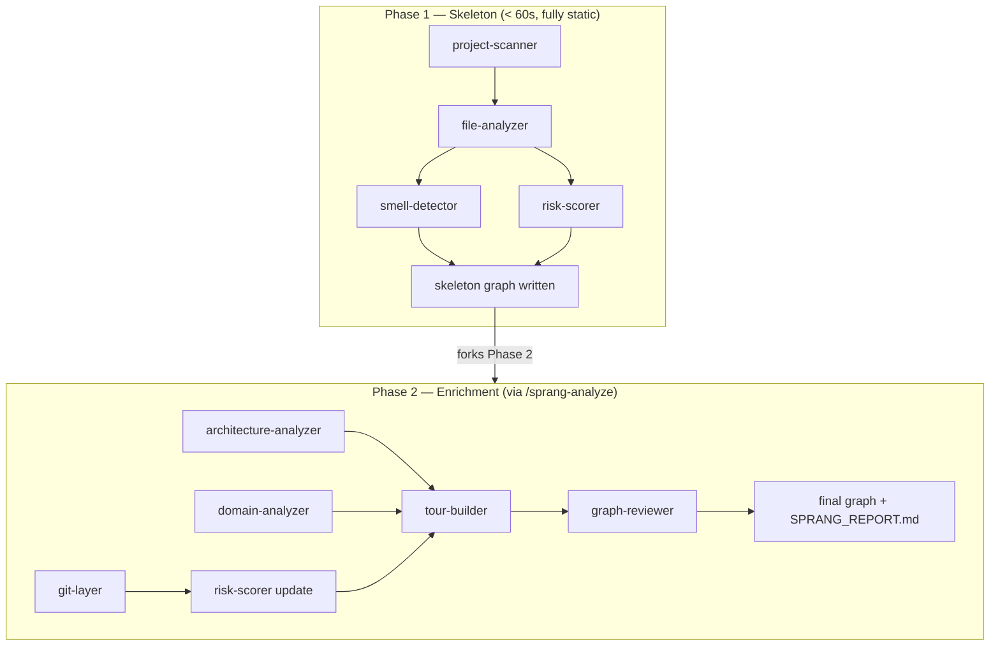
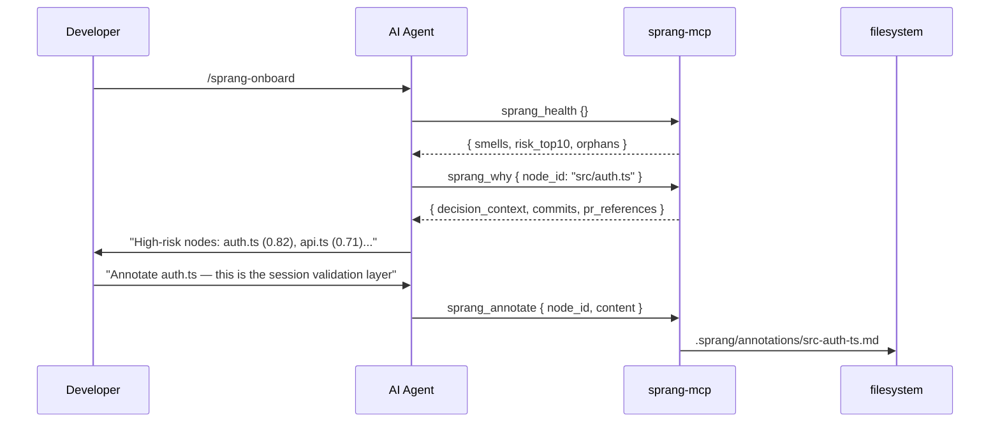

<!-- Hero banner — generated with Gemini gemini-3.1-flash-image-preview -->
<p align="center">
  
</p>

<p align="center">
  
</p>

<p align="center">
  <strong>The qualitative leap in codebase comprehension.</strong><br/>
  <em>Det qualitative Spring — Kierkegaard</em>
</p>

<p align="center">
  <a href="#installation"></a>
  <a href="#mcp-tools"></a>
  <a href="#slash-commands"></a>
  
  
  
  
</p>

---

Sprang is a knowledge graph platform for [Windsurf](https://windsurf.com) (Cascade / Devin Desktop), [Claude Code](https://claude.ai/code), and [GitHub Copilot](https://github.com/features/copilot) that creates **total comprehension** of codebases, knowledge bases, and document vaults — not just symbol search, but *why* code exists, *who* changed it, *what* it risks, and *how* it all fits together.

Your AI agent is the intelligence layer. Sprang is the memory. Together they answer **"what will break if I change this file?"** in a single tool call — and **"how does this codebase actually work?"** for anyone who just joined the team.

> *"The System knows everything about being, but nothing about existence."*  
> Kierkegaard's critique of Hegel applies equally to symbol indexers and grep tools.  
> Sprang bridges the gap: from static facts to living, contextual understanding.

---

## The Leap

*Det qualitative Spring* — the qualitative leap — is Kierkegaard's name for a discontinuous jump in understanding: the kind that cannot be reached by incremental steps, no matter how many you take.

Symbol search finds **where** things are. Documentation says what they were meant to do. An LLM can explain individual files brilliantly — and still lose the plot at file 50, forget the conversation from yesterday, and have no way to answer the question that matters most: *what breaks if I change this, before I break it?*

These answers require different infrastructure — one that understands the codebase **before** your agent starts working, persists that understanding across sessions, and makes the hard questions answerable in a single tool call:

- *Why does this file exist?* → `sprang_why` reads git history, PR references, and team annotations
- *What breaks if I change it?* → `sprang_diff_impact` runs BFS over the full dependency graph
- *How risky is it?* → `sprang_health` surfaces blast radius × coupling × test gap × churn, scored 0–1
- *What does this codebase actually do?* → `/sprang-onboard` gives a persona-adaptive guided tour

The leap becomes repeatable. The graph persists. The context accumulates.

---

### Not just codebases

The same infrastructure works for knowledge bases: Obsidian vaults, Logseq databases, Dendron workspaces, Foam wikis, Zettelkasten archives, or any folder of markdown. Notes become nodes. Links become edges. Topic clusters emerge. The same Ask Agent panel, the same force-directed graph, the same guided reading order — just pointed at your notes instead of your code.

```bash
/sprang-knowledge /path/to/your/obsidian-vault
```

---

## Installation

> **Note:** Windsurf AI and Devin Desktop are the same product — Windsurf was rebranded as Devin Desktop. All instructions, skills, and workflows are identical for both. Both names appear in this README.

### Quick install (npm)

Install once, then use the `sprang` command in any project:

```bash
npm install -g @faviovazquez/sprang
```

> The package is published under the scoped name **`@faviovazquez/sprang`**, but the command it installs is just **`sprang`**.

```bash
cd my-project
sprang init            # writes .mcp.json → reopen Claude Code / Copilot to pick it up
sprang scan            # build the knowledge graph (Phase 1, ~15 s)
sprang open            # launch the dashboard at http://localhost:7777
```

The `sprang` npm package bundles the dashboard, MCP server, and CLI into a single tarball — no separate build step, no pnpm workspace, no Node version pinning beyond Node 22.

> **`npm install -g` vs `npx`?** Every command also runs without installing — `npx @faviovazquez/sprang scan`, `npx @faviovazquez/sprang open`, etc. But prefer the global install for `sprang init`: it writes the bundled MCP server's **absolute path** into your project's `.mcp.json`, and a global install keeps that path stable, whereas the `npx` cache path can be pruned by npm and silently break your MCP config. Global install also gives you the short `sprang …` command everywhere.

---

### Platform comparison

| Feature | Claude Code | Windsurf / Devin Desktop | GitHub Copilot |
|---|---|---|---|
| 9 MCP tools | ✅ `.mcp.json` (project) | ✅ global or per-project | ✅ Agent mode only |
| 11 slash commands | ✅ `.claude/commands/` | ✅ workflows + skills | ⚡ via skills |
| Always-on rules | ✅ `.claude/rules/` | ✅ `.devin/` + `.windsurf/rules/` | ⚡ `copilot-instructions.md` |
| Auto-loaded instructions | `CLAUDE.md` | `AGENTS.md` | `AGENTS.md` + `copilot-instructions.md` |
| Session hooks | ✅ stale graph warn + auto-refresh | — | — |
| Dashboard Ask Agent | ✅ `claude -p` with `--resume` | ✅ via cascade-messaging extension | ✅ `copilot --prompt` CLI |
| Conversation continuity | ✅ session ID in `.sprang/claude-session.json` | ✅ via `agent-conversation.md` | ✅ session ID in `.sprang/copilot-session.json` |

**Recommended:** Claude Code or Windsurf/Devin Desktop for the fullest experience. GitHub Copilot works with MCP tools in Agent mode but does not have session hooks.

---

### Claude Code

**Via the plugin marketplace (recommended)**

Run these two commands inside a Claude Code session:

```
/plugin marketplace add FavioVazquez/sprang
/plugin install sprang
```

The first command registers the GitHub repo as a local marketplace source (reads `.claude-plugin/marketplace.json`). The second installs the plugin. Then build the MCP server binary to unlock all 9 tools:

```bash
# Find and build in the plugin cache (the exact version path may differ)
cd "$(ls -d ~/.claude/plugins/cache/sprang/sprang/*/ | tail -1)"
pnpm install && pnpm build
```

Then run `/reload-plugins` inside Claude Code to activate the MCP server.

> **Note on skill names:** Plugin skills are namespaced by plugin name. After installation, commands are invoked as `/sprang:sprang`, `/sprang:sprang-onboard`, `/sprang:sprang-analyze`, etc. If you want the shorter unnamespaced form (`/sprang`, `/sprang-onboard`), copy the standalone files into your project (see the manual install below).

**What the plugin activates:**

| Component | What it does |
|---|---|
| `skills/` | 11 slash commands (namespaced: `/sprang:sprang`, `/sprang:sprang-onboard`, …) |
| `hooks/hooks.json` | Session start warns on stale graph; post-commit incremental refresh |
| `.mcp.json` (via `plugin.json`) | 9 MCP tools — started automatically using `${CLAUDE_PLUGIN_ROOT}` path |
| `CLAUDE.md` | Claude Code project instructions — read automatically on every session open |

**Or manually copy into your project** (gives unnamespaced `/sprang`, `/sprang-onboard` commands):

```bash
SPRANG_DIR=~/.sprang/repo   # wherever install.sh cloned to, or your local clone
cp "$SPRANG_DIR/.mcp.json" .
cp "$SPRANG_DIR/CLAUDE.md" .
cp "$SPRANG_DIR/AGENTS.md" .
cp -r "$SPRANG_DIR/.claude" .
```

Then update `.mcp.json` → `args` to point to the absolute server path: `"$SPRANG_DIR/packages/mcp/dist/server.js"`.

**What Claude does automatically** (once rules are active):

- **Before editing any file** — calls `sprang_node` to check `risk_score` and `structural_warnings`
- **On high-risk files (risk > 0.7)** — calls `sprang_why` to read decision context and team annotations before changing anything
- **After every change** — calls `sprang_diff_impact` with changed files to assess blast radius
- **On session open** — warns if the graph is missing or stale vs. current git HEAD
- **After git commits** — silently triggers an incremental Phase 1 graph refresh in the background

To build the knowledge graph after install:

```
/sprang:sprang           # via plugin (namespaced)
/sprang                  # via manual copy (unnamespaced)
/sprang:sprang-onboard   # guided architecture tour (via plugin)
```

---

### GitHub Copilot

**Via `gh skill install` (recommended, requires [GitHub CLI 2.90.0+](https://cli.github.com/))**

```bash
gh skill install FavioVazquez/sprang
```

This installs Sprang's skills into `~/.copilot/skills/`, making them available across all your Copilot sessions. Then build the MCP server to enable the 9 tools:

```bash
# Clone (or update) and build — only needed once
git clone https://github.com/FavioVazquez/sprang.git ~/.sprang/repo
cd ~/.sprang/repo && pnpm install && pnpm build
```

Copy `.vscode/mcp.json` into your project and update the path, then open VS Code with Copilot in **Agent mode**:

```bash
mkdir -p .vscode
cp ~/.sprang/repo/.vscode/mcp.json .vscode/mcp.json
# Edit .vscode/mcp.json → set the absolute path to ~/.sprang/repo/packages/mcp/dist/server.js
```

**Or clone manually (without gh skill):**

```bash
git clone https://github.com/FavioVazquez/sprang.git ~/.sprang/repo
cd ~/.sprang/repo && pnpm install && pnpm build
```

Open VS Code with Copilot, switch to **Agent mode** (the model selector in the chat panel), and `.vscode/mcp.json` auto-connects the MCP server when placed in your project root.

**What activates:**

| File | What it does |
|---|---|
| `~/.copilot/skills/sprang*/` | Skills installed globally — Copilot loads them in all sessions |
| `.vscode/mcp.json` | MCP server — auto-connects in Agent mode (place in your project root) |
| `.github/copilot-instructions.md` | Pre-edit checklist: check risk score before editing, blast radius after — auto-loaded by Copilot in every session |
| `AGENTS.md` | Universal cross-platform instructions — both Windsurf/Devin Desktop and GitHub Copilot read this automatically |

> MCP tools only work in Copilot **Agent mode** — not the default ask/edit modes.

**What Copilot does automatically:**

- **Every session** — reads `AGENTS.md` and `.github/copilot-instructions.md`; the pre-edit checklist reminds it to call `sprang_node` before editing and `sprang_diff_impact` after
- **In Agent mode** — 9 MCP tools available directly; Copilot can call `sprang_health`, `sprang_why`, `sprang_diff_impact`, etc. without being asked

**Dashboard Ask Agent** — the Sprang dashboard auto-detects the `copilot` CLI and can route questions through it non-interactively. Uses `--resume=<session_id>` for conversation continuity. Session stored in `.sprang/copilot-session.json`.

> Copilot has a shallower integration than Claude Code or Windsurf — no session hooks that fire automatically, and MCP tools require Agent mode. The pre-edit instructions still meaningfully change how Copilot approaches edits in a Sprang-enabled project.

---

### Windsurf / Devin Desktop — agentic install

Paste this prompt into Cascade or Devin. It handles everything: clones, builds, wires up the MCP server, copies slash commands, skills, and rules, runs the first scan, and starts the dashboard.

```
Please install the Sprang knowledge graph platform for this project.
Run all steps sequentially using terminal commands. Do not ask me for input between steps.

1. Clone Sprang to ~/tools/sprang, or pull latest if it already exists:
   if [ -d ~/tools/sprang ]; then
     git -C ~/tools/sprang pull --ff-only
   else
     git clone https://github.com/FavioVazquez/sprang.git ~/tools/sprang
   fi

2. Install dependencies and build all packages (run both in ~/tools/sprang):
   pnpm install
   pnpm build

3. Link the CLI globally so `sprang` works from any terminal.
   Run these commands in ~/tools/sprang/packages/cli:
     pnpm setup
     export PNPM_HOME="$HOME/.local/share/pnpm"
     export PATH="$PNPM_HOME:$PATH"
     pnpm link --global
   Verify: which sprang  (should print a path ending in /sprang)

4. Determine the two absolute paths you need:
   SPRANG_DIR = the absolute path where you cloned sprang (~/tools/sprang resolved)
   PROJECT_DIR = the absolute path of the current workspace root

   Write the MCP server config to ~/.codeium/windsurf/mcp_config.json.
   If the file already exists and has other mcpServers entries, merge — do not overwrite.
   The entry to add:
   {
     "mcpServers": {
       "sprang": {
         "command": "node",
         "args": ["SPRANG_DIR/packages/mcp/dist/server.js"],
         "env": { "SPRANG_ROOT": "PROJECT_DIR" }
       }
     }
   }
   Use the real resolved paths, not placeholders.

5. Copy rules, workflows, skills, and hooks into the current project:

   Rules — tell Cascade/Devin to use Sprang automatically:
     mkdir -p .devin/rules .windsurf/rules
     cp ~/tools/sprang/.devin/rules/sprang-context.md .devin/rules/
     cp ~/tools/sprang/.devin/rules/sprang-highrisk.md .devin/rules/
     cp ~/tools/sprang/.devin/rules/cascade-messaging.md .devin/rules/
     cp ~/tools/sprang/.windsurf/rules/sprang-context.md .windsurf/rules/
     cp ~/tools/sprang/.windsurf/rules/sprang-highrisk.md .windsurf/rules/
     cp ~/tools/sprang/.windsurf/rules/cascade-messaging.md .windsurf/rules/

   Hooks — enable persistent dashboard chat (conversation history):
     cp ~/tools/sprang/.devin/hooks.json .devin/hooks.json
     mkdir -p .windsurf/hooks
     cp ~/tools/sprang/.windsurf/hooks.json .windsurf/hooks.json
     cp ~/tools/sprang/.windsurf/hooks/save-conversation.py .windsurf/hooks/save-conversation.py

   Devin Desktop MCP config — write .devin/config.json using the ACTUAL resolved SPRANG_DIR path
   from step 4 (do NOT copy the repo template — it has a relative path that won't resolve):
     cat > .devin/config.json << 'DEVIN_EOF'
     {
       "mcpServers": {
         "sprang": {
           "command": "node",
           "args": ["SPRANG_DIR/packages/mcp/dist/server.js"],
           "env": { "SPRANG_ROOT": "${workspaceFolder}" }
         }
       }
     }
     DEVIN_EOF
   Replace SPRANG_DIR in that file with the real absolute path (e.g. /home/yourname/tools/sprang).

   Workflows — all /sprang-* slash commands for Windsurf / Cascade:
     mkdir -p .windsurf/workflows
     cp ~/tools/sprang/.windsurf/workflows/*.md .windsurf/workflows/

   Skills — same /sprang-* commands for Devin Desktop:
     mkdir -p .windsurf/skills
     cp -r ~/tools/sprang/.windsurf/skills/sprang* .windsurf/skills/

   Symlinks so both Windsurf and Devin find them:
     ln -sf ../.windsurf/workflows .devin/workflows
     ln -sf ../.windsurf/skills .devin/skills

6. Run the initial scan of this project (Phase 1 — fully static, under 60s):
   sprang scan . --phase1-only
   (If `sprang` is not yet in PATH, use: node ~/tools/sprang/packages/cli/dist/index.js scan . --phase1-only)

7. Start the dashboard:
   SPRANG_ROOT="PROJECT_DIR" pnpm --filter @sprang/dashboard preview
   Dashboard will be at http://localhost:7777

8. Install the cascade-messaging VS Code extension (enables persistent dashboard chat):
   if ! windsurf --list-extensions 2>/dev/null | grep -q cascade-messaging; then
     windsurf --install-extension ~/tools/sprang/cascade-messaging-0.1.0.vsix 2>/dev/null || \
     code --install-extension ~/tools/sprang/cascade-messaging-0.1.0.vsix 2>/dev/null || \
     echo "Manual install: Extensions → Install from VSIX → ~/tools/sprang/cascade-messaging-0.1.0.vsix"
   fi

9. Report what was installed and where. Then tell me:
   "Please reload the window now (Cmd/Ctrl+Shift+P → Reload Window) so the MCP server
   and cascade-messaging extension activate.
   Dashboard is live at http://localhost:7777.
   Once reloaded, type /sprang-onboard to begin."
```

> After the agent finishes, **reload the window** (`Cmd/Ctrl+Shift+P` → *Reload Window*), then type `/sprang-onboard`. Dashboard is at **http://localhost:7777**.

---

### Installer script

For scripted or manual setup on any platform:

```bash
# macOS / Linux
curl -fsSL https://raw.githubusercontent.com/FavioVazquez/sprang/main/install.sh | bash -s windsurf
# Options:  windsurf  |  copilot  |  claude
```

```powershell
# Windows (PowerShell)
irm https://raw.githubusercontent.com/FavioVazquez/sprang/main/install.ps1 | iex
# Options:  .\install.ps1 windsurf  |  .\install.ps1 copilot  |  .\install.ps1 claude
```

```bash
# If you already have the repo cloned:
./install.sh windsurf     # symlinks 11 skills into ~/.windsurf/skills/
./install.sh copilot      # symlinks 11 skills into ~/.copilot/skills/
./install.sh claude       # prints per-project setup guide
./install.sh --update     # pull latest + rebuild
./install.sh --uninstall windsurf
```

| Flag | Skills target | Platform |
|---|---|---|
| `windsurf` | `~/.windsurf/skills/` | Windsurf AI / Devin Desktop |
| `copilot` | `~/.copilot/skills/` | GitHub Copilot (or use `gh skill install FavioVazquez/sprang`) |
| `claude` | project-local | Claude Code (plugin marketplace or manual copy — see guide printed by installer) |

---

## Contents

- [The Leap](#the-leap)
- [Installation](#installation)
- [What Sprang does](#what-sprang-does)
- [Workflows in practice](#workflows-in-practice)
- [Platform architecture](#platform-architecture)
- [Prerequisites](#prerequisites)
- [Manual build](#manual-build)
- [CLI usage](#cli-usage)
- [Windsurf / Devin Desktop — detailed setup](#windsurf--devin-desktop--detailed-setup)
- [Ask Agent (dashboard chat)](#ask-agent-dashboard-chat)
- [Slash commands](#slash-commands)
- [Two-phase pipeline](#two-phase-pipeline)
- [The three differentiating agents](#the-three-differentiating-agents)
- [MCP tools](#mcp-tools)
- [Dashboard](#dashboard)
- [Knowledge graphs](#knowledge-graphs)
- [Graph schema](#graph-schema)
- [Live watcher](#live-watcher)
- [Development](#development)
- [Configuration](#configuration)
- [Attributions](#attributions)
- [Troubleshooting](#troubleshooting)

---

## What Sprang does

<!-- Dashboard mockup — generated with Gemini gemini-3.1-flash-image-preview -->
<p align="center">
  
  <em>Force-directed knowledge graph, risk heatmap, node detail panel with decision context, and guided tour player.</em>
</p>

Sprang gives your AI agent a persistent memory of the codebase — not just file names and symbols, but the full context of *why* things exist, *who* changed them, *what* they risk, and *how* they connect.

### One-call answers

```
# "What will break if I change auth.ts?"
sprang_diff_impact { files: ["src/auth.ts"] }
→ 14 impacted nodes, top risk: api-gateway.ts (0.91), session.ts (0.78)

# "Why does this file exist?"
sprang_why { node_id: "src/auth.ts" }
→ 23 commits, 3 authors, PR #441 "add JWT refresh flow", churn: 8/90d

# "Show me the riskiest parts of this codebase"
sprang_health {}
→ god_node: 2, circular_dependency: 1, unstable_interface: 3
  top risk: auth.ts (0.82), api.ts (0.71), db/pool.ts (0.68)

# "Walk me through the architecture"
/sprang-onboard
→ 8-step guided tour, persona-adaptive (non-technical / pm / junior / senior)
```

### Capabilities

| Capability | How |
|---|---|
| **Git decision context** | `git-layer` — who changed each file, why, PR references, change frequency |
| **Code smell detection** | `smell-detector` — deterministic heuristics, zero LLM calls |
| **Function call graph** | `file-analyzer` — function-to-function `calls` edges, internal/external call counts, unused-function detection |
| **Design pattern detection** | 9 patterns — singleton, factory, observer, strategy, decorator, react_hook, context_provider, event_emitter, dependency_injection |
| **Layer violation detection** | `architecture-analyzer` — flags lower layers importing from higher ones (e.g. data → ui) |
| **Risk scoring** | `risk-scorer` — blast radius × coupling × test gap × churn, 0.0–1.0 per node |
| **Instant point-and-analyze** | Dashboard landing screen — type a local path or paste a GitHub URL, Phase 1 runs with no agent and no API key |
| **Guided tours** | `tour-builder` — BFS-ordered pedagogical paths through the codebase |
| **Domain map** | `domain-analyzer` — directory cohesion clustering into named business layers |
| **Blast-radius diff** | `sprang_diff_impact` — BFS over the graph before any edit, risk-ranked |
| **Team annotations** | `sprang_annotate` — write `.sprang/annotations/<id>.md`, committed to the repo |
| **Knowledge graphs** | `/sprang-knowledge` — Obsidian / Logseq / Dendron / Foam / Zettelkasten / plain markdown |
| **11 slash commands** | Full workflow coverage for Windsurf/Devin Desktop and Claude Code |
| **9 MCP tools** | Direct graph access — all agents read and write the graph via MCP |
| **< 60s skeleton** | Phase 1 is fully static — runs anywhere, no network, no waiting |
| **Architecture card view** | React Flow + ELK layer map — one card per layer, weighted cross-layer edges |
| **Structural fingerprinting** | SHA-256 + signature extraction — SKIP/COSMETIC/STRUCTURAL per file |
| **Language lessons** | 12 programming pattern detectors attached to tour steps and graph nodes |
| **Semantic search** | Cosine similarity + TF-IDF fallback — `sprang_query mode:"semantic"` |
| **Auto-update hooks** | `sprang install-hooks` or native Claude Code hooks — incremental refresh after every commit |
| **12 languages** | TypeScript, JavaScript, Python, Go, Rust, Java, Kotlin, Ruby, PHP, C, C++, C# — plus Markdown for knowledge graphs |
| **Live dashboard** | Sigma.js force-directed graph, risk heatmap, diff overlay, BFS pathfinder, tour player |

### What existing tools don't do

| | Sprang | Grep / LSP | LLM context | Sourcegraph |
|---|---|---|---|---|
| Locate code | ✅ | ✅ | ✅ | ✅ |
| WHY this file exists | ✅ git history + annotations | — | sometimes | — |
| Blast radius before an edit | ✅ BFS in one call | — | approximate | — |
| Risk score per node | ✅ deterministic formula | — | subjective | — |
| Persistent across sessions | ✅ graph on disk | ✅ files | ❌ ephemeral | ✅ |
| Agent-readable (MCP) | ✅ 9 tools | — | via context | partial |
| Works offline, no API key | ✅ Phase 1 | ✅ | ❌ | ❌ |
| Knowledge bases (Obsidian etc.) | ✅ | — | — | — |
| Team annotations committed to repo | ✅ | — | — | ✅ (notebooks) |

The key insight: **your AI agent is already excellent at reasoning — it just needs the right data**. Sprang provides that data layer so the agent doesn't have to reconstruct it from scratch on every conversation.

---

## Workflows in practice

### Day 1 at a new company

```bash
# Build the skeleton in 60 seconds — no API key needed
sprang scan . --phase1-only

# Open the dashboard
sprang open .

# Ask for a guided architecture tour
/sprang-onboard
# → 8-step tour, adapts to your role (junior / senior / PM / non-technical)

# Find the highest-risk areas before you touch anything
/sprang-health
# → health grade B, top risks: auth.ts (0.82), api-gateway.ts (0.71)
# → circular dependency: services/cache.ts ↔ services/session.ts
```

### Before refactoring a module

```bash
# Check what depends on the file you want to change
sprang_diff_impact { files: ["src/payments/processor.ts"] }
# → 18 impacted nodes. High risk: checkout.ts (0.88), invoice.ts (0.79)

# Read the git history before touching anything
sprang_why { node_id: "src/payments/processor.ts" }
# → 31 commits, PR #892 "stripe 3DS — do not simplify retry logic"
#    12 changes in 90 days, 2 primary authors

# Ask why it's built the way it is
/sprang-chat "Why is the retry logic in processor.ts so complex?"
# → "PR #892 added Stripe 3DS authentication. The retry loop handles partial auth states
#    that Stripe returns mid-payment. Simplifying it would break 3DS flows."
```

### PM review — "what does the checkout service do?"

```bash
# Explore the business domain without reading code
/sprang-domain checkout
# → Domain: Checkout
#   Flows: product_selection → cart_management → payment_processing → confirmation
#   Entry points: CartService, CheckoutController, PaymentGateway

# Non-technical persona tour
/sprang-onboard
# → "Selecting non-technical mode..."
#   Step 1: What Checkout does in plain English
#   Step 2: The 4 flows that make up a transaction
#   Step 3: What the team considers risky (and why)
```

### Reviewing a risky PR

```bash
# See what the PR touches and how risky those files are
/sprang-diff src/auth/session.ts src/auth/jwt.ts
# → diff-overlay written → open dashboard → amber nodes show impact zone

sprang_diff_impact { files: ["src/auth/session.ts", "src/auth/jwt.ts"] }
# → 22 impacted nodes. session.ts risk: 0.87 → review carefully
#   Downstream: api-gateway.ts, user-service.ts, admin-panel.ts

sprang_why { node_id: "src/auth/session.ts" }
# → 14 changes in 90 days, 4 authors, PR #321 "enterprise SSO session timeout"
#    Note: changes here broke SSO twice before (see annotation)
```

### Exploring an Obsidian vault

```bash
/sprang-knowledge /path/to/your/vault
# → 847 notes, 2,341 connections, 12 topic clusters

sprang open /path/to/vault
# → Force-directed graph of all your notes
# → Color by topic cluster
# → Click any note to see backlinks, frontmatter, tags
# → ReadingPanel: scroll the full article in the sidebar

# Find conceptual neighbors you didn't know were connected
sprang query "regularization techniques" --semantic
# → L2 weight decay, dropout, batch normalization, early stopping, data augmentation
```

---

## Platform architecture

<!-- Architecture diagram — generated with Gemini gemini-3.1-flash-image-preview -->
<p align="center">
  
  <em>Four packages. One data layer. Your AI agent is the intelligence; Sprang is the memory.</em>
</p>

```
packages/
├── core/       Pipeline: 9 agents, schema, watcher, graph store, fingerprinting, semantic search
├── cli/        sprang scan | health | query | watch | status | install-hooks | merge | open | diagram
├── mcp/        stdio MCP server — 9 tools for all AI platforms
└── dashboard/  React + Vite + Sigma.js — 7 views (Graph/Health/Domains/Architecture/Treemap/Matrix/Learn)
```


---

## Prerequisites

### Required

| Tool | Min version | Install | Why |
|---|---|---|---|
| **Node.js** | 20 | [nodejs.org](https://nodejs.org/) or `nvm install 20` | Runs the CLI, MCP server, and dashboard |
| **pnpm** | 10 | `npm install -g pnpm` or `corepack enable && corepack prepare pnpm@latest` | Package manager (enforced in `package.json`) |
| **Git** | 2.x | [git-scm.com](https://git-scm.com/) | `git-layer` agent reads commit history; scan works without it but decision context is unavailable |
| **Python 3** | 3.8 | Pre-installed on macOS/Linux; [python.org](https://www.python.org/) on Windows | `merge.py` assembles chunk files into `knowledge-graph.json`; Windsurf hook `save-conversation.py` uses it too. No third-party packages — stdlib only. |

Verify your environment:

```bash
node --version    # must be v20.x or higher
pnpm --version    # must be 10.x or higher
git --version     # any modern version
python3 --version # 3.8 or higher (python3 on macOS/Linux, python on Windows)
```

### Platform-specific

| Tool | Required for | Install |
|---|---|---|
| **GitHub CLI 2.90.0+** (`gh`) | `gh skill install` (Copilot) | [cli.github.com](https://cli.github.com/) |
| **Playwright Chromium** | e2e tests only — not for using the platform | Auto-installed by `pnpm --filter @sprang/dashboard test:e2e` |

### No API key needed

Sprang does not call any AI API directly. The LLM is your agent (Claude Code, Windsurf / Cascade, or Copilot) — it reads the knowledge graph through MCP tools and applies its own intelligence. Phase 1 (static analysis) runs fully offline.

---

## Manual build

If you've cloned the repo and want to build without using the installer:

```bash
cd ~/tools/sprang   # or wherever you cloned to

pnpm install        # install all dependencies
pnpm build          # build all packages

# Link the CLI globally
cd packages/cli
pnpm setup
export PNPM_HOME="$HOME/.local/share/pnpm"
export PATH="$PNPM_HOME:$PATH"
pnpm link --global
cd ../..

which sprang        # verify: should print $PNPM_HOME/sprang
sprang --version    # 0.2.1
```

```bash
# Start the dashboard (serves pre-built dist/, instant startup)
SPRANG_ROOT="/path/to/your/project" pnpm --filter @sprang/dashboard preview
# Open http://localhost:7777
```

---

## CLI usage

```bash
# Phase 1 — static analysis, < 60s, builds the skeleton graph
sprang scan /path/to/your/project --phase1-only

# Full scan — Phase 1 now + Phase 2 enrichment via your AI agent
sprang scan /path/to/your/project

# Skip scan if graph is already current (compares git HEAD vs stats.gitCommitHash)
sprang scan . --phase1-only --if-stale

# Install a post-commit git hook that auto-refreshes the graph after each commit
sprang install-hooks

# Check graph age, phase, and node/edge count
sprang status

# Print health report: smells, risk table, orphans, circular deps
sprang health

# Search nodes by name or summary
sprang query "authentication"
sprang query "authentication" --semantic   # cosine similarity over TF-IDF embeddings

# Watch for file changes and incrementally update the graph
sprang watch

# Open the dashboard for any local folder — shows landing screen if no graph yet
sprang open /path/to/any/project
sprang open /path/to/any/project --port 8080
# Auto-trigger Phase 1 scan without clicking the button
sprang open /path/to/any/project --auto-scan
# Or open standalone — dashboard landing lets you type a path or paste a GitHub URL
sprang open

# Generate a Mermaid architecture diagram from the graph
sprang diagram
sprang diagram --output architecture.md
```

Output written to `.sprang/` in your project root:

```
your-project/
└── .sprang/
    ├── knowledge-graph.json   ← main graph (nodes, edges, risk scores, smells)
    ├── SPRANG_REPORT.md       ← human-readable architecture summary
    ├── annotations/           ← agent-written node annotations (commit these)
    ├── config.json            ← optional thresholds + excludes
    └── intermediate/          ← Phase 2 progress (gitignored)
```

---

## Windsurf / Devin Desktop — detailed setup

The fastest path is the [agentic install prompt](#installation) above. For manual step-by-step control:

### 1 — Build and scan

```bash
cd ~/tools/sprang && pnpm install && pnpm build
sprang scan /path/to/your/project --phase1-only
```

### 2 — Add the MCP server

For **Windsurf** — add to `~/.codeium/windsurf/mcp_config.json` (merge if the file exists):

```json
{
  "mcpServers": {
    "sprang": {
      "command": "node",
      "args": ["/absolute/path/to/sprang/packages/mcp/dist/server.js"],
      "env": { "SPRANG_ROOT": "/absolute/path/to/your/project" }
    }
  }
}
```

> `${workspaceFolder}` is **not** resolved in this file — use full absolute paths.

For **Devin Desktop** — add to `.devin/config.json` in your project root instead:

```json
{
  "mcpServers": {
    "sprang": {
      "command": "node",
      "args": ["/absolute/path/to/sprang/packages/mcp/dist/server.js"],
      "env": { "SPRANG_ROOT": "${workspaceFolder}" }
    }
  }
}
```

> In `.devin/config.json`, `${workspaceFolder}` **is** resolved automatically.

### 3 — Copy workflows, skills, and rules

```bash
mkdir -p .windsurf/workflows .windsurf/skills .windsurf/rules .devin/rules
cp /path/to/sprang/.windsurf/workflows/*.md .windsurf/workflows/
cp -r /path/to/sprang/.windsurf/skills/sprang* .windsurf/skills/
cp /path/to/sprang/.devin/rules/*.md .devin/rules/
cp /path/to/sprang/.windsurf/rules/*.md .windsurf/rules/
ln -sf ../.windsurf/workflows .devin/workflows
ln -sf ../.windsurf/skills .devin/skills
```

### 4 — Start the dashboard

```bash
SPRANG_ROOT="$(pwd)" pnpm --filter @sprang/dashboard preview
# Opens at http://localhost:7777
```

> **Open in your system browser (Chrome/Firefox) at http://127.0.0.1:7777 — not the IDE's embedded preview.** The embedded Windsurf/Devin proxy does not forward `/knowledge-graph.json` and other middleware routes.

> **Important — start the server from a Windsurf / Devin Desktop terminal.**
> Bridge detection uses three signals (any one is sufficient):
> 1. `WINDSURF_CASCADE_TERMINAL_KIND` env var — automatically present in all IDE terminals
> 2. `.sprang/.cascade-bridge-active` — written by the cascade-messaging extension on activation (works even if the server was started outside the IDE)
> 3. `.cascade-trigger-session` exists — legacy fallback
>
> If the server is started outside the IDE (e.g. via SSH without the env) and the extension hasn't written the marker yet, the bridge falls through to Claude Code or Copilot CLI if those are installed.

### 5 — Install the cascade-messaging extension

Enables persistent chat from the Sprang dashboard with context across Cascade sessions.

```bash
windsurf --list-extensions 2>/dev/null | grep -q cascade-messaging && echo "already installed" || \
  windsurf --install-extension /path/to/sprang/cascade-messaging-0.1.0.vsix
```

Or: **Extensions** → **Install from VSIX** → `cascade-messaging-0.1.0.vsix`.

### 6 — Reload and run onboarding

Reload (`Cmd/Ctrl+Shift+P` → *Reload Window*) to activate the MCP server, then:

```
/sprang-onboard
```

### What the agent does automatically

With `.devin/rules/` files present, your agent will:

- **Before editing any file** — call `sprang_node` to check `risk_score` and `structural_warnings`
- **On high-risk files (risk > 0.7)** — call `sprang_why` to read decision context first
- **After changes** — call `sprang_diff_impact` to assess blast radius

Driven by `sprang-context.md` (always-on) and `sprang-highrisk.md` (glob: `*.ts`, `*.tsx`, `packages/*/src`).

---

## Ask Agent (dashboard chat)

The **Ask Agent** panel in the Sprang dashboard lets you ask questions about your codebase and see answers inline — routed through whichever AI agent is active. The bridge auto-detects the available agent at each request.

### Bridge priority

| Priority | Agent | How it works |
|---|---|---|
| 1 | **Windsurf / Devin Desktop** | Writes to `.cascade-trigger-session` — the `cascade-messaging` VS Code extension forwards it to Cascade (the Windsurf AI), which calls `sprang_respond` MCP tool to write the reply. Async (poll). |
| 2 | **Claude Code** (`claude` CLI) | Spawns `claude -p "<question>" --output-format json` non-interactively. Session ID persisted to `.sprang/claude-session.json` — resumes previous conversation via `--resume`. Sync. |
| 3 | **GitHub Copilot CLI** (`copilot`) | Spawns `copilot --prompt "<question>" --output-format json` non-interactively. Uses `--resume=<session-id>` for session continuity once a session exists. Sync. |
| — | **None** | Panel shows instructions to install one of the above. |

The active bridge is shown below the "Ask Agent" header (`via Claude Code`, `via Copilot CLI`, `via Windsurf`).

### Session files (gitignored)

| File | Purpose |
|---|---|
| `.sprang/cascade-response.json` | Response written by `sprang_respond` MCP tool or by the CLI bridge; polled by dashboard |
| `.sprang/claude-session.json` | Persisted Claude Code session ID for `--resume` |
| `.sprang/copilot-session.json` | Persisted Copilot CLI session ID for `--resume=<id>` |
| `.cascade-trigger-session` | Written by dashboard Windsurf bridge, read by cascade-messaging extension |

### Windsurf / Devin Desktop setup

| Setting | Default | Description |
|---|---|---|
| `cascade-messaging.triggerFile` | `.cascade-trigger-session` | Trigger file path relative to workspace root |
| `cascade-messaging.autoStart` | `true` | Start watcher automatically on activation |

> **Important:** the `SPRANG_ROOT` in `~/.codeium/windsurf/mcp_config.json` and the `SPRANG_ROOT` you pass to `pnpm preview` must point at the **same project**. The MCP server writes `cascade-response.json` to `SPRANG_ROOT/.sprang/` and the dashboard reads it from the same path. If they differ, responses will be written to one project but never appear in the other's dashboard. Update `mcp_config.json` and restart the MCP server whenever you switch projects.

---

## Slash commands

Available in Windsurf / Cascade, Devin Desktop, and Claude Code:

| Command | Description |
|---|---|
| `/sprang` | Build or refresh the knowledge graph — auto-detects codebase vs knowledge base |
| `/sprang-analyze [path] [--full] [--language <lang>] [--chunk N]` | Full AI-driven analysis — summaries, layers, tour, risk |
| `/sprang-knowledge [path] [--format obsidian\|logseq\|...] [--full]` | Build knowledge graph from markdown notes |
| `/sprang-chat <question>` | Ask any question about the codebase |
| `/sprang-explain <file>` | Deep-dive: what, why, who, risk, history for a file or function |
| `/sprang-onboard` | Guided architecture tour — adapts to persona (non-technical / pm / junior / senior) |
| `/sprang-diff [files...]` | Blast radius analysis — writes diff overlay for dashboard |
| `/sprang-domain [name]` | Explore business domain architecture and flows |
| `/sprang-why <file>` | Git history + rationale + team annotations for a file |
| `/sprang-health` | Full health report: risk, smells, orphans, circular deps |
| `/sprang-team [node]` | Browse/write team annotations with staleness detection |

---

## Two-phase pipeline

<!-- Pipeline diagram — generated with Gemini gemini-3.1-flash-image-preview -->
<p align="center">
  
  <em>Phase 1 is fully static — runs in under 60 seconds, no network calls. Phase 2 is driven by your AI agent.</em>
</p>



**Your AI agent is the intelligence layer.** Phase 2 enrichment is performed by the agent using its own context window — it reads the graph, writes summaries, and calls `sprang_annotate` to record what it learns. No external API.

---

## The three differentiating agents

<!-- Graph modes — generated with Gemini gemini-3.1-flash-image-preview -->
<p align="center">
  
  <em>Sprang supports two graph kinds — codebase analysis and markdown knowledge base indexing.</em>
</p>

### `git-layer` — Decision context from version history

```
git log --follow --format="%H|%ae|%ai|%s" -- <filepath>
   ↓
associate commits to nodes via line-range diff hunk headers
   ↓
node.decision_context: { commits, primary_authors, last_changed,
                          change_frequency, rationale_snippets, pr_references }
```

### `smell-detector` — 8 deterministic heuristics, no LLM calls

| Smell | Trigger |
|---|---|
| `god_node` | `out_degree > 20` OR cyclomatic_sum > 200 |
| `circular_dependency` | Johnson's cycle detection, cycles ≤ 6 nodes |
| `duplicate_logic` | Same param_count + complexity_bucket + ≥2 shared callers |
| `unclear_coupling` | Two modules share > 40% import targets, no direct edge |
| `low_cohesion` | Functions referenced by ≥3 distinct domains, < 50% same top domain |
| `unstable_interface` | change_frequency > 10/90d AND in_degree > 5 |
| `orphan_node` | in_degree=0 AND out_degree=0 AND not entry point |
| `over_connected` | total_degree (in + out) > 30 |

### `risk-scorer` — Composite formula

<!-- Risk formula — generated with Gemini gemini-3.1-flash-image-preview -->
<p align="center">
  
  <em>Deterministic. Every factor is traceable — risk_factors[] lists the exact contributors per node.</em>
</p>

```
risk_score = clamp(
  blast_radius  × 0.35   ← BFS reachable dependents / total nodes
  + coupling    × 0.25   ← (in+out degree)/40, +0.2 if in cycle
  + test_gap    × 0.25   ← 0.0 if tested, 0.5+blast×0.5 if not
  + churn       × 0.15,  ← change_frequency/20
  0.0, 1.0
)
```

---

## MCP tools

<!-- MCP tools reference — generated with Gemini gemini-3.1-flash-image-preview -->
<p align="center">
  
</p>

| Tool | Input | Output |
|---|---|---|
| `sprang_node` | `{ node_id }` | Full node + 1-hop neighbors + layer + in/out degree + annotation status |
| `sprang_query` | `{ query, node_types?, limit?, mode? }` | Fuzzy or semantic-ranked nodes with summaries |
| `sprang_diff_impact` | `{ files: string[] }` | BFS blast-radius, risk-ranked impact list |
| `sprang_why` | `{ node_id }` | Decision context + git history + team annotation |
| `sprang_health` | `{}` | Health grade (A–F), score (0–100), security summary, top-10 risk, smells, orphans, circular deps, run history |
| `sprang_tour` | `{ tour_id?, persona? }` | Ordered pedagogical tour — persona: `junior` (all steps) / `senior` or `experienced` (skip intro) / `pm` (domain/service nodes) / `non-technical` (entry-points and domains only) |
| `sprang_domain` | `{ domain_name? }` | Business domain flows and entry points |
| `sprang_annotate` | `{ node_id, content, tags? }` | Write `.sprang/annotations/<id>.md` |
| `sprang_respond` | `{ response, question? }` | Write response to `.sprang/cascade-response.json` for dashboard display |

`sprang_query` accepts `mode: "semantic"` for cosine similarity search over TF-IDF embeddings.

### Tour personas

`sprang_tour` and `/sprang-onboard` support four audience personas. The dashboard **PersonaSelector** sets the active persona for the Learn view.

| Persona | Alias | Audience | Tour filter |
|---|---|---|---|
| `junior` | — | Developer new to this codebase | All steps with language lessons |
| `senior` | `experienced` | Experienced engineer | Skips the introductory step, focuses on coupling and risk |
| `pm` | — | Product manager | Domain and service nodes only — business capability focus |
| `non-technical` | — | Executive / business stakeholder | Entry-points and domain nodes only — no implementation details |

**Default:** `junior` when no persona is specified.

### Health grade (v0.2.1)

`sprang_health` now returns a letter grade (A–F) computed from five deterministic penalty categories:

| Penalty | Max | Trigger |
|---|---|---|
| `dead_code_penalty` | 20 pts | orphan nodes (isolated — no imports, not an entry point) |
| `circular_penalty` | 20 pts | circular dependency chains |
| `god_node_penalty` | 15 pts | god_node smells (out_degree > 20) |
| `coupling_penalty` | 15 pts | over_connected smells (total_degree > 30) |
| `security_penalty` | 20 pts | hardcoded secrets, SQL injection, XSS patterns, and 5 other regex categories |

```
health_score = 100 − Σ(penalties)   → A ≥ 90, B ≥ 80, C ≥ 70, D ≥ 60, F < 60
```

`security_summary` groups findings by severity (high / medium / low) and by category (`hardcoded_secret`, `sql_injection`, `xss_risk`, `path_traversal`, `command_injection`, `weak_crypto`, `insecure_random`, `sensitive_data_exposure`). All 20 detection patterns are deterministic regex — no LLM calls.

`history` returns the last 30 `sprang_health` snapshots from `.sprang/intermediate/health-history.jsonl` so you can track whether code quality is improving or degrading over time.

### Enriched `sprang_node` response

```json
{
  "node": { "id": "...", "type": "file", "summary": "...", "risk_score": 0.72 },
  "neighbors": [{ "node_id": "...", "direction": "outgoing", "edge_type": "imports" }],
  "layer": { "id": "layer:services", "name": "Services" },
  "layer_mate_count": 7,
  "in_degree": 4,
  "out_degree": 11,
  "has_annotation": true,
  "annotation_path": ".sprang/annotations/src-auth-ts.md"
}
```

### Agent interaction flow



---

## Dashboard

> **Important:** always run these commands from the **Sprang monorepo directory** (`~/tools/sprang` or wherever you cloned it), not from your project directory. `SPRANG_ROOT` points at your project; the server lives in the Sprang repo.

```bash
# Production preview — pre-built dist/, instant startup — recommended for daily use
cd ~/tools/sprang
SPRANG_ROOT=/path/to/your/project pnpm --filter @sprang/dashboard preview
# Opens at http://localhost:7777

# Development — live reload (use when working on the dashboard itself)
cd ~/tools/sprang
SPRANG_ROOT=/path/to/your/project pnpm --filter @sprang/dashboard dev
# Opens at http://localhost:7338
```

**Which one to use?**
- **`preview`** — use this for normal codebase analysis. Serves the pre-built `dist/` folder, starts instantly, port `7777`. **After pulling a Sprang update you must rebuild before restarting preview** — see below.
- **`dev`** — use this only if you are modifying dashboard source code. Vite hot-reloads source changes automatically, port `7338`. No rebuild needed for source changes, but the `/knowledge-graph.json` middleware still reads from `SPRANG_ROOT` at runtime — it always serves the latest graph on disk.

**After pulling a Sprang update — rebuild before using `preview`:**
```bash
cd ~/tools/sprang
git pull --ff-only
pnpm install && pnpm build   # rebuilds dist/ — required for preview to pick up changes
SPRANG_ROOT=/path/to/your/project pnpm --filter @sprang/dashboard preview
```

> **`dev` vs `preview` and the knowledge graph:** Both modes read `SPRANG_ROOT/.sprang/knowledge-graph.json` live from disk via the Vite middleware — they always show the latest graph without any rebuild. The difference is only in the dashboard UI code itself: `preview` serves the last compiled `dist/`, `dev` compiles on the fly.

> **Open in your system browser, not the IDE's embedded browser.** Windsurf/Devin Desktop's embedded preview proxy (`127.0.0.1:4xxxx`) does not forward the custom middleware routes (`/knowledge-graph.json`, `/bridge-status`, etc.). Always open **http://127.0.0.1:7777** directly in Chrome or Firefox.

### Instant analysis — point and go (no agent, no API key)

Open the dashboard on a project that has not been scanned yet and you land on an analyze screen: type a local path or paste a GitHub URL and Phase 1 runs immediately — fully static, under 60 seconds, no agent and no API key. GitHub repos are shallow-cloned to a temp folder and never stored.

```bash
sprang open                            # standalone — type any path or paste a GitHub URL
sprang open /path/to/project --auto-scan   # start Phase 1 the moment the browser opens
```

The single input auto-detects local path vs. GitHub URL (`github.com/owner/repo`, `owner/repo`, or the full URL) and shows a live `Local` / `GitHub` badge. This is the zero-friction entry point — Phase 2 enrichment (semantic summaries, decision context, risk) then layers in via your agent. Once a graph is loaded, the **New analysis** button in the nav returns you to this screen to analyze another project.

### Views

| View | Key | Description |
|---|---|---|
| **Graph** | `g` / `1` | Sigma.js force-directed canvas — risk heatmap, layer filter, diff overlay, BFS pathfinder |
| **Health** | `h` / `2` | Smell breakdown, top-10 risky nodes, circular deps, orphan count |
| **Domains** | `d` / `3` | Business domain explorer — list view + React Flow layout toggle |
| **Architecture** | `a` / `4` | React Flow + ELK layer map — one card per layer, weighted cross-layer edge count |
| **Treemap** | `t` / `5` | D3 treemap — file/folder hierarchy sized by lines, colored by risk score |
| **Matrix** | `m` / `6` | Adjacency matrix — file-to-file dependency grid, sorted by layer rank |
| **Learn** | `l` / `7` | Persona-adaptive guided tour with language lessons per step |

### Keyboard shortcuts

| Key | Action |
|---|---|
| `Cmd/Ctrl+K` | Open node search |
| `Esc` | Close panel / search |
| `g` / `1` | Graph view |
| `h` / `2` | Health view |
| `d` / `3` | Domains view |
| `a` / `4` | Architecture view |
| `t` / `5` | Treemap view |
| `m` / `6` | Matrix view |
| `l` / `7` | Learn view |
| `r` | Toggle risk overlay |
| `?` | Keyboard shortcuts help |

<details>
<summary>Toolbar components (25 total)</summary>

| Component | Role |
|---|---|
| FilterPanel | Filter nodes by category, complexity, risk level, edge type |
| DiffToggle | Load `.sprang/diff-overlay.json` → amber/warm-gray blast radius |
| PathFinder | BFS shortest path between any two nodes |
| ExportMenu | Export graph as JSON, Markdown, clipboard, or SVG |
| FileExplorer | File tree with search; double-click opens CodeViewer |
| CodeViewer | Prism syntax highlighting with line-range jump |
| PersonaSelector | Business (non-technical) / Product (pm) / Learn (junior) / Deep Dive (senior) |
| KnowledgeInfo | Right sidebar for knowledge graphs: backlinks, frontmatter, tags |
| ReadingPanel | Slide-up reading overlay for article nodes |
| ThemePicker | Dark / Light / High-contrast (persisted to `localStorage`) |
| LayerLegend | Layer color swatches; hover highlights all nodes in that layer |
| NodeTooltip | Mouse-following tooltip: type, label, summary, risk score |
| KeyboardShortcutsHelp | `?` opens shortcut reference modal |
| OnboardingOverlay | 4-step first-run guide (dismissed after first visit) |
| MobileBottomNav | Bottom nav on screens < 768px |
| BreadCrumb | Layer → Node drill-down above the graph panel |

</details>

---

## Knowledge graphs

`/sprang-knowledge [path]` builds a `kind: "knowledge"` graph from markdown notes — Obsidian vaults, Logseq databases, Dendron workspaces, Foam wikis, Zettelkasten archives, or plain markdown.

```bash
/sprang-knowledge /path/to/your/notes
```

Produces:
- **Article nodes** — one per `.md` file, with summary, tags, `knowledgeMeta`
- **Topic / entity nodes** — inferred from MOC pages, wikilinks, frontmatter
- **Edges** — `cites`, `builds_on`, `contradicts`, `exemplifies`, `categorized_under`, `authored_by`
- **Topic clusters** — analogous to architecture layers
- **Reading tour** — recommended reading order from most-connected note outward

The dashboard auto-switches to knowledge mode: `KnowledgeInfo` sidebar, `ReadingPanel` overlay, reading order in the Learn tab.

---

## Graph schema

<details>
<summary>Extended node schema</summary>

```typescript
interface SprangNode {
  id: string;           // "file:src/auth.ts" | "function:src/auth.ts:validate"
  label: string;
  type: NodeType;       // 16 types: file | function | class | service | ...
  summary?: string;
  layer?: string;
  complexity?: 'simple' | 'moderate' | 'complex';
  location?: { file: string; start_line?: number; end_line?: number };

  decision_context?: {
    commits: CommitRef[];
    primary_authors: string[];
    last_changed: string;        // ISO-8601
    change_frequency: number;    // commits in last 90 days
    rationale_snippets: string[];
    pr_references: string[];
  };

  structural_warnings?: Array<{
    category: SmellCategory;     // 8 categories
    severity: 'low' | 'medium' | 'high';
    description: string;
    related_node_ids: string[];
    heuristic: string;
  }>;

  risk_score?: number;           // 0.0–1.0
  risk_factors?: RiskFactor[];   // blast_radius | coupling | test_gap | churn | ...
  knowledgeMeta?: {              // knowledge graphs only
    wikilinks: string[];
    backlinks: string[];
    category: string;
  };
}
```

Annotations are stored as `.sprang/annotations/<node-id>.md` with YAML frontmatter — **commit these files** so team knowledge persists across sessions.

</details>

---

## Live watcher

`sprang watch` uses chokidar with:
- `awaitWriteFinish: { stabilityThreshold: 800ms }` — no spurious saves
- 2s debounce collecting changed files into a batch
- SHA-256 fingerprinting — skips unchanged-content saves
- **Incremental**: re-analyzes changed files + 1-hop import neighbors only
- **Atomic write**: `.tmp` → rename — crash-safe

---

## Development

```bash
pnpm install
pnpm build             # build all packages
pnpm test              # 656 unit tests across core/dashboard/mcp/cli
pnpm typecheck         # strict TypeScript, zero errors
pnpm --filter @sprang/dashboard dev        # dashboard at http://localhost:7338
pnpm --filter @sprang/dashboard test:e2e          # 64 Playwright UI e2e tests
pnpm --filter @sprang/dashboard test:e2e:bridge   # 8 platform-bridge e2e tests (mock claude/copilot CLIs)
```

### Test summary

| Package | Runner | Tests | What is tested |
|---|---|---|---|
| `@sprang/core` | Vitest | 449 | Schema, agents, pipeline, fingerprinting, language lessons, normalization, semantic search, worktree, health-grade, similarity, call graph, layer violations, Phase 2 security-scanner wiring |
| `@sprang/dashboard` | Vitest | 85 | Zustand store (26), BFS pathfinder (7), ArchitectureView logic (9), edge-aggregation (7), elk-layout (6), bridge detection (30) |
| `@sprang/mcp` | Vitest | 65 | GraphLoader (3), sprang_node + sprang_annotate (11), 6 MCP tools (40), sprang_respond (8), sprang_query enhancements (3) |
| `sprang` (CLI) | Vitest | 57 | `--if-stale` scan flag (3), `install-hooks` command (3), hook scripts end-to-end (12), `merge` command (9), platform parity — manifests/skills/rules/hooks across Claude Code, Windsurf/Devin, Copilot (22), Windsurf `save-conversation.py` hook real execution (8) |
| **Total unit** | | **656** | |
| `@sprang/dashboard` | Playwright | 64 | Full UI e2e — loading, landing screen (path/GitHub URL), nav, keyboard shortcuts (all 1–7/g/h/d/a/t/m/l), architecture tab, treemap/matrix tabs + empty states, cascade bridge, health grade (A–F), security findings, risk overlay, analyze endpoint, tour player, persona selector |
| `@sprang/dashboard` | Playwright (bridge) | 8 | Platform bridge e2e with mock `claude`/`copilot` CLIs on PATH — real spawn → parse → session persist → response file for all 3 bridges: detection priority (windsurf marker > claude > copilot), `--resume` session continuity, `--allowedTools` MCP allowlist, Windsurf `.cascade-trigger-session` protocol, session clearing |

<details>
<summary>Full test structure</summary>

```
packages/core/tests/
├── schema/
│   └── validators.test.ts                  21 tests — Zod schema, round-trip serialization
├── agents/
│   ├── project-scanner.test.ts              6 tests — file discovery, language detection
│   ├── project-scanner-fingerprint.test.ts  6 tests — fingerprint stats, skip/structural detection
│   ├── file-analyzer.test.ts                5 tests — AST parsing, edge extraction
│   ├── smell-detector.test.ts              14 tests — circular-deps, god-node, clean baseline
│   ├── risk-scorer.test.ts                 15 tests — formula weights, factor tags
│   ├── git-layer.test.ts                    6 tests — commit association, PR refs
│   ├── architecture-analyzer.test.ts        8 tests — layer clustering
│   ├── language-lessons.test.ts            51 tests — 12 pattern detectors, positive + negative
│   ├── language-lessons-priority.test.ts   15 tests — priority ladder, multi-language
│   ├── multi-lang-imports.test.ts          50 tests — per-language import extraction + resolver
│   └── multi-lang-symbols.test.ts          34 tests — per-language symbol parsing
├── graph/
│   ├── normalize.test.ts                   17 tests — all 6 normalization steps
│   └── merge-subgraphs.test.ts              9 tests — pnpm workspace, prefix namespacing
├── utils/
│   ├── fingerprint.test.ts                 28 tests — SHA-256, TS/Python/Go extraction, classifyChange
│   └── embedding-search.test.ts            26 tests — cosine similarity, TF-IDF, vocabulary
├── orchestrator/
│   ├── worktree.test.ts                      4 tests — worktree redirect, git-not-found
│   └── phase2-security.test.ts               2 tests — real Phase 1→2 pipeline, security_summary + warnings
└── integration/
    ├── pipeline.test.ts                     13 tests — full Phase 1 against simple-ts/ fixture
    ├── pipeline-python.test.ts               8 tests — full Phase 1 against simple-python/ fixture
    └── pipeline-multilang.test.ts           16 tests — Go, Rust, Java, Ruby, C, Kotlin pipelines

packages/dashboard/src/
├── store.test.ts                26 tests — Zustand store state transitions
└── pathfinder.test.ts            7 tests — BFS shortest path

packages/dashboard/src/pages/
└── ArchitectureView.test.ts      9 tests — empty-state detection, card count, edge aggregation

packages/dashboard/src/utils/
├── edge-aggregation.test.ts      7 tests — cross-layer counting, intra-layer exclusion
└── elk-layout.test.ts            6 tests — ELK mock, coordinate pass-through, fallback

packages/dashboard/e2e/
└── app.spec.ts                  64 tests — Playwright, full UI coverage
    ├── error state (no graph, retry button)
    ├── loaded state (all 7 nav tabs)
    ├── navigation (graph → health → domains → architecture → treemap → matrix → learn)
    ├── keyboard shortcuts (Ctrl+K, h, g, d, a, t, m, l, ?, 1-7, r — complete set)
    ├── health view (heading, god_node smell, health grade A–F badge, security findings)
    ├── domains view (domain label rendered)
    ├── search dialog (open, type, filter, close)
    ├── onboarding overlay (dismiss)
    ├── architecture view (empty state, layer count, card click, clear selection)
    ├── agent bridge (/agent-ask POST validation + success, /agent-response DELETE)
    ├── bridge status (/bridge-status → kind + detail shape, Ask Agent panel)
    ├── graph APIs (/knowledge-graph.json, /diff-overlay.json, /file-content.json)
    ├── risk overlay (R key toggles on/off)
    ├── analyze endpoint (/analyze POST trigger)
    ├── sigma canvas (present and non-zero size)
    ├── learn view (persona selector — all 4 options, tour start, step advance, exit)
    └── nav bar (logo + all 7 tabs persistent)

packages/mcp/tests/
├── graph-loader.test.ts          3 tests — load, null-on-missing, hot-reload
├── sprang-node.test.ts          11 tests — sprang_node enrichment, sprang_annotate
└── mcp-tools.test.ts            38 tests — 6 MCP tools (health, tour, query, diff_impact, domain, why):
    ├── sprang_health  (7)  — counts, risk summary, smells, orphan detection
    ├── sprang_tour    (9)  — default/id, junior/senior/pm/non-technical/experienced persona, languageLesson
    ├── sprang_query   (9)  — label/summary match, empty, type filter, limit, mode:semantic
    ├── sprang_diff    (5)  — changed nodes, BFS blast radius, unknown files
    ├── sprang_domain  (4)  — list all, detail by name, unknown error
    └── sprang_why     (6)  — label/summary, decision_context, graceful no-context

packages/cli/tests/
├── commands/
│   ├── scan-if-stale.test.ts     3 tests — hash-match skip, hash-mismatch scan, missing graph
│   ├── install-hooks.test.ts     3 tests — fresh creation, append-to-existing, duplicate guard
│   └── merge.test.ts             9 tests — chunk assembly, dict-as-array normalization, envelope backfill
├── hooks-scripts.test.ts        12 tests — session-start.sh and post-tool-use.sh via bash:
│   ├── session-start.sh (5): no-graph warning, fresh silence, stale hash display,
│   │                         missing-gitCommitHash silence, non-git-repo silence
│   └── post-tool-use.sh (7): non-git-command silence, no-graph silence, no-CLI silence,
│                              empty-input silence, merge detection, cherry-pick detection,
│                              no trigger on git status/log/diff/push
├── platform-parity.test.ts      22 tests — cross-platform integration invariants:
│   ├── manifests (10): all 6 JSON manifests parse, plugin versions match, skills paths
│   │                   resolve, MCP server dist referenced by .devin/.mcp/.vscode configs
│   ├── skills parity (4): same 11 skills in skills/ and .windsurf/skills/, frontmatter
│   │                      name+description, Windsurf trigger phrases, merge.py present
│   ├── workflows/commands (2): 11 .windsurf/workflows + 11 .claude/commands match skills
│   ├── rules parity (2): 3 rules byte-identical .windsurf ↔ .devin, names in .claude/rules
│   ├── hooks wiring (2): both hooks.json wire save-conversation.py; .claude/settings.json
│   │                     SessionStart/PostToolUse scripts exist and are executable
│   └── copilot extras (2): copilot-instructions.md lists all 9 MCP tools, .vsix artifact
└── windsurf-hook.test.ts         8 tests — save-conversation.py real execution via python3:
                                  happy path, last-exchange-only, multi-response join, append,
                                  missing transcript, malformed stdin, no workspace root,
                                  user input without response

packages/dashboard/e2e/
├── app.spec.ts                  64 tests — full UI e2e (chromium)
└── bridge.spec.ts                8 tests — platform bridges with mock claude/copilot CLIs:
    ├── claude (3): detection, spawn contract (-p/--output-format/--allowedTools incl.
    │               sprang_respond), JSON parse, session persist, --resume continuity
    ├── windsurf (1): marker-file priority over claude CLI, async mode,
    │                 .cascade-trigger-session protocol prefix, atomic write
    └── copilot (4): priority fall-through, JSONL parse, session persist,
                     --resume=<id> continuity, DELETE clears session
```

</details>

<details>
<summary>Test fixtures</summary>

| Fixture | Purpose |
|---|---|
| `simple-python/` | Python import edges, def/class nodes |
| `simple-go/` | Go func/struct nodes, block imports |
| `simple-rust/` | Rust fn/struct/enum nodes, mod edges |
| `simple-java/` | Java class/method nodes, import edges |
| `simple-ruby/` | Ruby class/def nodes, require_relative edges |
| `simple-php/` | PHP class/function nodes, require edges |
| `simple-c/` | C function nodes, #include edges |
| `simple-csharp/` | C# class/method nodes, using edges |
| `simple-kotlin/` | Kotlin fun/class nodes, import edges |
| `simple-ts/` | 3 clean TS files — baseline |
| `circular-deps/` | A→B→C→A cycle for smell detection |
| `god-node/` | 30+ imports, 300+ LOC |
| `git-repo/` | 20 scripted commits, 3 authors, PR refs in messages |
| `well-tested/` | Every source file has a `tested_by` edge |
| `monorepo-root/` | pnpm workspace with 2 packages for subgraph merge testing |

</details>

---

## Configuration

<details>
<summary>.sprang/config.json — thresholds and options</summary>

```json
{
  "smellThresholds": {
    "godNodeOutDegree": 20,
    "circularMaxCycleLength": 6,
    "overConnectedDegree": 30
  },
  "riskWeights": {
    "blastRadius": 0.35,
    "coupling": 0.25,
    "testGap": 0.25,
    "churn": 0.15
  },
  "watch": {
    "debounceMs": 2000
  },
  "excludePatterns": []
}
```

</details>

---

## Troubleshooting

### Installation

**`pnpm: command not found`**
pnpm is not installed. Install it:
```bash
npm install -g pnpm
# or use corepack (bundled with Node.js 16.13+):
corepack enable && corepack prepare pnpm@latest --activate
```

**`pnpm install` fails with engine compatibility error**
Your Node.js version is too old. Sprang requires Node.js 20+:
```bash
node --version       # check current version
nvm install 20       # install Node 20 via nvm
nvm use 20
```
Or download from [nodejs.org](https://nodejs.org/).

**`pnpm install` fails with `EACCES` permission error**
pnpm's global store is in a directory your user can't write to:
```bash
pnpm config set store-dir ~/.pnpm-store
pnpm install
```

**`pnpm build` fails with TypeScript errors**
Make sure you're on the `main` branch and didn't mix up partial installs. Run clean:
```bash
pnpm clean          # removes all dist/ and tsbuildinfo files
pnpm install
pnpm build
```

---

### CLI

**`sprang: command not found` after build**
The CLI binary isn't on your PATH. Link it:
```bash
cd packages/cli
pnpm link --global
# then add pnpm's global bin to your PATH:
export PATH="$(pnpm root -g)/../bin:$PATH"
# add that export to your ~/.zshrc or ~/.bashrc to persist it
```
Or call it directly without linking: `node packages/cli/dist/index.js <command>`

**`sprang scan` finishes but no knowledge graph appears**
Check whether the target directory is a git repo — `git-layer` requires it. The graph is still written, but without `decision_context`:
```bash
cd /your/project && git init   # if not already a git repo
sprang scan .
```
Also check `.sprang/intermediate/` for agent error files (`<agent>-error.json`) that show which step failed.

**`sprang scan` is stuck / Phase 2 never completes**
Phase 2 runs as a detached background process. Check its progress:
```bash
cat .sprang/intermediate/phase2-progress.json
# or check the log
cat /tmp/sprang-phase2.log 2>/dev/null
```
Phase 2 requires `python3` to merge chunk files. Verify it's available: `python3 --version`

**`python3: command not found` during scan**
On Windows, Python may be `python` not `python3`. On macOS, install via Homebrew:
```bash
brew install python3
# on Windows: winget install Python.Python.3.12
# or download from https://www.python.org/
```

---

### MCP tools

**MCP tools not available in Claude Code**
1. Check that `.mcp.json` exists at your project root: `ls .mcp.json`
2. Verify the `args` path points to the built server: `node packages/mcp/dist/server.js` should start without error
3. Restart Claude Code — MCP servers only connect on session start
4. Check Claude Code logs: `Cmd/Ctrl+Shift+P` → *Open Logs*

**MCP tools not available in Windsurf / Devin Desktop**
1. Check `~/.codeium/windsurf/mcp_config.json` — the `sprang` entry must exist with the correct absolute path
2. Reload the window: `Cmd/Ctrl+Shift+P` → *Reload Window*
3. Open the MCP panel to see connection status and error output

**`sprang_health` / `sprang_node` returns "graph not found"**
The knowledge graph hasn't been built yet. Run the initial scan:
```
/sprang               # inside Claude Code (unnamespaced, manual install)
/sprang:sprang        # inside Claude Code (plugin install)
```
Or from the terminal: `sprang scan /path/to/project`

**`risk_score` is always 0 on every node**
Phase 2 enrichment hasn't run yet — the graph is still at `phase: "skeleton"`. Check:
```bash
cat .sprang/knowledge-graph.json | python3 -c "import json,sys; g=json.load(sys.stdin); print(g.get('phase'), g.get('stats',{}).get('risk_summary'))"
```
If it prints `skeleton None`, trigger Phase 2:
```bash
sprang scan . --full
```

---

### Dashboard

**Dashboard blank / "no graph found"**
`.sprang/knowledge-graph.json` doesn't exist yet. Build it first:
```bash
sprang scan .
```
Then restart the dashboard.

**Dashboard port 7777 already in use**
```bash
sprang open . --port 7778    # use any free port
# or kill whatever is on 7777:
lsof -ti:7777 | xargs kill -9
```

**Dashboard opens but graph is empty (no nodes)**
The knowledge graph may be corrupted or from a different project. Check its stats:
```bash
sprang status .
```
If the `node_count` is 0 or the path is wrong, run a fresh scan: `sprang scan . --full`

**"Ask Agent" panel shows "no bridge detected"**
The dashboard auto-detects the active agent bridge. For Claude Code, check that `claude` CLI is on PATH:
```bash
which claude && claude --version
```
For Copilot CLI: `which copilot`. For Windsurf: the `cascade-messaging` VS Code extension must be installed.

---

### Platform-specific

**Windsurf / Devin Desktop: skills not showing up**
Skills must be in `~/.windsurf/skills/<skill-name>/SKILL.md`. Verify:
```bash
ls ~/.windsurf/skills/sprang*/
```
If missing, re-run the installer: `./install.sh windsurf`

**GitHub Copilot: `gh skill install` command not found**
Your GitHub CLI is too old (needs 2.90.0+):
```bash
gh --version
# upgrade:
brew upgrade gh         # macOS
winget upgrade GitHub.cli   # Windows
```

**GitHub Copilot: MCP tools not available**
Copilot MCP tools only work in **Agent mode**. Switch to it in the chat panel model selector. Also verify `.vscode/mcp.json` exists in your project root.

**Claude Code plugin: MCP server not starting after `pnpm build`**
Find the exact plugin cache path and verify the binary exists:
```bash
ls ~/.claude/plugins/cache/sprang/sprang/
# navigate to the version folder and check:
ls <version-folder>/packages/mcp/dist/server.js
# if missing, rebuild:
cd <version-folder> && pnpm install && pnpm build
```
Then run `/reload-plugins` inside Claude Code.

---

### Still stuck?

- Check `.sprang/intermediate/` for `*-error.json` files — each agent writes its failure reason there
- Run `sprang status .` for a quick health snapshot (graph age, phase, node count)
- Open an issue at [github.com/faviovazquez/sprang/issues](https://github.com/faviovazquez/sprang/issues) with the output of `sprang status .` and the error message

---

## Attributions

The name **Sprang** comes from the Danish word for *leap* — Kierkegaard's *det qualitative Spring*, the discontinuous jump that transforms quantity of understanding into a new quality of it. The git-layer, smell-detector, risk-scorer, and three-platform agent integration are original work.

Sprang was built in the tradition of the open-source codebase comprehension space. Two projects were particularly influential:

- **[Understand Anything](https://github.com/Egonex-AI/Understand-Anything)** (Egonex AI / Lum1104) — pioneered the multi-agent pipeline approach to knowledge graph construction from codebases and markdown vaults, and the persona-adaptive guided tour concept. A landmark contribution to the space.

- **[CodeFlow](https://github.com/braedonsaunders/codeflow)** — demonstrated that blast-radius visualization and health-grade scoring could be delivered with zero setup in a browser-first tool. Its approachable "paste a URL, see the architecture" model informed Sprang's instant Phase 1 analysis and `sprang open` entry point.

---

## License

MIT
