<!-- Hero banner — generated with Gemini gemini-3.1-flash-image-preview -->
<p align="center">
  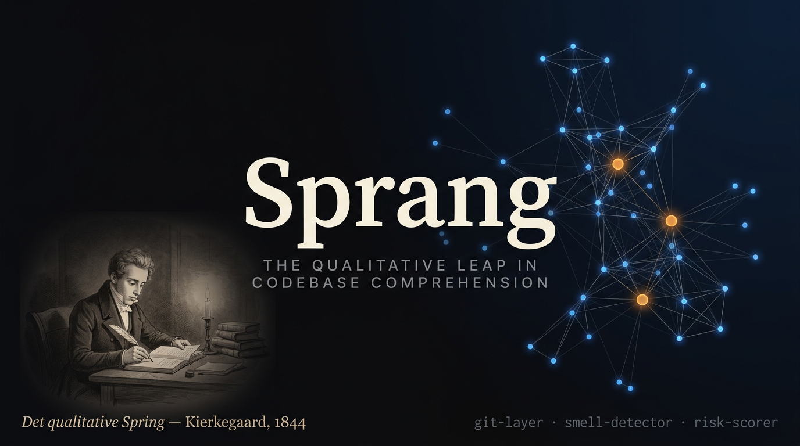
</p>

<p align="center">
  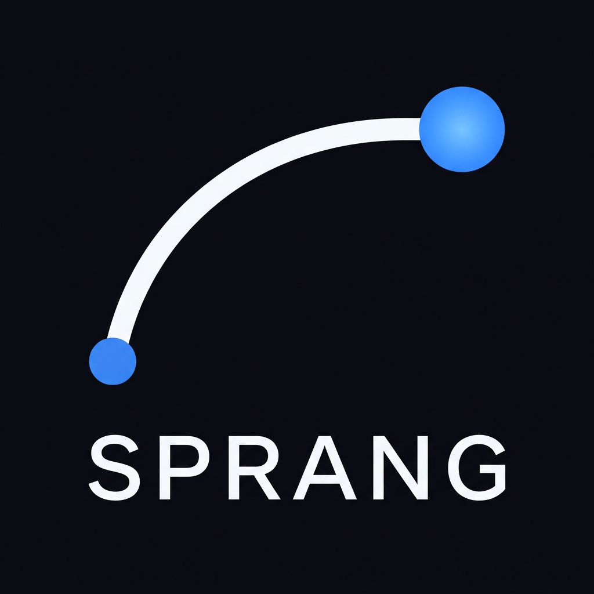
</p>

<p align="center">
  <strong>The qualitative leap in codebase comprehension.</strong><br/>
  <em>Det qualitative Spring — Kierkegaard</em>
</p>

<p align="center">
  <a href="#installation"></a>
  <a href="#mcp-tools"></a>
  <a href="#skills--slash-commands"></a>
  
  
</p>

---

Sprang is a knowledge graph platform for [Devin](https://devin.ai) (CLI and Desktop), [Claude Code](https://claude.ai/code), and the [GitHub Copilot CLI](https://github.com/features/copilot) that creates **total comprehension** of codebases, knowledge bases, and document vaults — not just symbol search, but *why* code exists, *who* changed it, *what* it risks, and *how* it all fits together.

Your AI agent is the intelligence layer. Sprang is the memory. Together they answer **"what will break if I change this file?"** in a single tool call — and **"how does this codebase actually work?"** for anyone who just joined the team.

> *"The System knows everything about being, but nothing about existence."*  
> Kierkegaard's critique of Hegel applies equally to symbol indexers and grep tools.  
> Sprang bridges the gap: from static facts to living, contextual understanding.

---

## The Leap

*Det qualitative Spring* — the qualitative leap — is Kierkegaard's name for a discontinuous jump in understanding: the kind that cannot be reached by incremental steps, no matter how many you take.

Symbol search finds **where** things are. Documentation says what they were meant to do. An LLM can explain individual files brilliantly — and still lose the plot at file 50, forget the conversation from yesterday, and have no way to answer the question that matters most: *what breaks if I change this, before I break it?*

These answers require different infrastructure — one that understands the codebase **before** your agent starts working, persists that understanding across sessions, and makes the hard questions answerable in a single tool call:

- *Why does this file exist?* → `sprang_why` reads git history, PR references, and team annotations
- *What breaks if I change it?* → `sprang_diff_impact` runs BFS over the full dependency graph
- *How risky is it?* → `sprang_health` surfaces blast radius × coupling × test gap × churn, scored 0–1
- *What does this codebase actually do?* → `/sprang-onboard` gives a persona-adaptive guided tour

The leap becomes repeatable. The graph persists. The context accumulates.

---

### Not just codebases

The same infrastructure works for knowledge bases: Obsidian vaults, Logseq databases, Dendron workspaces, Foam wikis, Zettelkasten archives, or any folder of markdown. Notes become nodes. Links become edges. Topic clusters emerge. The same Ask Agent panel, the same force-directed graph, the same guided reading order — just pointed at your notes instead of your code.

```bash
/sprang-knowledge /path/to/your/obsidian-vault
```

---

## Contents

- [The Leap](#the-leap)
- [Installation](#installation)
- [Supported platforms](#supported-platforms)
- [What Sprang does](#what-sprang-does)
- [Workflows in practice](#workflows-in-practice)
- [Repo layout](#repo-layout)
- [Prerequisites](#prerequisites)
- [Manual build](#manual-build)
- [CLI usage](#cli-usage)
- [Skills / slash commands](#skills--slash-commands)
- [Ask Agent (dashboard chat)](#ask-agent-dashboard-chat)
- [Two-phase pipeline](#two-phase-pipeline)
- [The three differentiating agents](#the-three-differentiating-agents)
- [MCP tools](#mcp-tools)
- [Dashboard](#dashboard)
- [Knowledge graphs](#knowledge-graphs)
- [Graph schema](#graph-schema)
- [Live watcher](#live-watcher)
- [Development](#development)
- [Configuration](#configuration)
- [Troubleshooting](#troubleshooting)
- [Attributions](#attributions)

---

## Installation

### Quick install (npm) — works for every platform

```bash
npm install -g @faviovazquez/sprang
cd my-project
sprang init --platform devin     # or: claude | copilot | all
```

`sprang init --platform <agent>` does two things:

- writes the MCP config where that agent reads it — `.devin/mcp_config.json` (Devin), `.mcp.json` (Claude Code), `.mcp.json` + `.vscode/mcp.json` (Copilot) — with the **absolute path** to the bundled MCP server already filled in;
- copies that agent's skills and rules into the project.

It installs **only one** agent tree by default, and that is deliberate: Devin reads both `.devin/skills/` and `.claude/skills/`, and when both are present it namespaces them (`/devin:sprang-*` and `/claude:sprang-*`), so every skill appears twice. Use `--platform all` only if you genuinely want all three trees.

Then build the graph and open the dashboard:

```bash
sprang scan            # build the knowledge graph (Phase 1, static, < 60s)
sprang open            # launch the dashboard at http://localhost:7777
```

> The package is published under the scoped name **`@faviovazquez/sprang`**, but the command it installs is just **`sprang`**. Run `sprang init` with no `--platform` to write only the MCP config (no skills or rules).

The npm package bundles the dashboard, MCP server, CLI, **and every platform's agent-integration files** into a single tarball — no separate build step, no pnpm workspace.

> **`npm install -g` vs `npx`?** Every command also runs via `npx @faviovazquez/sprang <cmd>`. Prefer the global install for `sprang init`: it writes the bundled MCP server's **absolute path** into your MCP config, and a global install keeps that path stable, whereas the `npx` cache path can be pruned by npm and silently break the config.

---

## Supported platforms

Sprang supports exactly three agent platforms. Each reads its assets from a different place:

| Platform | Skills | Rules | Hooks | MCP config | Plugin manifest |
|---|---|---|---|---|---|
| **Devin** (CLI + Desktop) | `.devin/skills/<name>/SKILL.md` | `.devin/rules/*.md` (`trigger:` frontmatter) | `.devin/hooks.v1.json` | `.devin/mcp_config.json` (`${workspaceFolder}` resolves) | `.devin-plugin/plugin.json` |
| **Claude Code** | `.claude/skills/<name>/SKILL.md` | `.claude/rules/*.md` | `.claude/settings.json` → `"hooks"` | `.mcp.json` | `.claude-plugin/plugin.json` |
| **Copilot CLI** | plugin `skills/` | `AGENTS.md`, `.github/copilot-instructions.md` | plugin hooks | `~/.copilot/mcp-config.json` or workspace `.mcp.json` | root `plugin.json` |

Notes:

- **Claude Code merged custom slash commands into skills.** `.claude/commands/` no longer exists; `.claude/skills/` is the supported location, and each skill is still invoked as `/sprang-*`.
- **Copilot CLI reads a *root* `plugin.json`** (verified against a real installed Copilot plugin), not `.copilot-plugin/plugin.json`. The latter was dead config and has been removed.
- **Devin plugins are in closed beta**, and `devin plugins install` requires `devin auth login`. So for Devin the *primary* install path is the project-level `.devin/` layout written by `sprang init --platform devin`; the plugin manifest is a bonus for when the beta opens up. The Claude and Copilot plugin installs work today.

### Devin (CLI and Desktop)

```bash
npm install -g @faviovazquez/sprang
cd my-project
sprang init --platform devin
```

This writes:

| Path | What it does |
|---|---|
| `.devin/mcp_config.json` | 9 MCP tools. `${workspaceFolder}` is resolved by Devin, so the config is portable. |
| `.devin/skills/sprang*/SKILL.md` | The 11 skills, invoked as `/sprang`, `/sprang-onboard`, … |
| `.devin/rules/*.md` | Always-on / glob-triggered rules (`sprang-context`, `sprang-highrisk`, `sprang-dashboard`) |
| `.devin/hooks.v1.json` + `.devin/hooks/*.sh` | `SessionStart` stale-graph warning, `PostToolUse` post-commit graph refresh |
| `AGENTS.md` | Always-on project instructions |

Devin has skills and rules — there is no "workflows" concept. Rules use `trigger:` frontmatter (`always_on`, `glob`, or `model_decision`).

> Devin also reads `.claude/skills/`. If both trees exist in a project the skills are namespaced as `/devin:sprang-*` and `/claude:sprang-*`. Install one tree, not two.

Then:

```bash
sprang scan .
sprang open .
```

and run `/sprang-onboard` in your Devin session.

### Claude Code

**Via the plugin marketplace (recommended):**

```
/plugin marketplace add FavioVazquez/sprang
/plugin install sprang
```

The first command registers the GitHub repo as a marketplace source (reads `.claude-plugin/marketplace.json`); the second installs the plugin. Then build the MCP server binary in the plugin cache to unlock the 9 tools:

```bash
cd "$(ls -d ~/.claude/plugins/cache/sprang/sprang/*/ | tail -1)"
pnpm install && pnpm build
```

Run `/reload-plugins` in Claude Code to activate the MCP server.

> Plugin skills are namespaced by plugin name: `/sprang:sprang`, `/sprang:sprang-onboard`, … For the unnamespaced form, use `sprang init --platform claude` instead.

**Via npm (project-local, unnamespaced commands):**

```bash
sprang init --platform claude
```

Writes `.mcp.json`, `.claude/` (skills, rules, hooks, `settings.json`), `CLAUDE.md` and `AGENTS.md`.

### Copilot CLI

```bash
copilot plugin install FavioVazquez/sprang
```

Copilot CLI reads the **root** `plugin.json`, whose `skills` field points at `skills/` — the same canonical skill tree every other platform is generated from.

MCP config goes in one of two places:

- `~/.copilot/mcp-config.json` — global, applies to every workspace
- workspace `.mcp.json` — per-project (this is what `sprang init --platform copilot` writes, alongside `.vscode/mcp.json` for the VS Code extension)

Copilot reads `AGENTS.md` and `.github/copilot-instructions.md` on every session; those carry the pre-edit checklist (check `sprang_node` risk before editing, `sprang_diff_impact` after).

> In the VS Code Copilot extension, MCP tools are available in **Agent mode** only.

---

## What Sprang does

<!-- Dashboard mockup — generated with Gemini gemini-3.1-flash-image-preview -->
<p align="center">
  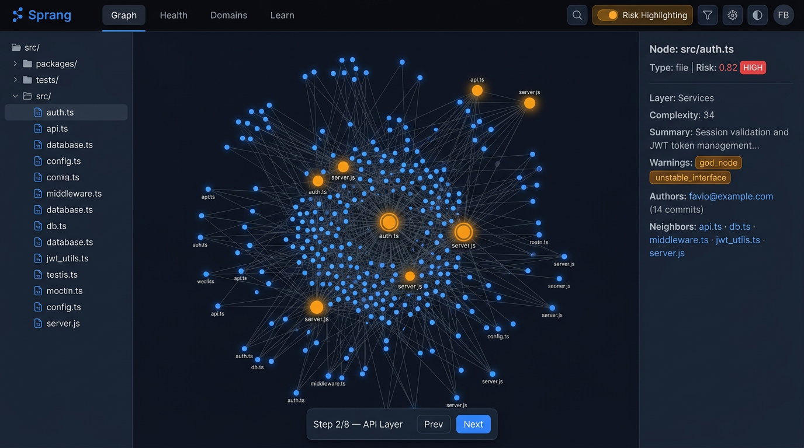
  <em>Force-directed knowledge graph, risk heatmap, node detail panel with decision context, and guided tour player.</em>
</p>

Sprang gives your AI agent a persistent memory of the codebase — not just file names and symbols, but the full context of *why* things exist, *who* changed them, *what* they risk, and *how* they connect.

### One-call answers

```
# "What will break if I change auth.ts?"
sprang_diff_impact { files: ["src/auth.ts"] }
→ 14 impacted nodes, top risk: api-gateway.ts (0.91), session.ts (0.78)

# "Why does this file exist?"
sprang_why { node_id: "src/auth.ts" }
→ 23 commits, 3 authors, PR #441 "add JWT refresh flow", churn: 8/90d

# "Show me the riskiest parts of this codebase"
sprang_health {}
→ god_node: 2, circular_dependency: 1, unstable_interface: 3
  top risk: auth.ts (0.82), api.ts (0.71), db/pool.ts (0.68)

# "Walk me through the architecture"
/sprang-onboard
→ 8-step guided tour, persona-adaptive (non-technical / pm / junior / senior)
```

### Capabilities

| Capability | How |
|---|---|
| **Git decision context** | `git-layer` — who changed each file, why, PR references, change frequency |
| **Code smell detection** | `smell-detector` — deterministic heuristics, zero LLM calls |
| **Function call graph** | `file-analyzer` — function-to-function `calls` edges, internal/external call counts, unused-function detection |
| **Design pattern detection** | 9 patterns — singleton, factory, observer, strategy, decorator, react_hook, context_provider, event_emitter, dependency_injection |
| **Layer violation detection** | `architecture-analyzer` — flags lower layers importing from higher ones (e.g. data → ui) |
| **Risk scoring** | `risk-scorer` — blast radius × coupling × test gap × churn, 0.0–1.0 per node |
| **Instant point-and-analyze** | Dashboard landing screen — type a local path or paste a GitHub URL, Phase 1 runs with no agent and no API key |
| **Guided tours** | `tour-builder` — BFS-ordered pedagogical paths through the codebase |
| **Domain map** | `domain-analyzer` — directory cohesion clustering into named business layers |
| **Blast-radius diff** | `sprang_diff_impact` — BFS over the graph before any edit, risk-ranked |
| **Team annotations** | `sprang_annotate` — write `.sprang/annotations/<id>.md`, committed to the repo |
| **Knowledge graphs** | `/sprang-knowledge` — Obsidian / Logseq / Dendron / Foam / Zettelkasten / plain markdown |
| **11 skills** | Full workflow coverage on Devin, Claude Code, and Copilot CLI |
| **9 MCP tools** | Direct graph access — all agents read and write the graph via MCP |
| **< 60s skeleton** | Phase 1 is fully static — runs anywhere, no network, no waiting |
| **Architecture card view** | React Flow + ELK layer map — one card per layer, weighted cross-layer edges |
| **Structural fingerprinting** | SHA-256 + signature extraction — SKIP/COSMETIC/STRUCTURAL per file |
| **Language lessons** | 12 programming pattern detectors attached to tour steps and graph nodes |
| **Semantic search** | Cosine similarity + TF-IDF fallback — `sprang_query mode:"semantic"` |
| **Auto-update hooks** | `sprang install-hooks`, plus native SessionStart/PostToolUse hooks on Devin and Claude Code |
| **12 languages** | TypeScript, JavaScript, Python, Go, Rust, Java, Kotlin, Ruby, PHP, C, C++, C# — plus Markdown for knowledge graphs |
| **Live dashboard** | Sigma.js force-directed graph, risk heatmap, diff overlay, BFS pathfinder, tour player |

### What existing tools don't do

| | Sprang | Grep / LSP | LLM context | Sourcegraph |
|---|---|---|---|---|
| Locate code | ✅ | ✅ | ✅ | ✅ |
| WHY this file exists | ✅ git history + annotations | — | sometimes | — |
| Blast radius before an edit | ✅ BFS in one call | — | approximate | — |
| Risk score per node | ✅ deterministic formula | — | subjective | — |
| Persistent across sessions | ✅ graph on disk | ✅ files | ❌ ephemeral | ✅ |
| Agent-readable (MCP) | ✅ 9 tools | — | via context | partial |
| Works offline, no API key | ✅ Phase 1 | ✅ | ❌ | ❌ |
| Knowledge bases (Obsidian etc.) | ✅ | — | — | — |
| Team annotations committed to repo | ✅ | — | — | ✅ (notebooks) |

The key insight: **your AI agent is already excellent at reasoning — it just needs the right data**. Sprang provides that data layer so the agent doesn't have to reconstruct it from scratch on every conversation.

---

## Workflows in practice

### Day 1 at a new company

```bash
# Build the skeleton in 60 seconds — no API key needed
sprang scan . --phase1-only

# Open the dashboard
sprang open .

# Ask for a guided architecture tour
/sprang-onboard
# → 8-step tour, adapts to your role (junior / senior / PM / non-technical)

# Find the highest-risk areas before you touch anything
/sprang-health
# → health grade B, top risks: auth.ts (0.82), api-gateway.ts (0.71)
# → circular dependency: services/cache.ts ↔ services/session.ts
```

### Before refactoring a module

```bash
sprang_diff_impact { files: ["src/payments/processor.ts"] }
# → 18 impacted nodes. High risk: checkout.ts (0.88), invoice.ts (0.79)

sprang_why { node_id: "src/payments/processor.ts" }
# → 31 commits, PR #892 "stripe 3DS — do not simplify retry logic"
#    12 changes in 90 days, 2 primary authors

/sprang-chat "Why is the retry logic in processor.ts so complex?"
# → "PR #892 added Stripe 3DS authentication. The retry loop handles partial auth states
#    that Stripe returns mid-payment. Simplifying it would break 3DS flows."
```

### PM review — "what does the checkout service do?"

```bash
/sprang-domain checkout
# → Domain: Checkout
#   Flows: product_selection → cart_management → payment_processing → confirmation
#   Entry points: CartService, CheckoutController, PaymentGateway

/sprang-onboard
# → non-technical persona: what Checkout does in plain English, the 4 flows,
#   and what the team considers risky (and why)
```

### Reviewing a risky PR

```bash
/sprang-diff src/auth/session.ts src/auth/jwt.ts
# → diff-overlay written → open dashboard → amber nodes show impact zone

sprang_diff_impact { files: ["src/auth/session.ts", "src/auth/jwt.ts"] }
# → 22 impacted nodes. session.ts risk: 0.87 → review carefully

sprang_why { node_id: "src/auth/session.ts" }
# → 14 changes in 90 days, 4 authors, PR #321 "enterprise SSO session timeout"
```

### Exploring an Obsidian vault

```bash
/sprang-knowledge /path/to/your/vault
# → 847 notes, 2,341 connections, 12 topic clusters

sprang open /path/to/vault
# → force-directed graph of all your notes, colored by topic cluster,
#   backlinks + frontmatter per note, full article text in the ReadingPanel

sprang query "regularization techniques" --semantic
# → L2 weight decay, dropout, batch normalization, early stopping, data augmentation
```

---

## Repo layout

<!-- Architecture diagram — generated with Gemini gemini-3.1-flash-image-preview -->
<p align="center">
  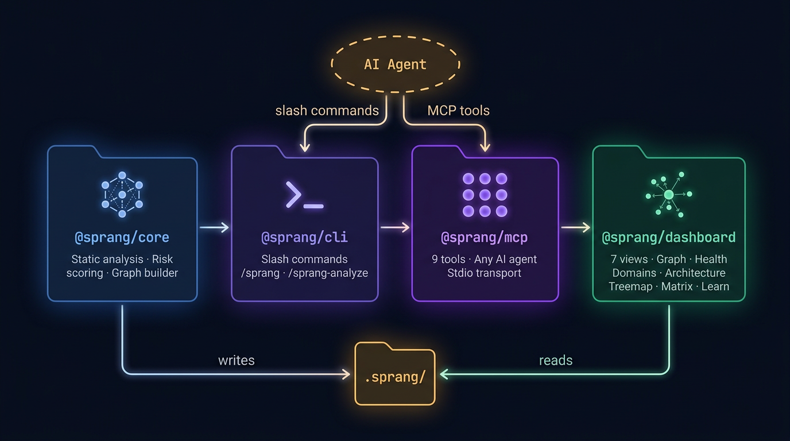
  <em>Four packages. One data layer. Your AI agent is the intelligence; Sprang is the memory.</em>
</p>

```
packages/
├── core/       Pipeline: 9 agents, schema, watcher, graph store, fingerprinting, semantic search
├── cli/        sprang scan | health | query | watch | status | install-hooks | merge | open | diagram | init
├── mcp/        stdio MCP server — 9 tools for all AI platforms
└── dashboard/  React + Vite + Sigma.js — 7 views (Graph/Health/Domains/Architecture/Treemap/Matrix/Learn)

skills/         ← CANONICAL: the 11 skills (SKILL.md, REFERENCE.md, merge.py)
.devin/rules/   ← CANONICAL: the 3 rules
.devin/hooks/   ← CANONICAL: session-start.sh, post-tool-use.sh

.devin/skills/    ← GENERATED from skills/
.claude/skills/   ← GENERATED from skills/
.claude/rules/    ← GENERATED from .devin/rules/
.claude/hooks/    ← GENERATED from .devin/hooks/

plugin.json           root manifest — Copilot CLI
.devin-plugin/        Devin plugin manifest (closed beta)
.claude-plugin/       Claude Code plugin + marketplace manifests
```

### Single source of truth for agent assets

Before v0.3.0 each platform kept a hand-maintained copy of every skill and rule, and those copies had silently diverged — the same `/sprang` command gave Claude and Devin materially different instructions. Now the copies are generated:

```bash
pnpm sync:agents        # node scripts/sync-agent-assets.mjs — regenerate the copies
node scripts/sync-agent-assets.mjs --check   # verify only; CI runs this and fails on drift
```

**Edit `skills/`, `.devin/rules/`, `.devin/hooks/`. Never edit the generated trees.** Copilot CLI needs no copy at all: its `plugin.json` points straight at `skills/`.

Each skill is self-contained. The two long ones — `sprang-analyze` and `sprang-knowledge` — keep their full procedure in `skills/<name>/REFERENCE.md` next to the `SKILL.md`.

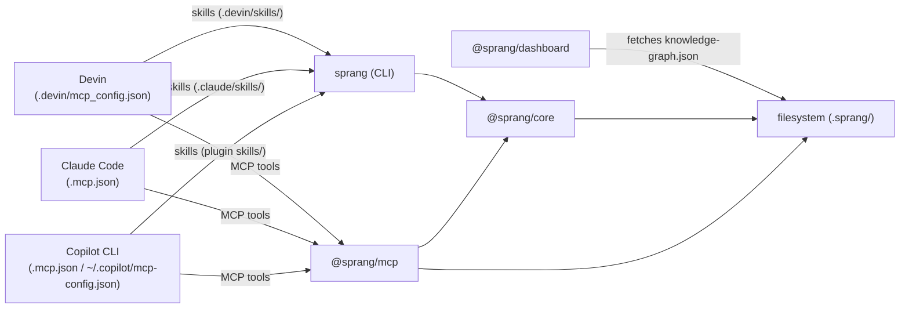
```mermaid
graph LR
    CLI["sprang (CLI)"] --> CORE["@sprang/core"]
    MCP["@sprang/mcp"] --> CORE
    DASH["@sprang/dashboard"] -->|"fetches knowledge-graph.json"| FS["filesystem (.sprang/)"]
    CORE --> FS
    MCP --> FS

    DEVIN["Devin\n(.devin/mcp_config.json)"] -->|"MCP tools"| MCP
    DEVIN -->|"skills (.devin/skills/)"| CLI

    CLAUDE["Claude Code\n(.mcp.json)"] -->|"MCP tools"| MCP
    CLAUDE -->|"skills (.claude/skills/)"| CLI

    COPILOT["Copilot CLI\n(.mcp.json / ~/.copilot/mcp-config.json)"] -->|"MCP tools"| MCP
    COPILOT -->|"skills (plugin skills/)"| CLI
```

---

## Prerequisites

### Required

| Tool | Min version | Install | Why |
|---|---|---|---|
| **Node.js** | 20 | [nodejs.org](https://nodejs.org/) or `nvm install 20` | Runs the CLI, MCP server, and dashboard |
| **pnpm** | 10 | `npm install -g pnpm` or `corepack enable` | Package manager (enforced in `package.json`) — only needed to build from source |
| **Git** | 2.x | [git-scm.com](https://git-scm.com/) | `git-layer` reads commit history; scan works without it but decision context is unavailable |
| **Python 3** | 3.8 | Pre-installed on macOS/Linux | Only for the `merge.py` fallback in `/sprang-analyze`. `sprang merge` (TypeScript) is preferred and needs no Python. |

```bash
node --version    # v20+
pnpm --version    # 10+ (source builds only)
git --version
python3 --version # optional
```

### No API key needed

Sprang does not call any AI API directly. The LLM is your agent (Devin, Claude Code, or Copilot) — it reads the knowledge graph through MCP tools and applies its own intelligence. Phase 1 (static analysis) runs fully offline.

---

## Manual build

If you've cloned the repo and want to build from source:

```bash
git clone https://github.com/FavioVazquez/sprang.git ~/tools/sprang
cd ~/tools/sprang

pnpm install
pnpm build

cd packages/cli && pnpm link --global && cd ../..
which sprang        # verify
sprang --version    # 0.3.0
```

---

## CLI usage

```bash
# Phase 1 — static analysis, < 60s, builds the skeleton graph
sprang scan /path/to/project --phase1-only

# Full scan — Phase 1 + Phase 2 enrichment
sprang scan /path/to/project

# Skip scan if graph is already current (compares git HEAD vs stats.gitCommitHash)
sprang scan . --phase1-only --if-stale

# Set up a project for an agent (MCP config + skills/rules)
sprang init --platform devin|claude|copilot|all

# Assemble the graph from the intermediate chunks an agent wrote
sprang merge [path] [--intermediate .sprang/intermediate] [--kind codebase|knowledge]

# Install a post-commit git hook that auto-refreshes the graph
sprang install-hooks

sprang status                         # graph age, phase, node/edge count
sprang health                         # health grade, smells, risk table, security findings
sprang query "authentication"         # keyword search
sprang query "authentication" --semantic
sprang watch                          # incremental file watcher
sprang diagram [--output file.md]     # Mermaid architecture diagram

# Dashboard — works from any directory, no monorepo needed
sprang open /path/to/project
sprang open /path/to/project --port 8080
sprang open /path/to/project --auto-scan   # run Phase 1 immediately
sprang open                                # standalone: type a path or paste a GitHub URL
```

`sprang merge` defaults `--intermediate` to `<root>/.sprang/intermediate` — the directory every skill actually writes to. (Before v0.3.0 it defaulted to `<root>/intermediate`, so the documented command always failed; the old value is still accepted as a fallback.) `--kind` must match the graph you are assembling: `codebase` for source trees, `knowledge` for markdown vaults.

Output written to `.sprang/` in your project root:

```
your-project/
└── .sprang/
    ├── knowledge-graph.json   ← main graph (nodes, edges, risk scores, smells)
    ├── SPRANG_REPORT.md       ← human-readable architecture summary
    ├── annotations/           ← agent-written node annotations (commit these)
    ├── config.json            ← optional thresholds + excludes
    └── intermediate/          ← Phase 1/2 working files (gitignored)
```

---

## Skills / slash commands

The same 11 skills are available on Devin, Claude Code, and Copilot CLI:

| Skill | Description |
|---|---|
| `/sprang` | Build or refresh the knowledge graph — auto-detects codebase vs knowledge base |
| `/sprang-analyze [path] [--full] [--language <lang>] [--chunk N]` | Full AI-driven analysis — summaries, layers, tour, risk |
| `/sprang-knowledge [path] [--format obsidian\|logseq\|...] [--full]` | Build a knowledge graph from markdown notes |
| `/sprang-chat <question>` | Ask any question about the codebase |
| `/sprang-explain <file \| path:function>` | Deep-dive: what, why, who, risk, history |
| `/sprang-onboard [persona]` | Guided architecture tour — non-technical / pm / junior / senior |
| `/sprang-diff [files...]` | Blast radius analysis — writes the diff overlay for the dashboard |
| `/sprang-domain [name]` | Explore business domain architecture and flows |
| `/sprang-why <file>` | Git history + rationale + team annotations |
| `/sprang-health` | Full health report: grade, risk, smells, orphans, circular deps |
| `/sprang-team [node]` | Browse/write team annotations with staleness detection |

Installed via a plugin, skills are namespaced by plugin name (`/sprang:sprang-onboard`). Installed with `sprang init`, they are unnamespaced (`/sprang-onboard`).

### What the agent does automatically

With the rules installed (`.devin/rules/` or `.claude/rules/`, or `AGENTS.md` for Copilot):

- **Before editing any file** — call `sprang_node` to check `risk_score` and `structural_warnings`
- **On high-risk files (risk > 0.7)** — call `sprang_why` to read decision context first
- **After changes** — call `sprang_diff_impact` to assess blast radius
- **On session open** (Devin, Claude Code) — the `SessionStart` hook warns if the graph is missing or behind `HEAD`
- **After a git commit** (Devin, Claude Code) — the `PostToolUse` hook triggers a background incremental refresh

---

## Ask Agent (dashboard chat)

The **Ask Agent** panel routes a question from the dashboard to whichever agent is reachable. The bridge is detected per request.

### Bridge priority

| Priority | Bridge | How it works |
|---|---|---|
| 1 | **Devin CLI** | Spawns `devin -p "<question>"` with `--continue` (continuity), `--respect-workspace-trust false` (print mode can't answer a trust prompt), and a fast model (below). Answers in ~20–30s **even while your editor sits idle**. Sync. |
| 2 | **Devin local** | The Devin session in your IDE, reached by lifecycle hooks (below). Answers with that session's full context. **No extra login.** Async — but only delivers when the session does something. |
| 3 | **Claude Code** | Spawns `claude -p "<question>" --output-format json`; session id persisted to `.sprang/claude-session.json` and reused via `--resume`. Sync. |
| 4 | **Copilot CLI** | Spawns `copilot --prompt "<question>"`; session id persisted to `.sprang/copilot-session.json` and reused via `--resume=<id>`. Sync. |
| 5 | **Relay** | Nothing drivable: the dashboard stages the same question file and shows it for copy/paste. Your agent answers and calls `sprang_respond`. Async. |

The CLI outranks the in-editor session deliberately: a hook can only deliver when something *happens*, so a question asked while the editor is idle waits for you to come back, whereas the CLI always answers. When no CLI is authenticated, Devin local takes priority again. Either can be chosen explicitly in the panel.

Relay is always available, so there is no "no bridge detected" state. And if a CLI is installed but cannot actually answer — a revoked token, an unsupported model, a rate limit — the bridge degrades to relay and reports the underlying error, rather than leaving the panel spinning.

### Devin CLI

One `devin auth login` (use `--force-manual-token-flow` on a remote or SSH box, where the localhost redirect cannot work). Two things then make it usable, both of which fail silently otherwise:

- **`ACP_BACKEND` is stripped** before spawning. The dashboard is usually launched from a terminal inside Devin Desktop, which exports it; the CLI then treats the ACP host as its only credential source — *"local CLI credentials will NOT be used"* — and a correctly logged-in CLI reports **Not logged in**.
- **MCP calls are granted explicitly.** `--permission-mode auto` approves read-only tools but not MCP calls, so the agent answers *"rejected a tool call that requires confirmation"*. Rather than `--permission-mode dangerous`, which approves everything, Sprang generates a config granting exactly `mcp__sprang__*`.

Questions run on **`swe-1.7-lightning`** — override with `SPRANG_DEVIN_MODEL`. Measured end to end on a question requiring an MCP call: ~23s, against ~115s for `claude-sonnet-4.5`. Dashboard questions are short lookups against a graph that already exists, and the fast model matched the slow one on accuracy, so the wait was pure cost.

If a question ever seems stuck, `.sprang/bridge.log` records exactly what happened:

```
ask         bridge=devin requested=devin question=hi
devin.spawn bin=devin model=swe-1.7-lightning resume=false
devin.exit  code=0 secs=23 chars=214
```

### Devin local (Devin Desktop)

Devin local is already signed in, but it is **not** a spawnable process — its credentials live in the IDE, not in the CLI credential store, so `devin auth status` reports *Not logged in* while the IDE works fine.

Sprang reaches it with **lifecycle hooks**, which run *inside* your Devin session:

| Hook | Delivers the pending question when |
|---|---|
| `Stop` | Devin finishes a turn |
| `UserPromptSubmit` | you send any message |

The dashboard writes `.sprang/agent-question.md`; the first hook to fire consumes it (renaming to `.delivered.md`, so it is delivered exactly once and can never cause a stop-loop) and hands it to the agent. Devin answers with its full context and MCP tools, calls `sprang_respond`, and the answer appears in the dashboard.

Installed by `sprang init --platform devin`. No extension required.

> **Limitation:** a hook only runs when something happens. A question asked while the session is completely idle waits for the next turn or keystroke. Reaching a genuinely idle IDE session is not possible with the APIs Devin exposes.

<details><summary>Why not an editor extension?</summary>

An earlier version shipped one that called `devin.sendChatActionMessage`. Measured behaviour:

- `explainAndFixProblem` — opens a **new** conversation answered by **Cascade**, with none of your session's context.
- `codeBlockMention` / `fileMention` — do land in the current conversation, but only *insert* text. No command exists to submit the chat input, so it cannot be automatic.

Worse, with both routes installed the extension won the race every time — it fires instantly while a hook waits for a turn boundary — so dashboard questions were silently answered by the wrong agent. The extension was removed.

</details>


### Session files (gitignored)

| File | Purpose |
|---|---|
| `.sprang/cascade-response.json` | The answer, whichever bridge produced it — polled by the dashboard |
| `.sprang/agent-question.md` | Pending question — consumed by a Devin hook, or copy/pasted |
| `.sprang/bridge.log` | One line per question: bridge chosen, process spawned, exit code, duration |
| `.sprang/agent-conversation.md` | Running transcript, appended by `sprang_respond` |
| `.sprang/claude-session.json` | Claude Code session id for `--resume` |
| `.sprang/copilot-session.json` | Copilot CLI session id for `--resume=<id>` |
| `.sprang/devin-session.json` | Whether a Devin turn has happened (drives `--continue`) |
| `.sprang/devin-cli-config.json` | Generated permission grant for the spawned CLI (`mcp__sprang__*` only) |

---

## Two-phase pipeline

<!-- Pipeline diagram — generated with Gemini gemini-3.1-flash-image-preview -->
<p align="center">
  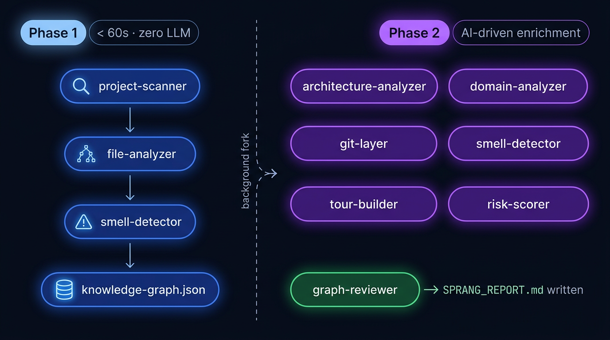
  <em>Phase 1 is fully static — runs in under 60 seconds, no network calls. Phase 2 is driven by your AI agent.</em>
</p>

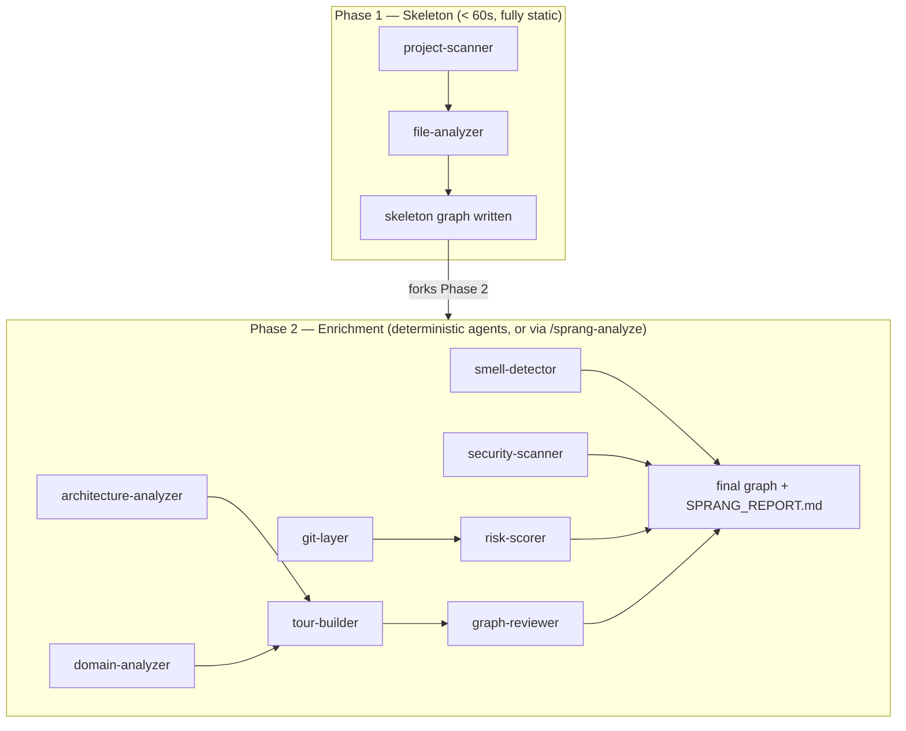
```mermaid
flowchart TB
    subgraph Phase1 ["Phase 1 — Skeleton (< 60s, fully static)"]
        PS[project-scanner] --> FA[file-analyzer]
        FA --> SG[skeleton graph written]
    end
    subgraph Phase2 ["Phase 2 — Enrichment (deterministic agents, or via /sprang-analyze)"]
        SM[smell-detector] --> FG[final graph + SPRANG_REPORT.md]
        SEC[security-scanner] --> FG
        G3[git-layer] --> RS[risk-scorer]
        G1[architecture-analyzer] --> TB[tour-builder]
        G2[domain-analyzer] --> TB
        RS --> FG
        TB --> GR[graph-reviewer]
        GR --> FG
    end
    SG -->|"forks Phase 2"| Phase2
```

> **Phase 1 is just `project-scanner` + `file-analyzer`** — the structural skeleton (files, functions, import/call edges). Structural warnings, risk scores, security findings, layers, tours, and domains are populated in **Phase 2**.

Phase 1 also writes `.sprang/intermediate/node-warnings.json` — the per-node `structural_warnings` and `security_warnings` it computed. Both merge paths (`sprang merge` and `merge.py`) re-attach these when assembling an agent-enriched graph, so an `/sprang-analyze` run can no longer silently erase Phase 1's findings (agent-supplied values still win).

**Your AI agent is the intelligence layer.** Phase 2 enrichment is performed by the agent using its own context window — it reads the graph, writes summaries, and calls `sprang_annotate` to record what it learns. No external API.

---

## The three differentiating agents

<!-- Graph modes — generated with Gemini gemini-3.1-flash-image-preview -->
<p align="center">
  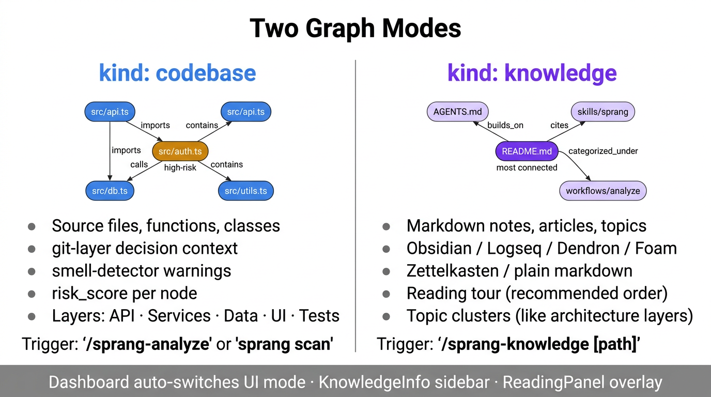
  <em>Sprang supports two graph kinds — codebase analysis and markdown knowledge base indexing.</em>
</p>

### `git-layer` — Decision context from version history

```
git log --follow --format="%H|%ae|%ai|%s" -- <filepath>
   ↓
associate commits to nodes via line-range diff hunk headers
   ↓
node.decision_context: { commits, primary_authors, last_changed,
                          change_frequency, rationale_snippets, pr_references }
```

### `smell-detector` — 10 deterministic heuristics, no LLM calls

| Smell | Trigger |
|---|---|
| `god_node` | `out_degree > 20` OR cyclomatic_sum > 200 |
| `circular_dependency` | Johnson's cycle detection, cycles ≤ 6 nodes |
| `duplicate_logic` | Same param_count + complexity_bucket + ≥2 shared callers |
| `unclear_coupling` | Two modules share > 40% import targets, no direct edge |
| `low_cohesion` | Functions referenced by ≥3 distinct domains, < 50% same top domain |
| `unstable_interface` | change_frequency > 10/90d AND in_degree > 5 |
| `orphan_node` | in_degree=0 AND out_degree=0 AND not entry point |
| `over_connected` | total_degree (in + out) > 30 |
| `name_duplicate` | Same symbol name defined in ≥2 files |
| `layer_violation` | Lower layer imports from a higher one (e.g. data → ui) |

### `risk-scorer` — Composite formula

<!-- Risk formula — generated with Gemini gemini-3.1-flash-image-preview -->
<p align="center">
  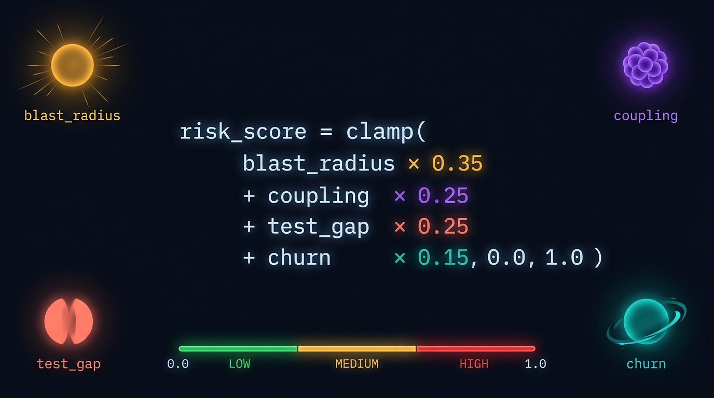
  <em>Deterministic. Every factor is traceable — risk_factors[] lists the exact contributors per node.</em>
</p>

```
risk_score = clamp(
  blast_radius  × 0.35   ← BFS reachable dependents / total nodes
  + coupling    × 0.25   ← (in+out degree)/40, +0.2 if in cycle
  + test_gap    × 0.25   ← 0.0 if tested, 0.5+blast×0.5 if not
  + churn       × 0.15,  ← change_frequency/20
  0.0, 1.0
)
```

---

## MCP tools

<!-- MCP tools reference — generated with Gemini gemini-3.1-flash-image-preview -->
<p align="center">
  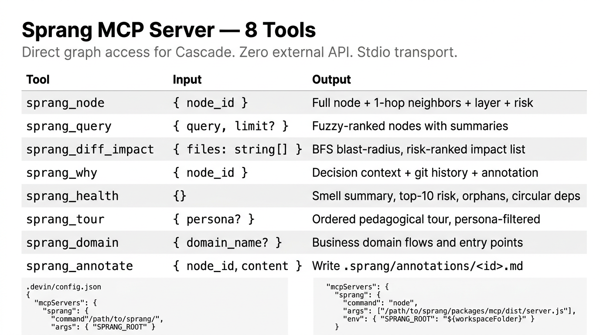
</p>

| Tool | Input | Output |
|---|---|---|
| `sprang_node` | `{ node_id }` | Full node + 1-hop neighbors + layer + in/out degree + annotation status |
| `sprang_query` | `{ query, node_types?, limit?, mode? }` | Fuzzy or semantic-ranked nodes with summaries |
| `sprang_diff_impact` | `{ files: string[] }` | BFS blast-radius, risk-ranked impact list |
| `sprang_why` | `{ node_id }` | Decision context + git history + team annotation |
| `sprang_health` | `{}` | Health grade (A–F), score (0–100), security summary, top-10 risk, smells, orphans, circular deps, run history |
| `sprang_tour` | `{ tour_id?, persona? }` | Ordered pedagogical tour |
| `sprang_domain` | `{ domain_name? }` | Business domain flows and entry points |
| `sprang_annotate` | `{ node_id, content, tags? }` | Write `.sprang/annotations/<id>.md` |
| `sprang_respond` | `{ response, question? }` | Write the answer to `.sprang/cascade-response.json` and append to `.sprang/agent-conversation.md` |

`sprang_query` accepts `mode: "semantic"` for cosine similarity search over TF-IDF embeddings.

### Error codes

| Code | Meaning | Remedy |
|---|---|---|
| `GRAPH_NOT_FOUND` | No `.sprang/knowledge-graph.json` at all | Run `sprang scan` or `/sprang` |
| `GRAPH_INVALID` | The graph exists but fails schema validation | Returned with the actual Zod issues and the graph path. Re-run `sprang merge` (or `/sprang-analyze`) — a re-scan will **not** fix an enrichment bug. |

The dashboard exposes the same information at `GET /graph-status` and renders the validation errors on the landing screen, so an invalid graph no longer looks like a missing one.

### Tour personas

| Persona | Alias | Audience | Tour filter |
|---|---|---|---|
| `junior` | — | Developer new to this codebase | All steps with language lessons |
| `senior` | `experienced` | Experienced engineer | Skips the introductory step, focuses on coupling and risk |
| `pm` | — | Product manager | Domain and service nodes only |
| `non-technical` | — | Executive / business stakeholder | Entry-points and domain nodes only |

**Default:** `junior`.

### Health grade

| Penalty | Max | Trigger |
|---|---|---|
| `dead_code_penalty` | 20 pts | orphan nodes (isolated — no imports, not an entry point) |
| `circular_penalty` | 20 pts | circular dependency chains |
| `god_node_penalty` | 15 pts | god_node smells (out_degree > 20) |
| `coupling_penalty` | 15 pts | over_connected smells (total_degree > 30) |
| `security_penalty` | 20 pts | hardcoded secrets, SQL injection, XSS patterns, and 5 other regex categories |

```
health_score = 100 − Σ(penalties)   → A ≥ 90, B ≥ 80, C ≥ 70, D ≥ 60, F < 60
```

`security_summary` groups findings by severity (high / medium / low) and by category (`hardcoded_secret`, `sql_injection`, `xss_risk`, `unsafe_eval`, `unsafe_exec`, `unsafe_deserialization`, `path_traversal`, `weak_crypto`). All 20 detection patterns are deterministic regex — no LLM calls.

`history` returns the last 30 `sprang_health` snapshots from `.sprang/intermediate/health-history.jsonl`.

### Enriched `sprang_node` response

```json
{
  "node": { "id": "...", "type": "file", "summary": "...", "risk_score": 0.72 },
  "neighbors": [{ "node_id": "...", "direction": "outgoing", "edge_type": "imports" }],
  "layer": { "id": "layer:services", "name": "Services" },
  "layer_mate_count": 7,
  "in_degree": 4,
  "out_degree": 11,
  "has_annotation": true,
  "annotation_path": ".sprang/annotations/src-auth-ts.md"
}
```

### Agent interaction flow

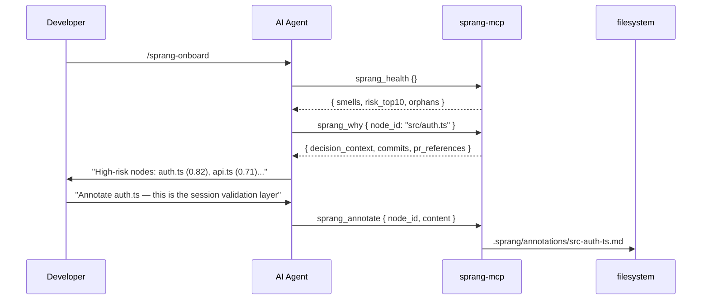
```mermaid
sequenceDiagram
    participant D as Developer
    participant C as AI Agent
    participant M as sprang-mcp
    participant F as filesystem

    D->>C: /sprang-onboard
    C->>M: sprang_health {}
    M-->>C: { smells, risk_top10, orphans }
    C->>M: sprang_why { node_id: "src/auth.ts" }
    M-->>C: { decision_context, commits, pr_references }
    C->>D: "High-risk nodes: auth.ts (0.82), api.ts (0.71)..."
    D->>C: "Annotate auth.ts — this is the session validation layer"
    C->>M: sprang_annotate { node_id, content }
    M->>F: .sprang/annotations/src-auth-ts.md
```

---

## Dashboard

```bash
sprang open [path] [--port 7777] [--no-browser] [--auto-scan]
```

`sprang open` is the entry point that works everywhere — it boots a standalone server bundled with the npm package, so no clone and no Vite are required.

> **Known caveat:** `pnpm --filter @sprang/dashboard preview` and `… dev` only work **inside the Sprang monorepo** (they need the workspace and the built `dist/`). Outside the monorepo, use `sprang open <path>`.

Inside the monorepo:

```bash
cd ~/tools/sprang
SPRANG_ROOT=/path/to/your/project pnpm --filter @sprang/dashboard preview   # pre-built dist, :7777
SPRANG_ROOT=/path/to/your/project pnpm --filter @sprang/dashboard dev       # hot reload, :7338
```

`preview` serves the last compiled `dist/`, so after pulling a Sprang update run `pnpm install && pnpm build` before restarting it. Both modes read `SPRANG_ROOT/.sprang/knowledge-graph.json` live from disk.

> **Open the dashboard in your system browser** (`http://127.0.0.1:7777`), not an IDE's embedded preview — embedded proxies do not forward the custom routes (`/knowledge-graph.json`, `/graph-status`, `/bridge-status`).

### Instant analysis — point and go (no agent, no API key)

Open the dashboard on a project that has not been scanned and you land on an analyze screen: type a local path or paste a GitHub URL and Phase 1 runs immediately — fully static, under 60 seconds. GitHub repos are shallow-cloned to a temp folder and never stored.

If a graph exists but fails schema validation, the landing screen shows the validation errors and the correct remedy instead of pretending no graph exists.

### Views

| View | Key | Description |
|---|---|---|
| **Graph** | `g` / `1` | Sigma.js force-directed canvas — risk heatmap, layer filter, diff overlay, BFS pathfinder |
| **Health** | `h` / `2` | Letter grade A–F, smell breakdown, top-10 risky nodes, security findings, design patterns |
| **Domains** | `d` / `3` | Business domain explorer — list view + React Flow layout toggle |
| **Architecture** | `a` / `4` | React Flow + ELK layer map — one card per layer, weighted cross-layer edge count |
| **Treemap** | `t` / `5` | D3 treemap — file/folder hierarchy sized by lines, colored by risk score |
| **Matrix** | `m` / `6` | Adjacency matrix — file-to-file dependency grid, sorted by layer rank |
| **Learn** | `l` / `7` | Persona-adaptive guided tour with language lessons per step |

Keyboard: `Cmd/Ctrl+K` node search · `r` risk overlay · `?` shortcut help · `Esc` close panel.

The UI is React + Vite with an OKLCH-tinted surface ramp, three themes (dark / light / high-contrast), Outfit + JetBrains Mono typography, spring-physics motion, and full `prefers-reduced-motion` support. Risk renders as an accessible heat scale, not a naive red/green.

<details>
<summary>Toolbar components</summary>

| Component | Role |
|---|---|
| FilterPanel | Filter nodes by category, complexity, risk level, edge type |
| DiffToggle | Load `.sprang/diff-overlay.json` → amber/warm-gray blast radius |
| PathFinder | BFS shortest path between any two nodes |
| ExportMenu | Export graph as JSON, Markdown, clipboard, or SVG |
| FileExplorer | File tree with search; double-click opens CodeViewer |
| CodeViewer | Prism syntax highlighting with line-range jump |
| PersonaSelector | Business (non-technical) / Product (pm) / Learn (junior) / Deep Dive (senior) |
| KnowledgeInfo | Right sidebar for knowledge graphs: backlinks, frontmatter, tags |
| ReadingPanel | Slide-up reading overlay for article nodes |
| ThemePicker | Dark / Light / High-contrast (persisted to `localStorage`) |
| LayerLegend | Layer color swatches; hover highlights all nodes in that layer |
| NodeTooltip | Mouse-following tooltip: type, label, summary, risk score |
| KeyboardShortcutsHelp | `?` opens shortcut reference modal |
| OnboardingOverlay | 4-step first-run guide |
| MobileBottomNav | Bottom nav on screens < 768px |
| BreadCrumb | Layer → Node drill-down above the graph panel |

</details>

---

## Knowledge graphs

`/sprang-knowledge [path]` builds a `kind: "knowledge"` graph from markdown notes — Obsidian vaults, Logseq databases, Dendron workspaces, Foam wikis, Zettelkasten archives, or plain markdown.

```bash
/sprang-knowledge /path/to/your/notes
```

Produces:
- **Article nodes** — one per `.md` file, with summary, tags, `knowledgeMeta`
- **Topic / entity nodes** — inferred from MOC pages, wikilinks, frontmatter
- **Edges** — `cites`, `builds_on`, `contradicts`, `exemplifies`, `categorized_under`, `authored_by`
- **Topic clusters** — analogous to architecture layers
- **Reading tour** — recommended reading order from the most-connected note outward

The dashboard auto-switches to knowledge mode: `KnowledgeInfo` sidebar, `ReadingPanel` overlay, reading order in the Learn tab.

> When assembling a knowledge graph manually, pass `sprang merge --kind knowledge`. The default is `codebase`.

---

## Graph schema

<details>
<summary>Extended node schema</summary>

```typescript
interface SprangNode {
  id: string;           // "file:src/auth.ts" | "function:src/auth.ts:validate"
  label: string;
  type: NodeType;       // 16 types: file | function | class | service | ...
  summary?: string;
  layer?: string;       // omit entirely when unknown — `null` is not valid
  complexity?: 'simple' | 'moderate' | 'complex';
  location?: { file: string; start_line?: number; end_line?: number };

  decision_context?: {
    commits: CommitRef[];
    primary_authors: string[];
    last_changed: string;        // ISO-8601
    change_frequency: number;    // commits in last 90 days
    rationale_snippets: string[];
    pr_references: string[];
  };

  structural_warnings?: Array<{
    category: SmellCategory;     // 10 categories
    severity: 'low' | 'medium' | 'high';
    description: string;
    related_node_ids: string[];
    heuristic: string;
  }>;

  risk_score?: number;           // 0.0–1.0
  risk_factors?: RiskFactor[];   // blast_radius | coupling | test_gap | churn | ...
  knowledgeMeta?: {              // knowledge graphs only
    wikilinks: string[];
    backlinks: string[];
    category: string;
  };
}
```

</details>

There are **35 canonical edge types** in 8 categories (structural, behavioral, data flow, dependencies, semantic, infrastructure/schema, domain, knowledge). Anything else fails validation. Because agents drift over long runs, both merge implementations normalize before writing:

- any `null` field (notably `"layer": null`) is stripped rather than emitted;
- 54 common aliases are mapped onto the canonical set — `dependsOn` → `depends_on`, `references` → `related`, and `tests` → `tested_by` **with source and target swapped** (a test file *is tested_by*-adjacent in the opposite direction);
- edges whose type cannot be mapped are dropped with a warning rather than invalidating the whole graph.

Annotations are stored as `.sprang/annotations/<node-id>.md` with YAML frontmatter — **commit these files** so team knowledge persists across sessions.

---

## Live watcher

`sprang watch` uses chokidar with:
- `awaitWriteFinish: { stabilityThreshold: 800ms }` — no spurious saves
- 2s debounce collecting changed files into a batch
- SHA-256 fingerprinting — skips unchanged-content saves
- **Incremental**: re-analyzes changed files + 1-hop import neighbors only
- **Atomic write**: `.tmp` → rename — crash-safe

---

## Development

```bash
pnpm install
pnpm build             # build all packages
pnpm test              # unit tests across core/dashboard/mcp/cli
pnpm typecheck         # strict TypeScript, zero errors
pnpm lint
pnpm sync:agents       # regenerate .devin/.claude asset trees from skills/ + .devin/rules/
pnpm --filter @sprang/dashboard dev               # dashboard at http://localhost:7338
pnpm --filter @sprang/dashboard test:e2e          # Playwright UI e2e
pnpm --filter @sprang/dashboard test:e2e:bridge   # platform-bridge e2e (mock agent CLIs)
```

CI runs `node scripts/sync-agent-assets.mjs --check` and fails if a generated tree has drifted from its canonical source.

| Package | Runner | What is tested |
|---|---|---|
| `@sprang/core` | Vitest | Schema, 9 agents, pipeline, fingerprinting, language lessons, graph normalization (incl. assembled-graph coercion and node-warning re-attachment), semantic search, health grade, call graph, layer violations |
| `@sprang/dashboard` | Vitest | Zustand store, BFS pathfinder, ArchitectureView logic, edge aggregation, ELK layout, bridge detection/priority |
| `@sprang/mcp` | Vitest | GraphLoader (incl. `GRAPH_INVALID` diagnostics), all 9 tools |
| `sprang` (CLI) | Vitest | `init --platform`, `scan --if-stale`, `install-hooks`, `query`, `merge` + `merge.py` normalization, hook scripts driven with real JSON on stdin, cross-platform asset parity |
| `@sprang/dashboard` | Playwright | Full UI e2e + bridge e2e against mock `devin`/`claude`/`copilot` CLIs |

---

## Configuration

<details>
<summary>.sprang/config.json — thresholds and options</summary>

```json
{
  "smellThresholds": {
    "godNodeOutDegree": 20,
    "circularMaxCycleLength": 6,
    "overConnectedDegree": 30
  },
  "riskWeights": {
    "blastRadius": 0.35,
    "coupling": 0.25,
    "testGap": 0.25,
    "churn": 0.15
  },
  "watch": {
    "debounceMs": 2000
  },
  "excludePatterns": []
}
```

</details>

---

## Troubleshooting

### Installation

**`pnpm: command not found`** — `npm install -g pnpm`, or `corepack enable && corepack prepare pnpm@latest --activate`.

**`pnpm install` fails on engine compatibility** — Sprang requires Node 20+. `nvm install 20 && nvm use 20`.

**`pnpm build` fails with TypeScript errors** — `pnpm clean && pnpm install && pnpm build`.

### CLI

**`sprang: command not found` after a source build**
```bash
cd packages/cli && pnpm link --global
export PATH="$(pnpm root -g)/../bin:$PATH"
```
Or call it directly: `node packages/cli/dist/index.js <command>`.

**`sprang scan` finishes but decision context is empty** — the target directory is not a git repo. `git-layer` needs one.

**`sprang merge` says it found no chunk files** — check `--intermediate`. The default is `<root>/.sprang/intermediate`, which is where every skill writes.

### MCP tools

**Tools not available** — verify the config exists where your platform reads it (`.devin/mcp_config.json`, `.mcp.json`, or `~/.copilot/mcp-config.json`), that `args` points to a built `server.js`, and restart the agent — MCP servers only connect at session start.

**Every tool returns `GRAPH_NOT_FOUND`** — the graph really is missing. Run `/sprang` or `sprang scan`.

**Every tool returns `GRAPH_INVALID`** — the graph exists but fails schema validation. The error lists the actual Zod issues and the graph path. Re-run `sprang merge` (or `/sprang-analyze`); `sprang scan` will not fix it.

**`risk_score` is always 0** — Phase 2 hasn't run. Check `.sprang/intermediate/phase2-progress.json`, or run a full `sprang scan .`.

### Dashboard

**Blank / "no graph found"** — run `sprang scan .`, then reload.

**Port 7777 in use** — `sprang open . --port 7778`.

**`pnpm --filter @sprang/dashboard preview` fails outside the repo** — expected. Use `sprang open <path>`.

**Ask Agent falls back to relay** — nothing drivable was found, or a CLI failed mid-answer. Read `.sprang/bridge.log`: it names the bridge chosen and, on a `degrade` line, the underlying error. If `devin auth status` says *Not logged in* while Devin Desktop works, that is the `ACP_BACKEND` behaviour described under [Devin CLI](#devin-cli) — the dashboard strips it, but your shell does not, so check with `env -u ACP_BACKEND devin auth status`. Otherwise check `claude --version` / `copilot --version`. Relay still works regardless: copy the question, answer it in your agent, and have it call `sprang_respond`.

### Still stuck?

- Check `.sprang/intermediate/` for `*-error.json` files — each agent writes its failure reason there
- Run `sprang status .` for a quick snapshot (graph age, phase, node count)
- Open an issue at [github.com/faviovazquez/sprang/issues](https://github.com/faviovazquez/sprang/issues)

---

## Attributions

The name **Sprang** comes from the Danish word for *leap* — Kierkegaard's *det qualitative Spring*, the discontinuous jump that transforms quantity of understanding into a new quality of it. The git-layer, smell-detector, risk-scorer, and the three-platform agent integration are original work.

Sprang was built in the tradition of the open-source codebase comprehension space. Two projects were particularly influential:

- **[Understand Anything](https://github.com/Egonex-AI/Understand-Anything)** (Egonex AI / Lum1104) — pioneered the multi-agent pipeline approach to knowledge graph construction from codebases and markdown vaults, and the persona-adaptive guided tour concept.

- **[CodeFlow](https://github.com/braedonsaunders/codeflow)** — demonstrated that blast-radius visualization and health-grade scoring could be delivered with zero setup in a browser-first tool. Its "paste a URL, see the architecture" model informed Sprang's instant Phase 1 analysis and `sprang open` entry point.

---

## License

MIT
